# Continuous Monitoring

## Document Control

| Field | Value |
|---|---|
| Document Name | Continuous Monitoring |
| Capability | Continuous Monitoring |
| Repository | Enterprise AI Governance Playbook |
| Reference Organization | Megastar Mortgage |
| Reference AI System | Megastar Intelligent Processor (MIP) |
| Document Owner | AI Governance Lead |
| Version | 1.0 |
| Classification | Public Reference Implementation |
| Status | Published |
| Review Cycle | Annual |
| Last Updated | July 2026 |

---

# Executive Summary

AI Assurance provides objective confidence regarding the design, implementation, and operating effectiveness of AI governance controls during a defined review period.

Continuous Monitoring extends that confidence into ongoing operational visibility.

The Continuous Monitoring capability establishes how Megastar Mortgage observes the current condition of the Megastar Intelligent Processor (MIP), its risks, controls, third-party dependencies, corrective actions, and governance obligations throughout the operational lifecycle.

This capability defines the monitoring strategy, governance metrics, Key Performance Indicators, Key Risk Indicators, thresholds, alerts, control-health signals, dashboards, monitoring findings, escalation requirements, and consolidated monitoring conclusions used to detect deterioration, emerging exposure, control weakness, provider concerns, and material changes.

Continuous Monitoring does not replace AI Risk Management, AI Controls, AI Assurance, Third-Party AI Governance, AI Incident Management, AI Change Management, or Governance Oversight. It provides the ongoing evidence and visibility that allow those capabilities to act when conditions change.

---

# Purpose

The purpose of this capability is to establish a standardized approach for maintaining ongoing visibility into the health of the enterprise AI governance environment.

This capability defines:

- how monitoring scope, ownership, sources, and cadence are established;
- how governance metrics are defined and maintained;
- how KPIs and KRIs are designed;
- how targets, tolerances, thresholds, and escalation triggers are established;
- how control-health signals are monitored;
- how risk conditions and residual-risk indicators are observed;
- how third-party AI obligations and provider conditions are monitored;
- how corrective actions and governance commitments are followed;
- how monitoring information is consolidated through governance dashboards;
- how monitoring observations become findings or specialist-governance handoffs; and
- how the overall monitoring position is summarized and communicated.

Completion of this capability enables Megastar Mortgage to identify material governance deterioration before it becomes an unmanaged incident, control failure, or executive-governance issue.

---

# Capability Scope

This capability monitors approved governance conditions associated with:

- governed AI systems;
- AI risks;
- AI controls;
- control effectiveness;
- corrective actions;
- assurance findings;
- third-party AI providers;
- provider obligations;
- due-diligence conditions;
- contractual and onboarding conditions;
- service performance;
- model and operational performance signals;
- data-quality conditions;
- privacy and security indicators;
- human-oversight performance;
- incidents and near misses;
- material changes;
- regulatory or policy obligations;
- review dates and expiry dates;
- exceptions and waivers;
- exit-readiness conditions; and
- other governance commitments requiring ongoing visibility.

The capability observes current conditions and initiates governance action where required.

It does not independently:

- identify and analyze new enterprise risks;
- determine formal risk priority;
- select risk-response strategies;
- design or implement controls;
- conduct formal assurance testing;
- investigate incidents;
- approve material changes;
- perform third-party due diligence;
- negotiate provider contracts;
- accept residual risk;
- conduct management review; or
- approve strategic continual-improvement decisions.

Those activities remain owned by their established governance capabilities.

---

# Governance Artifacts

| Governance Artifact | Purpose |
|---|---|
| Continuous Monitoring Strategy | Defines what will be monitored, why it will be monitored, who is responsible, which sources will be used, and how frequently monitoring will occur. |
| Governance Metrics Catalogue | Maintains the standardized catalogue of governance measures, definitions, formulas, sources, owners, frequencies, and reporting requirements. |
| KPI & KRI Framework | Establishes how performance and risk indicators are designed, targeted, thresholded, interpreted, and escalated. |
| Continuous Control Monitoring | Defines how control-health signals and control-operation conditions are observed between formal assurance activities. |
| Governance Dashboard | Establishes how monitoring information is consolidated and communicated to operational, governance, and executive stakeholders. |
| Monitoring Findings & Escalation | Determines which monitoring observations require formal findings, escalation, or handoff to another governance capability. |
| Continuous Monitoring Summary | Consolidates the overall monitoring position, material trends, breaches, findings, actions, and governance priorities. |

Together, these artifacts establish the ongoing visibility layer of the Enterprise AI Governance Program.

---

# Governance Lifecycle

Continuous Monitoring begins after relevant AI systems, risks, controls, assurance outcomes, provider obligations, and corrective actions have been established.

```mermaid
flowchart LR

A[AI Assurance and Third-Party Governance Handoffs]
--> B[Continuous Monitoring Strategy]
--> C[Governance Metrics Catalogue]
--> D[KPI and KRI Framework]
--> E[Continuous Control Monitoring]
--> F[Governance Dashboard]
--> G[Monitoring Findings and Escalation]
--> H[Continuous Monitoring Summary]
--> I[Governance Oversight and Specialist Handoffs]
```

Monitoring is continuous or recurring according to the significance, volatility, dependency, and risk of the condition being observed.

---

# Monitoring Principles

Megastar Mortgage performs Continuous Monitoring according to the following principles:

- Monitoring shall be tied to a defined governance objective, risk, control, obligation, condition, or decision.
- Every monitored measure shall have a clear owner, source, definition, frequency, and intended use.
- Monitoring frequency shall be proportionate to risk, control significance, operational criticality, and the speed at which conditions may change.
- Metrics shall be decision-useful rather than collected solely because data is available.
- KPIs shall measure progress or performance against approved objectives.
- KRIs shall indicate increasing exposure or deterioration in risk conditions.
- Thresholds shall distinguish normal variation from conditions requiring attention.
- Alerts shall identify required action, ownership, and escalation timing.
- Monitoring shall distinguish current observations from formal risk, incident, change, assurance, or governance conclusions.
- Data quality, lineage, completeness, timeliness, and reliability shall be considered before monitoring information is used.
- Dashboard aggregation shall preserve traceability to authoritative source records.
- Monitoring shall not create duplicate risk, control, provider, incident, or change records.
- Material monitoring observations shall trigger the capability that owns the required governance response.
- Monitoring limitations and blind spots shall be documented.
- Monitoring outcomes shall progressively enrich existing living governance records.
- Continuous Monitoring shall support, but not replace, periodic AI Assurance and formal management review.

---

# Monitoring Strategy

The Continuous Monitoring Strategy establishes the operating model for ongoing governance visibility.

The strategy defines:

- monitoring objectives;
- systems and governance objects within scope;
- monitoring domains;
- source systems and authoritative records;
- metric and indicator ownership;
- monitoring frequency;
- data-quality requirements;
- threshold-setting approach;
- alert and escalation rules;
- reporting audiences;
- dashboard views;
- review forums;
- monitoring limitations;
- evidence-retention requirements;
- specialist-governance handoffs; and
- review and maintenance requirements.

Monitoring may be:

- continuous;
- near real time;
- daily;
- weekly;
- monthly;
- quarterly;
- event-driven;
- threshold-driven; or
- aligned to a defined governance review cycle.

The selected cadence shall reflect how quickly the monitored condition could materially change.

---

# Governance Metrics

Governance metrics provide standardized measures of the operation and condition of the AI governance system.

Metrics may include:

- number of governed AI systems;
- systems awaiting assessment;
- overdue inventory reviews;
- open High or Critical risks;
- risks without approved response strategies;
- overdue risk actions;
- controls not implemented;
- controls not yet assured;
- ineffective or partially effective controls;
- open assurance findings;
- overdue corrective actions;
- provider due-diligence expiry;
- provider contractual non-compliance;
- service-performance deterioration;
- material change volume;
- unapproved changes;
- incident volume and recurrence;
- human-override rates;
- exception rates;
- data-quality failure rates;
- model-performance deterioration;
- policy exceptions;
- monitoring coverage;
- threshold breaches;
- unresolved escalations; and
- governance decision aging.

Each metric shall have:

- a defined business and governance purpose;
- a standardized name;
- a clear definition;
- a documented calculation;
- an authoritative source;
- a data owner;
- a metric owner;
- a reporting frequency;
- a target or expected range where appropriate;
- a threshold where appropriate;
- an audience;
- an escalation rule; and
- a review date.

---

# Key Performance Indicators

KPIs measure whether AI governance activities and controls are achieving approved performance objectives.

Examples may include:

- percentage of AI systems with current inventory records;
- percentage of AI assessments completed within required timelines;
- percentage of High-priority risks with approved response strategies;
- percentage of approved controls implemented;
- percentage of controls tested according to schedule;
- percentage of corrective actions completed by target date;
- percentage of third-party AI reviews completed on time;
- percentage of provider obligations meeting agreed service levels;
- percentage of incidents resolved within approved timelines;
- percentage of material changes reviewed before implementation;
- percentage of required human reviews completed;
- percentage of monitoring measures with current data; and
- percentage of governance decisions completed within defined service standards.

A KPI shall not be treated as evidence that governance is effective unless the measure is reliable, relevant, and supported by appropriate context.

---

# Key Risk Indicators

KRIs provide early warning that risk exposure may be increasing or that governance conditions may be deteriorating.

Examples may include:

- increase in model error rates;
- increase in override rates;
- increase in unreviewed AI outputs;
- increase in data-quality exceptions;
- increase in unresolved control exceptions;
- repeated threshold breaches;
- increase in High or Critical provider issues;
- expired assurance reports;
- increase in incidents or near misses;
- increase in unapproved or emergency changes;
- increase in overdue corrective actions;
- increase in provider concentration;
- reduction in exit readiness;
- increase in unresolved privacy or security concerns;
- reduction in human-oversight coverage;
- repeated service degradation;
- unresolved model drift;
- unusual change in system use;
- increase in users or data categories outside approved scope; or
- extended age of unresolved governance decisions.

KRIs signal potential exposure.

They do not independently establish that a new risk exists, that an incident has occurred, or that residual risk has changed formally.

---

# Targets, Tolerances, and Thresholds

Monitoring measures shall use defined decision boundaries where appropriate.

| Monitoring Boundary | Purpose |
|---|---|
| Target | Defines the desired or expected level of performance. |
| Tolerance | Defines acceptable variation around the target. |
| Warning Threshold | Indicates emerging deterioration requiring review. |
| Breach Threshold | Indicates that an approved limit has been exceeded and governance action is required. |
| Critical Threshold | Indicates severe deterioration requiring immediate escalation, restriction, suspension, or incident evaluation. |

Thresholds shall be:

- tied to a defined governance objective or risk;
- evidence-based where possible;
- proportionate to impact and volatility;
- approved by the appropriate owner;
- tested for usability;
- reviewed periodically;
- adjusted when operating conditions change; and
- accompanied by a clear required action.

A threshold breach shall not automatically be classified as an incident, control failure, or accepted risk. It initiates evaluation through the capability that owns the required response.

---

# Continuous Control Monitoring

Continuous Control Monitoring observes indicators that provide information about whether approved controls remain present, active, timely, and within expected operating conditions.

Control-monitoring signals may include:

- control execution frequency;
- missed control activities;
- overdue control reviews;
- access-control exceptions;
- configuration deviations;
- segregation-of-duties conflicts;
- override activity;
- approval failures;
- missing evidence;
- log-generation failures;
- exception volume;
- control-response time;
- unresolved control defects;
- expired control dependencies;
- provider control failures;
- human-oversight coverage;
- change in control ownership;
- change in control scope; and
- control-health trends.

Continuous Control Monitoring does not provide the same level of confidence as formal AI Assurance.

It may indicate that a control requires:

- review;
- repair;
- redesign;
- retesting;
- enhanced monitoring;
- escalation; or
- renewed assurance.

---

# Risk-Condition Monitoring

Risk-condition monitoring observes factors that may indicate changes in known AI risks or the emergence of new exposure.

It may include:

- changes in likelihood drivers;
- changes in impact drivers;
- control deterioration;
- new system use;
- new data use;
- provider deterioration;
- changes in operating context;
- regulatory developments;
- repeated incidents;
- performance degradation;
- model drift;
- human-oversight failure;
- data-quality deterioration;
- concentration increases;
- unresolved corrective actions;
- control exceptions;
- material changes; and
- exit-readiness deterioration.

Continuous Monitoring may update current-condition and trend information within the Enterprise AI Risk Register.

Formal risk analysis, reprioritization, response selection, residual-risk determination, and acceptance remain within their owning capabilities.

---

# Corrective-Action Monitoring

Continuous Monitoring follows approved corrective actions and governance commitments arising from:

- AI Assurance Findings;
- provider oversight;
- due-diligence conditions;
- onboarding conditions;
- contractual remediation;
- incidents;
- change reviews;
- control weaknesses;
- monitoring findings;
- policy exceptions; and
- governance decisions.

Monitoring may track:

- owner;
- priority;
- target date;
- current status;
- elapsed time;
- overdue status;
- dependency;
- blocker;
- reported completion;
- verification status;
- escalation status; and
- effect on risks, controls, providers, or approved use.

Monitoring confirms progress and identifies delay or deterioration.

It does not independently verify effectiveness or formally close a finding unless the required verification and closure process has been completed.

---

# Third-Party AI Monitoring

Continuous Monitoring receives provider-specific requirements from Third-Party AI Governance.

Provider monitoring may include:

- service availability;
- service quality;
- contractual compliance;
- incident-notification timeliness;
- material-change notification;
- assurance-report currency;
- due-diligence review dates;
- contract-expiry and renewal dates;
- provider corrective actions;
- onboarding conditions;
- subprocessor changes;
- concentration indicators;
- provider financial or operational concerns;
- regulatory developments;
- portability conditions;
- exit-readiness indicators;
- vendor lock-in;
- unresolved provider risks; and
- continued-use conditions.

Third-Party AI Governance remains responsible for the relationship-level continued-use decision.

Continuous Monitoring supplies the recurring evidence and alerts supporting that decision.

---

# Monitoring Data and Evidence

Monitoring information may be obtained from:

- AI System Inventory records;
- Enterprise AI Risk Register records;
- Enterprise AI Control Register records;
- Enterprise Third-Party AI Register records;
- assurance records;
- corrective-action records;
- system logs;
- access logs;
- workflow records;
- model-performance reports;
- data-quality reports;
- human-oversight records;
- incident records;
- change records;
- provider service reports;
- contractual reports;
- dashboards;
- ticketing systems;
- GRC platforms;
- technical monitoring platforms;
- business-process records;
- regulatory sources; and
- approved manual reporting.

Monitoring data shall be evaluated for:

- completeness;
- accuracy;
- timeliness;
- consistency;
- lineage;
- reliability;
- relevance;
- coverage;
- access control;
- retention; and
- traceability.

Where data quality is insufficient, the monitoring limitation shall be recorded and considered before conclusions are formed.

---

# Governance Dashboard

The Governance Dashboard consolidates monitoring information for decision-makers without replacing authoritative source records.

Dashboard views may be organized by:

- AI system;
- business function;
- risk category;
- risk priority;
- control domain;
- control effectiveness;
- provider;
- incident severity;
- change status;
- corrective-action status;
- monitoring period;
- trend;
- threshold status; and
- escalation level.

Dashboard audiences may include:

- operational teams;
- control owners;
- risk owners;
- business owners;
- AI Governance;
- Legal & Compliance;
- Privacy;
- Security;
- Technology;
- Internal Audit;
- executive management; and
- governance committees.

Dashboard information shall preserve:

- metric definitions;
- source references;
- reporting period;
- current status;
- trend;
- threshold;
- owner;
- required action; and
- escalation status.

A dashboard is a communication layer, not an authoritative governance record.

---

# Monitoring Observations and Findings

Monitoring may identify:

- isolated observations;
- recurring deviations;
- threshold warnings;
- threshold breaches;
- control-health deterioration;
- unresolved obligations;
- material trends;
- coverage gaps;
- data-quality limitations;
- repeated provider issues;
- overdue corrective actions;
- unapproved changes;
- potential incidents; or
- conditions requiring governance escalation.

Not every observation becomes a formal monitoring finding.

A monitoring finding is established where the observation:

- is supported by reliable information;
- is material to a governance objective, risk, control, obligation, or decision;
- requires accountable action;
- requires escalation;
- requires a specialist-governance handoff; or
- indicates repeated or systemic deterioration.

Monitoring Findings & Escalation determines the formal disposition.

---

# Escalation

Monitoring escalation shall be proportionate to the nature, severity, duration, recurrence, and potential consequence of the observed condition.

Escalation may be triggered by:

- critical threshold breach;
- repeated warning-threshold breach;
- control-health deterioration;
- ineffective or inactive control;
- unresolved High or Critical risk condition;
- material provider deterioration;
- overdue High-priority corrective action;
- potential AI incident;
- unapproved material change;
- regulatory or contractual breach;
- significant model-performance deterioration;
- sustained data-quality failure;
- human-oversight breakdown;
- monitoring blind spot affecting a critical system;
- repeated evidence failure;
- concentration deterioration;
- exit-readiness deterioration; or
- inability to resolve a monitoring finding within delegated authority.

Every escalation shall identify:

- the monitored condition;
- affected system, risk, control, provider, or obligation;
- threshold or trigger;
- severity;
- owner;
- required action;
- escalation authority;
- escalation timing;
- supporting evidence; and
- status.

---

# Cross-Capability Handoffs

Continuous Monitoring may initiate the following governance activities:

| Monitoring Signal | Capability Owner |
|---|---|
| New AI use, material operating-context change, or reassessment need | AI Inventory & Assessment |
| New or materially changed AI risk | AI Risk Management |
| Control weakness, gap, or redesign requirement | AI Controls |
| Need for independent control evaluation | AI Assurance |
| Provider deterioration, condition breach, or continued-use concern | Third-Party AI Governance |
| Potential or confirmed AI incident | AI Incident Management |
| Material system, model, data, prompt, control, provider, or policy change | AI Change Management |
| Executive decision, residual-risk acceptance, policy change, or strategic intervention | Governance Oversight & Continual Improvement |
| Framework or regulatory mapping change | Framework Alignment |

Continuous Monitoring detects and routes.

It does not perform the specialist activity owned by the receiving capability.

---

# Living Governance Records

Continuous Monitoring does not establish a separate Enterprise Monitoring Register.

Monitoring observes existing governed objects and progressively enriches their authoritative records.

## Enterprise AI System Inventory

Monitoring may trigger or confirm updates to:

- system status;
- current use;
- operating context;
- deployment model;
- business ownership;
- provider dependency;
- lifecycle stage;
- reassessment status;
- suspension;
- retirement; and
- last review information.

## Enterprise AI Risk Register

Continuous Monitoring may update:

- Monitoring Status;
- Current Risk Condition;
- Last Monitoring Date;
- Next Monitoring Date;
- KRI Status;
- Threshold Breach;
- Risk Trend;
- Emerging Change;
- Monitoring Escalation;
- Monitoring Notes; and
- related monitoring references.

Formal residual-risk acceptance remains outside this capability.

## Enterprise AI Control Register

Continuous Monitoring may update:

- Current Control Status;
- Monitoring Status;
- Last Review Date;
- Next Review Date;
- Control Health;
- KPI or KRI Status;
- Threshold Breach;
- Improvement Actions;
- Improvement Status;
- Monitoring Notes; and
- monitoring references.

Formal control-effectiveness conclusions remain subject to AI Assurance where required.

## Enterprise Third-Party AI Register

Continuous Monitoring may update:

- Provider Monitoring Status;
- Provider KPI Status;
- Provider KRI Status;
- Threshold Breach;
- Material Trend;
- Monitoring Escalation;
- Last Monitoring Review Date;
- Monitoring Reference; and
- related provider-condition status.

These records remain linked rather than recreated.

---

# Capability Outcomes

Upon completion of this capability, Megastar Mortgage will have established:

- an approved Continuous Monitoring Strategy;
- a standardized Governance Metrics Catalogue;
- a defined KPI & KRI Framework;
- approved targets, tolerances, thresholds, and escalation triggers;
- a Continuous Control Monitoring approach;
- a traceable Governance Dashboard;
- a Monitoring Findings & Escalation process;
- current monitoring information within applicable living governance records; and
- a Continuous Monitoring Summary communicating the overall governance position.

These deliverables provide the ongoing visibility required for incident response, change management, governance oversight, management review, and continual improvement.

---

# Why This Capability Matters

AI governance conditions do not remain static after assessment, control implementation, assurance, or provider onboarding.

Models change. Data changes. Usage changes. Providers change. Controls deteriorate. Corrective actions become overdue. Assurance evidence expires. Incidents recur. Regulatory expectations evolve. Business dependency increases.

Without Continuous Monitoring, governance may rely on conclusions that were once valid but no longer reflect current conditions.

The Continuous Monitoring capability enables Megastar Mortgage to detect material deterioration early, maintain current living governance records, preserve accountability, and direct the right issue to the right governance capability before unmanaged exposure grows.

---

# Relationship to Other Capabilities

This capability builds upon:

- AI Inventory & Assessment;
- AI Risk Management;
- AI Controls;
- AI Assurance; and
- Third-Party AI Governance.

It provides ongoing inputs to:

- AI Incident Management;
- AI Change Management;
- Governance Oversight & Continual Improvement; and
- Framework Alignment.

Continuous Monitoring sits between periodic assurance and executive governance oversight.

It converts operational and governance signals into sustained enterprise visibility.

---

# Capability Completion Criteria

This capability is complete when:

- the Continuous Monitoring Strategy has been approved;
- monitoring scope, ownership, sources, and cadence are defined;
- the Governance Metrics Catalogue has been established;
- KPIs and KRIs have approved definitions and owners;
- targets, tolerances, thresholds, and escalation rules are documented;
- control-monitoring requirements are established;
- required system, risk, control, provider, and corrective-action measures are defined;
- the Governance Dashboard has been established;
- monitoring findings and escalation processes are operational;
- applicable living governance records have been enriched with monitoring information; and
- the Continuous Monitoring Summary has been completed.

---

# Capability Completion Checklist

| Status | Deliverable |
|---|---|
| ☐ | Continuous Monitoring Strategy completed |
| ☐ | Governance Metrics Catalogue established |
| ☐ | KPI & KRI Framework completed |
| ☐ | Continuous Control Monitoring established |
| ☐ | Governance Dashboard established |
| ☐ | Monitoring Findings & Escalation process established |
| ☐ | Living governance record updates completed |
| ☐ | Continuous Monitoring Summary completed |

---

# Next Capability

Following completion of Continuous Monitoring, Megastar Mortgage proceeds to **AI Incident Management**, where potential or confirmed AI incidents are identified, classified, contained, investigated, resolved, and reviewed.

Continuous Monitoring may detect an incident signal.

AI Incident Management governs the incident itself.

---

# Related Capabilities

- AI Inventory & Assessment
- AI Risk Management
- AI Controls
- AI Assurance
- Third-Party AI Governance
- AI Incident Management
- AI Change Management
- Governance Oversight & Continual Improvement

---

# Revision History

| Version | Date | Description |
|---|---|---|
| 1.0 | July 2026 | Initial release of the Continuous Monitoring capability. |