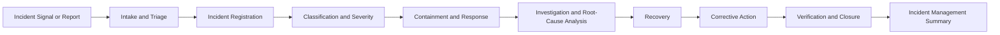

# AI Incident Management Framework

## Executive Summary

AI incidents may originate from model failure, data issues, control breakdown, human-oversight failure, provider events, unauthorized use, operational disruption, or another condition affecting a governed AI system.

The AI Incident Management Framework establishes how Megastar Mortgage governs AI incidents involving the Megastar Intelligent Processor (MIP) from initial detection through formal closure.

It defines the operating model, lifecycle, roles, accountability, decision rights, escalation structure, evidence expectations, and cross-capability coordination required to manage AI incidents consistently.

This framework does not define detailed intake questions, incident categories, severity criteria, investigation methods, root-cause techniques, corrective-action records, or closure evidence. Those requirements are established through the later artifacts within this capability.

---

## Purpose

The purpose of this framework is to establish a consistent and auditable governance model for AI Incident Management.

It enables Megastar Mortgage to:

- govern AI incidents through one standard lifecycle;
- assign accountable ownership;
- coordinate operational and governance functions;
- prioritize immediate harm reduction;
- preserve evidence;
- support proportionate escalation;
- maintain clear decision rights;
- route specialist issues to the appropriate capability;
- keep authoritative governance records current; and
- ensure that incidents are closed only through an approved process.

---

## Framework Scope

This framework applies to potential or confirmed incidents involving:

- governed AI systems;
- AI models or externally supplied AI services;
- prompts, configurations, rules, and workflows;
- AI-generated or AI-supported outputs;
- training, validation, monitoring, or operational data;
- human-review and human-oversight activities;
- AI governance controls;
- third-party AI providers and subprocessors;
- technical integrations and dependencies;
- approved-use boundaries;
- affected business processes; and
- AI-related legal, regulatory, contractual, privacy, security, or governance obligations.

The framework applies regardless of whether the event is detected internally, reported by a user, or notified by a provider or external authority.

---

## Framework Boundary

AI Incident Management owns the coordinated AI-incident lifecycle.

It does not replace:

- enterprise cybersecurity incident response;
- privacy-breach management;
- business-continuity execution;
- technology recovery;
- legal investigation;
- regulatory-notification ownership;
- provider contract enforcement;
- enterprise risk analysis;
- control design;
- assurance testing;
- change approval;
- residual-risk acceptance; or
- management review.

The capability coordinates the AI-specific governance dimensions of the event and connects them to the appropriate enterprise process.

---

## Governance Objectives

The framework is designed to ensure that every material AI incident is:

- identified and evaluated promptly;
- recorded within an authoritative incident record;
- assigned to an accountable owner;
- classified and escalated proportionately;
- contained where necessary;
- investigated using preserved evidence;
- supported by coordinated recovery;
- linked to corrective actions;
- reflected in relevant governance records;
- reviewed for recurrence and systemic implications; and
- formally closed through an approved decision.

---

## Incident Management Principles

Megastar Mortgage manages AI incidents according to the following principles:

- Protection of people, customers, data, and business operations takes priority.
- Triage shall not delay urgent containment.
- Every formal AI incident shall have an accountable Incident Owner.
- Evidence shall be preserved as early as practicable.
- Containment shall remain distinct from recovery and closure.
- Recovery shall be validated before unrestricted operation resumes.
- Incident severity shall remain distinct from enterprise risk priority.
- Root cause shall consider technical, operational, human, control, provider, and governance factors.
- Provider involvement shall not transfer Megastar Mortgage’s accountability.
- Corrective actions shall have named owners and defined timelines.
- Reported completion shall remain distinct from verified closure.
- Repeated incidents shall be reviewed for systemic weakness.
- Material incidents shall update related system, risk, control, provider, monitoring, and change records.
- Closure shall require evidence and appropriate approval.

---

## Incident Management Lifecycle

The lifecycle may accelerate during urgent events, but accountability, evidence, decision history, and record integrity shall remain traceable.

---

## Lifecycle Stages

### 1. Detection

A possible AI incident is identified through monitoring, operations, assurance, provider notification, customer complaint, security, privacy, audit, or another reporting channel.

### 2. Intake and Triage

The event is reviewed to determine whether it involves a governed AI system, whether immediate action is required, and whether formal incident registration is appropriate.

### 3. Incident Registration

A formal incident record is created in the Enterprise AI Incident Register.

### 4. Classification and Severity

The incident is categorized and assigned an initial severity, response urgency, and escalation level.

### 5. Containment and Response

Immediate measures are taken to reduce further harm, preserve evidence, and stabilize the affected environment.

### 6. Investigation and Root-Cause Analysis

The organization determines what happened, why it happened, what was affected, and which conditions contributed.

### 7. Recovery

The affected service, process, or AI system is restored or moved into an approved restricted state.

### 8. Corrective Action

Actions are assigned to address root causes, contributing factors, control weaknesses, monitoring gaps, or governance failures.

### 9. Verification and Closure

Required actions and closure criteria are validated before the incident is formally closed.

### 10. Incident Management Summary

Material outcomes, recurring themes, open actions, and cross-capability implications are consolidated.

---

## Governance Roles

| Role | Primary Responsibility |
|---|---|
| AI Governance Lead | Maintains the incident-governance model and coordinates cross-capability alignment. |
| Incident Owner | Owns the incident lifecycle from registration through closure. |
| AI System Owner | Provides business accountability for the affected AI system. |
| Technical Owner | Coordinates technical containment, investigation, restoration, and evidence. |
| Business Process Owner | Manages operational impact and business recovery. |
| Privacy | Leads privacy-specific assessment and obligations. |
| Security | Leads cybersecurity-specific response and investigation. |
| Legal & Compliance | Advises on legal, regulatory, contractual, and notification requirements. |
| Third-Party Relationship Owner | Coordinates provider-related response and obligations. |
| Risk Owner | Reviews incident-related risk implications. |
| Control Owner | Addresses affected or failed controls. |
| Assurance Function | Provides independent evaluation where required. |
| Communications Owner | Coordinates approved internal or external communications. |
| Governance Authority | Approves major decisions, restrictions, suspension, or closure where required. |

---

## Accountability Model

Every formal incident shall have:

- one Incident Owner;
- one affected AI System Owner;
- clearly assigned operational and specialist responsibilities;
- an identified escalation authority;
- documented decision rights;
- a current incident record; and
- defined closure approval.

Where multiple functions participate, ownership shall remain explicit.

---

## Decision Rights

The framework governs decisions including:

- whether the event enters formal AI Incident Management;
- who owns the incident;
- whether immediate containment is required;
- whether AI use should continue, be restricted, or be suspended temporarily;
- which functions must participate;
- whether provider escalation is required;
- whether executive escalation is required;
- when recovery may begin;
- whether corrective actions are sufficient for closure review; and
- whether the incident is ready for formal closure.

The framework does not determine:

- formal residual-risk acceptance;
- permanent provider continuation;
- enterprise risk reprioritization;
- final control-effectiveness conclusions;
- formal change approval; or
- strategic management-review outcomes.

---

## Escalation Structure

Escalation shall reflect urgency, severity, scale, stakeholder impact, regulatory exposure, and the ability to contain the event.

| Escalation Level | Typical Authority |
|---|---|
| Operational | Incident Owner, AI System Owner, Technical Owner, Business Process Owner |
| Functional | AI Governance, Privacy, Security, Legal & Compliance, Risk, Technology |
| Governance Committee | Cross-functional material decisions and unresolved High-severity matters |
| Executive | Critical, systemic, strategic, or potentially unacceptable conditions |

Detailed severity and escalation criteria are established in the AI Incident Classification & Severity artifact.

---

## Evidence and Record Expectations

Incident evidence may include:

- system logs;
- workflow history;
- prompts and outputs;
- model or service versions;
- access records;
- configuration records;
- human-review records;
- affected data;
- provider notifications;
- tickets and alerts;
- communications;
- screenshots;
- reports;
- change records;
- control evidence; and
- decisions and approvals.

Evidence shall be:

- preserved promptly;
- access-controlled;
- time-stamped where possible;
- traceable to the incident;
- protected from unauthorized alteration;
- retained according to applicable requirements; and
- available for investigation, assurance, audit, or regulatory review.

---

## Enterprise AI Incident Register

The Enterprise AI Incident Register is the authoritative living record for formal AI incidents.

It maintains current information concerning:

- incident identity;
- affected AI system;
- category and severity;
- current lifecycle status;
- ownership;
- containment;
- investigation;
- recovery;
- root cause;
- corrective actions;
- cross-capability handoffs;
- notifications;
- escalation;
- verification; and
- closure.

The detailed register structure is defined in Artifact 02.

---

## Cross-Capability Coordination

| Incident Matter | Receiving Capability |
|---|---|
| AI-system reassessment or approved-use review | AI Inventory & Assessment |
| New or materially changed risk | AI Risk Management |
| Missing, failed, or inadequate control | AI Controls |
| Independent evaluation or retesting | AI Assurance |
| Provider-originated incident or obligation breach | Third-Party AI Governance |
| Recurrence, threshold, or post-incident monitoring | Continuous Monitoring |
| Material corrective change | AI Change Management |
| Executive, policy, exception, or residual-risk decision | Governance Oversight & Continual Improvement |
| Regulatory or framework-mapping change | Framework Alignment |

The incident record shall preserve each handoff and receiving reference.

---

## Relationship to Enterprise Incident Processes

Where an AI incident is also a:

- cybersecurity incident;
- privacy breach;
- business-continuity event;
- operational incident;
- customer complaint;
- provider incident;
- legal matter; or
- regulatory event,

the applicable enterprise process remains authoritative for its specialist domain.

The AI Incident Management capability coordinates the AI-specific governance record and ensures the event remains connected across those processes.

---

## Framework Outputs

The framework produces:

- a governed AI-incident lifecycle;
- clear ownership and accountability;
- an authoritative AI incident record;
- traceable escalation;
- coordinated specialist participation;
- preserved evidence;
- linked corrective actions;
- cross-capability handoffs;
- current governance-record updates; and
- a formal incident conclusion.

---

## Framework Effectiveness Indicators

The framework may be evaluated through measures such as:

- incidents with an assigned owner;
- time from detection to triage;
- time from triage to registration;
- incidents with complete evidence;
- incidents escalated within required time;
- containment timeliness;
- investigation completion;
- corrective-action aging;
- repeated incident rate;
- closure-verification completion; and
- incidents with completed governance-record updates.

Definitions and thresholds belong to the Continuous Monitoring capability.

---

## Framework Review

The framework shall be reviewed when:

- a Critical AI incident occurs;
- repeated incidents reveal systemic weakness;
- regulatory obligations change;
- enterprise incident processes change;
- provider obligations change;
- monitoring reveals delayed detection;
- investigation identifies governance ambiguity;
- closure decisions are inconsistent;
- evidence requirements prove insufficient; or
- the current framework no longer supports effective incident governance.

---

## Framework Approval

Before approval, Megastar Mortgage confirms that:

- scope is clear;
- lifecycle stages are defined;
- roles and accountability are assigned;
- decision rights are established;
- escalation structure is clear;
- evidence expectations are defined;
- the Enterprise AI Incident Register is recognized as authoritative;
- specialist-process boundaries are clear;
- cross-capability handoffs are defined; and
- closure authority is established.

---

## Related Artifacts

- Enterprise AI Incident Register
- AI Incident Intake & Triage
- AI Incident Classification & Severity
- AI Incident Response & Recovery
- AI Incident Investigation & Root-Cause Analysis
- AI Incident Corrective Action & Closure
- AI Incident Management Summary

---

## Document Control

| Field | Value |
|---|---|
| Document | AI Incident Management Framework |
| Capability | AI Incident Management |
| Repository | Enterprise AI Governance Playbook |
| Reference Organization | Megastar Mortgage |
| Reference AI System | Megastar Intelligent Processor (MIP) |
| Document Owner | AI Governance Lead |
| Version | 1.0 |
| Review Cycle | Annual |
| Status | Published Reference |

---

## Revision History

| Version | Date | Description |
|---|---|---|
| 1.0 | July 2026 | Initial release of the AI Incident Management Framework. |