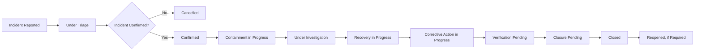

# Enterprise AI Incident Register

## Executive Summary

The Enterprise AI Incident Register is the authoritative living record for formal AI incidents involving the Megastar Intelligent Processor (MIP) and other governed AI systems within Megastar Mortgage.

The register preserves the current lifecycle status of each incident from initial reporting through triage, confirmation, containment, investigation, recovery, corrective action, verification, and closure.

It provides a consistent source of truth for incident ownership, severity, affected systems, related risks and controls, provider involvement, escalation, notifications, corrective actions, and closure evidence.

The register does not replace detailed intake, severity assessment, response, investigation, root-cause analysis, recovery, corrective-action, or closure records. It records the current authoritative state and links to those records.

---

## Purpose

The purpose of this document is to establish the structure, ownership, lifecycle rules, and minimum information requirements for the Enterprise AI Incident Register.

The register enables Megastar Mortgage to:

- assign a unique identifier to every reported or confirmed AI incident;
- maintain one authoritative current-state record;
- track incident status across the full lifecycle;
- identify affected AI systems, providers, processes, users, and stakeholders;
- preserve ownership and accountability;
- link related risks, controls, changes, findings, and corrective actions;
- track escalation and notification obligations;
- distinguish reported remediation from verified closure;
- retain incident history after closure;
- support monitoring, assurance, audit, regulatory review, and governance oversight; and
- identify recurring or systemic incident patterns.

---

## Register Scope

The Enterprise AI Incident Register includes:

- reported potential AI incidents entering formal triage;
- confirmed AI incidents;
- provider-originated AI incidents affecting Megastar Mortgage;
- reopened incidents;
- cancelled reports retained for traceability; and
- closed incidents retained as historical governance records.

The register does not include routine operational errors, monitoring observations, or near misses unless they enter the formal incident triage process.

---

## Register Ownership

| Role | Responsibility |
|---|---|
| Register Owner | Maintains the register structure, data standards, access, quality, and lifecycle rules. |
| Incident Owner | Ensures the incident record remains current throughout the lifecycle. |
| AI System Owner | Confirms system, business-process, and operational-impact information. |
| Specialist Functions | Maintain domain-specific information and provide authoritative references. |
| AI Governance Lead | Oversees governance consistency, linkages, escalation visibility, and portfolio reporting. |
| Closure Authority | Approves formal closure according to incident severity and decision rights. |

The Incident Owner is responsible for the accuracy and timeliness of the individual incident record.

---

## Register Lifecycle

An incident may move through stages concurrently where urgency requires parallel containment, investigation, recovery, or corrective action.

---

## Incident Status Model

| Incident Status | Meaning |
|---|---|
| Reported | A potential AI incident has been submitted and recorded. |
| Under Triage | Initial validation, scope, urgency, and ownership review are underway. |
| Confirmed | The event has been accepted as a formal AI incident. |
| Containment in Progress | Immediate measures are being implemented to reduce further impact. |
| Under Investigation | Evidence review and root-cause analysis are underway. |
| Recovery in Progress | Restoration or controlled return to service is underway. |
| Corrective Action in Progress | Required remediation is being implemented. |
| Verification Pending | Evidence or independent verification is required before closure. |
| Closure Pending | Closure criteria are satisfied and approval is pending. |
| Closed | Formal closure has been approved. |
| Reopened | The incident recurred, new evidence emerged, or closure was insufficient. |
| Cancelled | The report was determined not to meet the formal AI-incident threshold. |

The register shall record both the current status and status history.

---

## Required Register Fields

### 1. Incident Identification

| Field | Purpose |
|---|---|
| Incident ID | Unique, permanent incident identifier. |
| Incident Title | Concise description of the event. |
| Incident Description | Brief factual summary of the event. |
| Incident Record Status | Current lifecycle status. |
| Occurrence Date and Time | When the event occurred, if known. |
| Detection Date and Time | When the event was first detected. |
| Reporting Date and Time | When the event was formally reported. |
| Registration Date and Time | When the incident record was created. |
| Detection Source | Monitoring, user report, provider, audit, security, privacy, or other source. |
| Reporting Person or Function | Originator of the report. |

---

### 2. Affected AI Environment

| Field | Purpose |
|---|---|
| AI System Name | Affected governed AI system. |
| AI System Inventory ID | Link to the Enterprise AI System Inventory. |
| Business Process | Affected business process or workflow. |
| Business Function | Accountable organizational function. |
| Model or Service | Affected model, service, API, or external AI capability. |
| Model or Service Version | Relevant version at the time of the incident. |
| Deployment Environment | Production, test, development, or other environment. |
| Geographic or Jurisdictional Scope | Locations or jurisdictions affected. |
| Third-Party Relationship ID | Link to the provider relationship, where applicable. |
| Subprocessor or Fourth Party | Relevant downstream provider, where applicable. |

---

### 3. Incident Classification

| Field | Purpose |
|---|---|
| Primary Incident Category | Main incident category. |
| Secondary Categories | Additional applicable categories. |
| Current Severity | Current approved incident severity. |
| Initial Severity | Severity assigned at confirmation. |
| Severity Status | Provisional or confirmed. |
| Severity Last Reviewed | Date of most recent severity review. |
| Actual Impact | Confirmed impact at the current stage. |
| Potential Impact | Reasonably foreseeable impact. |
| Affected Stakeholders | Customers, employees, users, providers, or others. |
| Recurrence Status | First occurrence, repeated, persistent, or systemic. |

Detailed classification and severity methodology remain within the AI Incident Classification & Severity artifact.

---

### 4. Incident Ownership

| Field | Purpose |
|---|---|
| Incident Owner | Accountable owner for the incident lifecycle. |
| AI System Owner | Business owner of the affected AI system. |
| Technical Owner | Owner of technical response and recovery. |
| Business Process Owner | Owner of operational recovery. |
| Third-Party Relationship Owner | Provider owner, where applicable. |
| Lead Specialist Function | Privacy, Security, Legal & Compliance, Technology, or another lead function. |
| Coordinating Functions | Other participating functions. |
| Escalation Authority | Current escalation authority. |
| Closure Authority | Authority required to approve closure. |

---

### 5. Lifecycle Status

| Field | Purpose |
|---|---|
| Triage Status | Not Started, In Progress, Completed, or Reopened. |
| Confirmation Decision | Confirmed, Cancelled, or Pending. |
| Containment Status | Not Required, Planned, In Progress, Complete, or Failed. |
| Investigation Status | Not Started, In Progress, Complete, or Unable to Conclude. |
| Recovery Status | Not Required, Planned, In Progress, Complete, or Failed. |
| Corrective-Action Status | Not Required, Planned, In Progress, Overdue, Complete, or Verification Pending. |
| Verification Status | Not Required, Planned, In Progress, Satisfactory, Unsatisfactory, or Unable to Conclude. |
| Closure Status | Not Ready, Ready, Pending Approval, Closed, or Reopened. |
| Next Required Activity | Current next lifecycle action. |
| Next Review Date | Date of the next incident review. |

---

### 6. Containment and Recovery

| Field | Purpose |
|---|---|
| Immediate Containment Required | Whether urgent containment was required. |
| Containment Start Date | Date containment began. |
| Containment Completion Date | Date containment was completed. |
| Temporary Restriction | Any restriction applied to system use. |
| Temporary Suspension | Whether system or service use was suspended. |
| Manual Fallback Activated | Whether a fallback process was used. |
| Recovery Decision | Approved recovery or restricted operation decision. |
| Recovery Date | Date service or process was restored. |
| Return-to-Service Authority | Authority approving resumed operation. |
| Enhanced Monitoring Required | Whether increased post-incident monitoring is required. |

Detailed response and recovery activity remains in the AI Incident Response & Recovery record.

---

### 7. Investigation and Root Cause

| Field | Purpose |
|---|---|
| Investigation Reference | Link to the investigation record. |
| Root-Cause Analysis Reference | Link to the approved RCA record. |
| Root Cause Status | Not Started, In Progress, Confirmed, or Unable to Conclude. |
| Primary Root-Cause Category | Main confirmed cause category. |
| Contributing Factors | Summary or reference to relevant contributing conditions. |
| Control Failure Identified | Whether a control failure or gap was identified. |
| Human-Oversight Failure Identified | Whether human oversight contributed. |
| Provider Contribution Identified | Whether provider action or failure contributed. |
| Change-Related Cause | Whether an approved or unapproved change contributed. |
| Monitoring Gap Identified | Whether delayed or ineffective detection contributed. |

The register stores summary status and references, not the complete investigation narrative.

---

### 8. Governance Linkages

| Field | Purpose |
|---|---|
| Related Risk IDs | Linked Enterprise AI Risk Register records. |
| Related Control IDs | Linked Enterprise AI Control Register records. |
| Related Provider ID | Linked Enterprise Third-Party AI Register record. |
| Related Change IDs | Linked AI Change Management records. |
| Related Monitoring Finding IDs | Linked monitoring findings. |
| Related Assurance Finding IDs | Linked assurance findings. |
| Related Corrective-Action IDs | Linked remediation records. |
| Related Policy or Standard | Relevant governance obligation. |
| Related Regulatory Requirement | Relevant legal or regulatory obligation. |

Linkage shall use identifiers rather than duplicate detailed records.

---

### 9. Escalation and Notification

| Field | Purpose |
|---|---|
| Escalation Level | Operational, Functional, Governance Committee, or Executive. |
| Escalation Status | Not Required, Planned, Submitted, Under Review, Decision Issued, or Resolved. |
| Escalation Date | Date of formal escalation. |
| Executive Notification Status | Current executive-notification status. |
| Privacy Notification Status | Current privacy-notification status. |
| Security Notification Status | Current security-notification status. |
| Legal & Compliance Notification Status | Current legal and compliance status. |
| Regulatory Notification Status | Current regulator-notification status. |
| Customer or Stakeholder Notification Status | Current external-notification status. |
| Provider Notification Status | Current provider-notification status. |
| Contractual Notification Status | Current contractual-notification status. |
| Notification References | Links to authoritative notification records. |

The responsible specialist function remains authoritative for notification decisions.

---

### 10. Corrective Actions

| Field | Purpose |
|---|---|
| Corrective-Action References | Links to required remediation actions. |
| Open Corrective Actions | Number or status of open actions. |
| Overdue Corrective Actions | Number or status of overdue actions. |
| Corrective-Action Owner | Accountable owner or owners. |
| Target Completion Date | Planned completion date. |
| Reported Completion Date | Date the owner reported completion. |
| Verification Required | Whether verification is required. |
| Verification Reference | Link to verification evidence or assurance record. |
| Residual Open Matter | Any unresolved matter transferred elsewhere. |
| Post-Incident Monitoring Reference | Link to recurring monitoring requirements. |

---

### 11. Closure

| Field | Purpose |
|---|---|
| Closure Readiness | Ready, Conditionally Ready, or Not Ready. |
| Closure Decision | Closed, Closure Deferred, Reopened, or Cancelled. |
| Closure Rationale | Concise reason supporting the decision. |
| Closure Authority | Approving authority. |
| Closure Date | Date formal closure was approved. |
| Closure Evidence Reference | Link to closure evidence. |
| Lessons-Learned Reference | Link to post-incident review or lessons learned. |
| Ongoing Monitoring Required | Whether follow-up monitoring remains active. |
| Authoritative Record Retaining Open Matter | Record holding any transferred issue after closure. |
| Record Retention Date | Required retention period or review date. |

---

## Register Integrity Rules

The register shall comply with the following rules:

- Every reported incident entering formal triage receives one unique Incident ID.
- Incident IDs shall not be reused.
- Closed, cancelled, or superseded records shall not be deleted.
- Current status shall be updated promptly after material lifecycle changes.
- Status, severity, ownership, and closure changes shall retain history.
- Detailed evidence and narrative shall be referenced rather than duplicated.
- One incident record shall not be created separately by each participating function.
- Related enterprise incident records shall be cross-referenced.
- Reported action completion shall not be recorded as verified closure.
- Cancelled records shall retain the cancellation rationale.
- Reopened incidents shall retain the original Incident ID.
- Restricted or sensitive information shall be protected through role-based access.
- Manual amendments shall identify who changed the record, when, and why.
- Required fields shall not be left blank without an approved reason.
- Portfolio reporting shall derive from the register without altering source records.

---

## Data Quality Requirements

Register information shall be:

- complete;
- current;
- accurate;
- consistent;
- traceable;
- access-controlled;
- retained appropriately; and
- supported by authoritative references.

Minimum quality checks shall confirm:

- valid Incident ID;
- valid AI System Inventory ID;
- assigned Incident Owner;
- current severity;
- current lifecycle status;
- next required activity;
- current escalation status;
- current corrective-action status;
- current closure status; and
- supporting references where required.

---

## Access and Confidentiality

Register access shall reflect:

- incident severity;
- legal privilege;
- privacy sensitivity;
- security sensitivity;
- customer information;
- employee information;
- provider confidentiality;
- regulatory restrictions;
- investigation integrity; and
- need to know.

Controls may include:

- role-based access;
- restricted fields;
- limited export;
- access logging;
- periodic access review;
- retention restrictions; and
- controlled sharing with external parties.

---

## Register Review

The register shall be reviewed periodically to identify:

- open incidents;
- High and Critical incidents;
- overdue triage;
- overdue containment;
- incomplete investigation;
- delayed recovery;
- overdue corrective actions;
- incidents awaiting verification;
- incidents awaiting closure;
- reopened incidents;
- repeated incident categories;
- recurring root causes;
- incidents linked to the same control or provider;
- missing ownership;
- missing evidence;
- incomplete governance linkages; and
- stale records.

Material portfolio themes shall feed the AI Incident Management Summary and Continuous Monitoring.

---

## Register Maintenance

The register shall be updated when:

- a potential incident is reported;
- triage begins or ends;
- the incident is confirmed or cancelled;
- severity changes;
- ownership changes;
- containment begins or ends;
- investigation status changes;
- root cause is confirmed;
- recovery begins or ends;
- corrective-action status changes;
- a specialist handoff is accepted;
- a notification decision is made;
- verification is completed;
- closure is approved;
- the incident is reopened; or
- a linked governance record changes materially.

---

## Related Artifacts

- AI Incident Management Framework
- AI Incident Intake & Triage
- AI Incident Classification & Severity
- AI Incident Response & Recovery
- AI Incident Investigation & Root-Cause Analysis
- AI Incident Corrective Action & Closure
- AI Incident Management Summary

---

## Document Control

| Field | Value |
|---|---|
| Document | Enterprise AI Incident Register |
| Capability | AI Incident Management |
| Repository | Enterprise AI Governance Playbook |
| Reference Organization | Megastar Mortgage |
| Reference AI System | Megastar Intelligent Processor (MIP) |
| Register Owner | AI Governance Lead |
| Version | 1.0 |
| Review Cycle | Quarterly |
| Status | Published Reference |

---

## Revision History

| Version | Date | Description |
|---|---|---|
| 1.0 | July 2026 | Initial release of the Enterprise AI Incident Register artifact. |