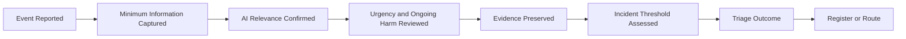

# AI Incident Intake & Triage

## Executive Summary

AI-related events may be reported through monitoring, operations, quality review, provider notification, customer complaint, security, privacy, assurance, audit, or regulatory channels.

The AI Incident Intake & Triage process determines whether a reported event should enter formal AI Incident Management and what immediate action is required before full classification, investigation, or recovery begins.

It establishes a consistent method for:

- capturing minimum event information;
- confirming relevance to a governed AI system;
- identifying immediate harm or urgency;
- preserving evidence;
- assigning initial ownership;
- determining whether the AI-incident threshold is met;
- routing the matter to the correct enterprise or governance process; and
- creating or updating the Enterprise AI Incident Register.

This artifact does not assign final severity, investigate root cause, approve recovery, define corrective actions, or close the incident.

---

## Purpose

The purpose of this document is to establish a standardized process for receiving, validating, and triaging suspected AI incidents.

The process enables Megastar Mortgage to:

- receive AI-related reports through approved channels;
- capture sufficient facts for an initial decision;
- identify the affected AI system and business process;
- determine whether urgent protective action is required;
- distinguish an AI incident from a monitoring observation, operational issue, complaint, control exception, or specialist-domain event;
- assign an initial Incident Owner;
- determine the appropriate routing outcome;
- preserve evidence and decision traceability; and
- hand confirmed incidents to AI Incident Classification & Severity.

---

## Scope

This process applies to suspected events involving:

- governed AI systems;
- AI models or externally supplied AI services;
- AI-supported business processes;
- prompts, configurations, rules, or workflows;
- AI-generated or AI-assisted outputs;
- operational, training, validation, or monitoring data;
- human oversight;
- AI controls;
- third-party AI providers;
- approved-use boundaries; or
- AI-related legal, privacy, security, contractual, or regulatory obligations.

It applies whether the event originates internally or externally.

---

## Intake & Triage Boundary

### This process owns

- event intake;
- minimum information capture;
- initial AI relevance review;
- urgent-condition identification;
- immediate evidence-preservation instruction;
- temporary protective-action recommendation;
- initial Incident Owner assignment;
- AI-incident threshold decision;
- routing outcome;
- register creation or update;
- triage decision approval; and
- handoff to the next lifecycle stage.

### This process does not own

- final incident severity;
- detailed incident classification;
- containment execution;
- recovery approval;
- investigation;
- root-cause analysis;
- corrective-action design;
- formal notification decisions;
- residual-risk acceptance; or
- incident closure.

---

## Intake Sources

Suspected AI incidents may be received from:

- Continuous Monitoring;
- AI Governance Dashboard;
- Monitoring Findings & Escalation;
- Business Operations;
- Quality Assurance;
- Human Oversight;
- AI System Owners;
- Control Owners;
- AI Assurance;
- Security;
- Privacy;
- Legal & Compliance;
- Internal Audit;
- Third-Party AI Providers;
- customers or affected users;
- regulators; or
- another enterprise incident process.

The reporting channel shall not determine whether the matter qualifies as an AI incident.

---

## Minimum Intake Information

Triage should begin with the following information where available:

| Intake Field | Purpose |
|---|---|
| Event Title | Concise identification of the reported condition. |
| Event Description | Factual summary of what was observed. |
| Detection Source | How the event was identified. |
| Occurrence Date and Time | When the event occurred, if known. |
| Detection Date and Time | When the event was identified. |
| Reporter | Person or function submitting the event. |
| AI System Name | Affected AI system. |
| AI System Inventory ID | Link to the authoritative inventory record. |
| Business Process | Affected process or workflow. |
| Provider Relationship ID | Relevant third-party relationship, where applicable. |
| Initial Impact | Known or suspected effect at intake. |
| Ongoing Condition | Whether the event is continuing. |
| Immediate Actions Taken | Protective action already performed. |
| Evidence Available | Logs, records, screenshots, outputs, alerts, or other evidence. |

Incomplete information shall not delay urgent protective action.

---

## Intake Process

---

## Initial AI Relevance Review

The triage reviewer determines whether the event involves:

- a governed AI system;
- an AI-generated or AI-supported output;
- an AI model or service;
- an AI-related control;
- human oversight of AI;
- an AI provider;
- an approved-use boundary;
- AI-related data processing; or
- another AI governance obligation.

Where no AI connection exists, the matter should be transferred to the appropriate enterprise process and the rationale recorded.

---

## Immediate Urgency Review

Triage shall identify whether the event presents an immediate or continuing concern involving:

- customer or employee harm;
- privacy or confidentiality exposure;
- security compromise;
- unauthorized access or use;
- material processing error;
- significant operational disruption;
- uncontrolled AI output;
- failed human oversight;
- uncontrolled provider activity;
- regulatory or contractual urgency;
- evidence loss;
- continued transaction impact; or
- rapidly expanding scope.

Urgent protective action shall not wait for final classification or severity confirmation.

---

## Immediate Protective Actions

Triage may recommend or initiate temporary actions within approved authority, including:

- preserve logs, prompts, outputs, and records;
- increase human review;
- restrict affected use;
- suspend affected processing;
- isolate an integration;
- revoke or limit access;
- activate manual fallback;
- stop an affected data flow;
- notify Security, Privacy, Legal & Compliance, or Technology;
- notify the provider;
- preserve affected data;
- protect customers or employees; or
- escalate to the appropriate governance authority.

The action taken, owner, time, and rationale shall be recorded.

---

## AI-Incident Threshold

A reported event should enter formal AI Incident Management where one or more of the following apply:

- actual or reasonably foreseeable material harm occurred;
- a governed AI system materially failed or behaved outside approved expectations;
- an approved-use boundary may have been exceeded;
- a material control may have failed;
- required human oversight may have been bypassed or ineffective;
- privacy, security, legal, regulatory, or contractual exposure may exist;
- the event materially disrupted an AI-supported business process;
- a provider-originated event materially affected the organization;
- the event requires coordinated investigation, containment, recovery, or corrective action;
- the event requires formal escalation;
- the event may recur or indicate broader governance weakness; or
- the matter cannot be managed adequately through routine operational correction.

The threshold decision shall be evidence-based and documented.

---

## Conditions That May Not Require Formal Incident Registration

An event may remain outside formal AI Incident Management where it is:

- a routine operational error corrected through normal process;
- an isolated monitoring observation without material consequence;
- a duplicate of an existing incident;
- a non-AI issue;
- a minor control exception already governed through an existing authoritative record;
- a complaint without an identified AI-related event;
- an unsupported allegation after reasonable review; or
- a matter fully owned by another enterprise process with no separate AI-governance implications.

The rationale and destination process shall be recorded.

---

## Triage Questions

The triage reviewer should determine:

1. Does the event involve a governed AI system or AI-supported process?
2. Is the event ongoing?
3. Is immediate harm reduction required?
4. Is evidence at risk of loss or alteration?
5. Could customers, employees, or other stakeholders be affected?
6. Could privacy, security, legal, regulatory, or contractual obligations be affected?
7. Could an AI control or human-oversight requirement have failed?
8. Could the event involve unauthorized or unapproved AI use?
9. Could a provider have contributed?
10. Does the event require coordinated response beyond routine operational handling?
11. Does an existing incident already cover the same condition?
12. Is sufficient information available to make a triage decision?

---

## Triage Outcomes

Each reported event shall receive one primary outcome.

| Triage Outcome | Meaning |
|---|---|
| Confirmed for Incident Registration | The event meets the AI-incident threshold and shall enter the formal lifecycle. |
| Pending Additional Information | A decision cannot yet be reached, but the event remains under active review. |
| Monitor as Watch Item | The event does not yet meet the incident threshold but requires defined monitoring. |
| Transfer to Enterprise Process | Another enterprise process owns the matter, with AI-governance linkage retained where necessary. |
| Merge with Existing Incident | The event duplicates or forms part of an existing incident. |
| Cancelled — Not an AI Incident | The event does not meet the AI-incident threshold. |
| Escalation Required Before Decision | The triage reviewer lacks sufficient authority to determine the outcome. |

Only one primary outcome shall be selected, with secondary handoffs recorded separately.

---

## Incident Registration Decision

Where the event is confirmed:

- a unique Incident ID shall be assigned;
- the Enterprise AI Incident Register shall be created or updated;
- the Incident Owner shall be assigned;
- the affected AI System Owner shall be identified;
- immediate actions shall be recorded;
- required specialist functions shall be engaged;
- evidence references shall be preserved;
- the initial category may be recorded provisionally; and
- the incident shall proceed to AI Incident Classification & Severity.

The detailed severity decision is not completed during intake and triage.

---

## Initial Ownership

The triage process shall identify:

- Triage Owner;
- provisional Incident Owner;
- affected AI System Owner;
- relevant Technical Owner;
- relevant Business Process Owner;
- provider owner, where applicable;
- required specialist functions; and
- escalation authority.

Ownership may change after formal classification, but the incident shall never remain unowned.

---

## Specialist Routing

Triage may initiate immediate routing to:

| Condition | Receiving Function or Capability |
|---|---|
| Security event | Information Security |
| Privacy concern | Privacy |
| Legal or regulatory concern | Legal & Compliance |
| Business disruption | Business Operations or Business Continuity |
| Provider-originated event | Third-Party AI Governance |
| New or changed risk | AI Risk Management |
| Suspected control failure | AI Controls |
| Independent evaluation required | AI Assurance |
| Material corrective change likely | AI Change Management |
| Critical or executive decision | Governance Oversight & Continual Improvement |
| Ongoing observation required | Continuous Monitoring |

Routing does not remove the need for a formal AI incident record where the AI-incident threshold is met.

---

## Evidence Preservation

Triage shall identify and preserve relevant evidence before it is overwritten, altered, or deleted.

Evidence may include:

- system logs;
- workflow records;
- prompts and outputs;
- model or service version;
- configuration records;
- access records;
- human-review records;
- affected data;
- provider notifications;
- tickets and alerts;
- screenshots;
- communications; and
- previous monitoring results.

The triage record should store references, not unnecessary copies of sensitive evidence.

---

## Triage Timing

Triage timing shall be proportionate to urgency.

| Triage Priority | Expected Handling |
|---|---|
| Urgent | Immediate review and protective action. |
| High | Prompt review within the approved incident-response timeframe. |
| Standard | Review within the normal triage service level. |
| Information Pending | Active follow-up until a decision is possible. |

Detailed severity-based response times belong to the AI Incident Classification & Severity artifact.

---

## Triage Completion Criteria

Triage is complete when:

- the affected AI system or process is identified;
- immediate urgency has been assessed;
- evidence-preservation needs have been addressed;
- initial ownership is assigned;
- the AI-incident threshold decision is documented;
- one primary triage outcome is selected;
- required specialist routing is recorded;
- the Enterprise AI Incident Register is created or updated where required; and
- the next activity is assigned.

---

## Triage Quality Review

The triage record shall confirm that:

- the event description is factual;
- the AI connection is documented;
- immediate risk was considered;
- protective actions were recorded;
- evidence references are available;
- the threshold decision is supported;
- duplicate incidents were checked;
- routing is appropriate;
- ownership is clear;
- the register decision is complete; and
- the next step is defined.

---

## Related Artifacts

- AI Incident Management Framework
- Enterprise AI Incident Register
- AI Incident Classification & Severity

---

## Document Control

| Field | Value |
|---|---|
| Document | AI Incident Intake & Triage |
| Capability | AI Incident Management |
| Repository | Enterprise AI Governance Playbook |
| Reference Organization | Megastar Mortgage |
| Reference AI System | Megastar Intelligent Processor (MIP) |
| Document Owner | AI Governance Lead |
| Version | 1.0 |
| Review Cycle | Annual |
| Status | Published Reference |

---

## Revision History

| Version | Date | Description |
|---|---|---|
| 1.0 | July 2026 | Initial release of the AI Incident Intake & Triage artifact. |