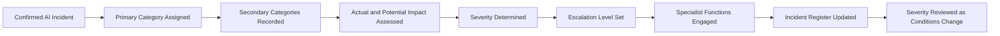

# AI Incident Classification & Severity

## Executive Summary

AI Incident Intake & Triage determines whether a reported event should enter formal AI Incident Management.

AI Incident Classification & Severity determines what type of incident has occurred, how serious it is, how urgently it must be handled, and which governance functions must be engaged.

This artifact establishes the incident taxonomy, severity criteria, escalation levels, specialist-routing requirements, and reassessment rules used for confirmed AI incidents involving the Megastar Intelligent Processor (MIP).

It does not perform containment, investigation, root-cause analysis, recovery, corrective action, or closure. Those activities are governed through later incident-management artifacts.

---

## Purpose

The purpose of this document is to establish a consistent method for classifying confirmed AI incidents and assigning an appropriate severity and escalation level.

It enables Megastar Mortgage to:

- assign one primary incident category;
- record relevant secondary categories;
- assess actual and potential impact;
- determine current incident severity;
- establish response urgency;
- identify required specialist functions;
- determine escalation authority;
- review and revise severity when conditions change; and
- update the Enterprise AI Incident Register with an approved classification.

---

## Scope

This process applies to confirmed AI incidents recorded in the Enterprise AI Incident Register.

It covers:

- incident category;
- impact assessment;
- severity determination;
- response urgency;
- escalation level;
- specialist engagement;
- severity review; and
- register updates.

It does not own:

- incident intake or confirmation;
- containment execution;
- operational recovery;
- investigation;
- root-cause analysis;
- control-effectiveness conclusions;
- risk reprioritization;
- corrective-action design;
- residual-risk acceptance; or
- incident closure.

---

## Classification Process



---

## Classification Principles

Megastar Mortgage applies the following rules:

- Every confirmed AI incident shall have one primary category.
- Secondary categories may be assigned where multiple domains are materially affected.
- Classification shall describe the nature of the incident.
- Severity shall describe the seriousness and urgency of the incident.
- Severity shall consider both actual and reasonably foreseeable impact.
- Incident severity shall remain distinct from enterprise risk priority, assurance-finding severity, and monitoring-finding severity.
- No single factor shall determine severity in isolation unless an approved mandatory escalation rule applies.
- Classification and severity decisions shall be supported by evidence and rationale.
- Severity shall be reviewed when material facts change.
- All severity changes shall retain decision history.

---

## Incident Categories

| Category | Description |
|---|---|
| Model Performance | Materially incorrect, unstable, degraded, or unexpected AI behaviour. |
| Data Quality | Incomplete, inaccurate, corrupted, inappropriate, or ungoverned data materially affected the AI system or output. |
| Fairness & Bias | Potentially discriminatory, inequitable, or systematically adverse outcomes were identified. |
| Transparency & Explainability | Outputs, logic, evidence, or decision pathways could not be explained or traced where required. |
| Human Oversight | Required review, intervention, escalation, or override controls failed or were bypassed. |
| Privacy | Personal, confidential, or restricted information was exposed, misused, retained, or processed improperly. |
| Security | Unauthorized access, compromise, manipulation, misuse, or security-control failure affected the AI environment. |
| Reliability & Resilience | Availability, stability, capacity, recovery, or continuity failure materially affected the AI-supported service. |
| Approved-Use Deviation | The AI system was used outside its approved purpose, users, data, environment, or operating boundaries. |
| Control Failure | An AI governance, technical, operational, or oversight control failed, was absent, or was not performed. |
| Third-Party AI | A provider, subprocessor, external model, or supplier dependency contributed materially to the incident. |
| Regulatory & Compliance | A legal, regulatory, policy, contractual, or governance obligation may have been breached. |
| Operational Process | AI-related failure materially disrupted a business process or operating workflow. |
| Change-Related | An approved, emergency, failed, or unauthorized change contributed to the incident. |
| Evidence & Records | Required logs, records, approvals, traceability, or governance evidence were unavailable, altered, or lost. |
| Other | Another AI-related incident category approved by the AI Governance Lead. |

One primary category is mandatory.

---

## Primary and Secondary Classification

The primary category shall represent the incident’s central nature.

Secondary categories shall be used only where they add decision value.

Example:

```text
Primary Category: Human Oversight
Secondary Categories: Control Failure, Operational Process
```

Categories shall not be added merely to increase perceived severity.

---

## Severity Levels

| Severity | Definition |
|---|---|
| Low | Limited and contained impact that can be managed through routine operational response without material stakeholder, regulatory, security, privacy, or business consequence. |
| Moderate | Material but manageable impact requiring coordinated action, formal tracking, and specialist involvement. |
| High | Significant impact or exposure affecting an important AI system, customer or employee outcome, critical control, provider, legal obligation, or business process. Prompt cross-functional escalation is required. |
| Critical | Severe, systemic, rapidly expanding, potentially unacceptable, or difficult-to-contain impact requiring immediate executive and cross-functional intervention. |

---

## Severity Assessment Dimensions

Severity shall be assessed across the following dimensions.

### Stakeholder Impact

Consider:

- customers;
- employees;
- applicants;
- business users;
- third parties;
- vulnerable populations; and
- the scale and seriousness of actual or potential harm.

### Operational Impact

Consider:

- service disruption;
- transaction volume affected;
- duration;
- backlog;
- manual fallback availability;
- business-continuity impact; and
- recovery complexity.

### Data, Privacy, and Security Impact

Consider:

- sensitivity and volume of data;
- unauthorized disclosure or access;
- data integrity;
- confidentiality;
- misuse;
- retention or deletion failure;
- security compromise; and
- cross-border or regulated-data implications.

### Legal, Regulatory, and Contractual Impact

Consider:

- potential breach of law or regulation;
- reporting obligations;
- contractual notification;
- customer commitments;
- provider obligations;
- policy violation; and
- regulatory scrutiny.

### AI-System and Control Impact

Consider:

- affected AI-system impact classification;
- model or service criticality;
- automation level;
- control failure;
- human-oversight failure;
- explainability failure;
- approved-use deviation; and
- ability to detect or contain the issue.

### Scale, Duration, and Recurrence

Consider:

- number of affected transactions;
- number of affected people;
- number of systems or business units;
- duration;
- recurrence;
- persistence;
- systemic pattern; and
- likelihood of continued impact.

### Provider and Dependency Impact

Consider:

- provider criticality;
- concentration;
- replacement difficulty;
- provider responsiveness;
- fourth-party involvement;
- contractual support; and
- exit or fallback readiness.

---

## Severity Decision Guidance

The following guidance supports consistency but does not replace judgment.

### Low

Typical characteristics:

- limited scope;
- short duration;
- no material harm;
- no regulated-data exposure;
- no critical control failure;
- no executive decision required;
- effective containment available.

### Moderate

Typical characteristics:

- material operational or governance impact;
- limited stakeholder exposure;
- specialist response required;
- manageable control weakness;
- recoverable without major business disruption;
- no systemic or rapidly expanding condition.

### High

Typical characteristics:

- significant customer, employee, operational, privacy, security, provider, or compliance impact;
- important control or human-oversight failure;
- broad or prolonged exposure;
- significant provider dependency;
- material notification or governance concern;
- prompt committee or senior-management attention required.

### Critical

Typical characteristics:

- severe or potentially unacceptable harm;
- systemic or enterprise-wide impact;
- ongoing uncontrolled exposure;
- major privacy or security compromise;
- substantial regulatory or legal consequence;
- inability to contain or recover quickly;
- critical provider failure;
- immediate restriction, suspension, or executive decision required.

---

## Mandatory Escalation Conditions

Regardless of the initial severity score, immediate escalation shall be considered where:

- there is ongoing material harm;
- regulated or highly sensitive data may be exposed;
- unauthorized AI use is continuing;
- a Critical AI system is uncontrolled;
- a required human-control boundary has failed materially;
- the incident affects multiple systems or business functions;
- provider failure threatens continuity;
- evidence may be lost;
- a regulator, law-enforcement authority, or material customer is involved;
- the incident may require public or contractual notification;
- containment is ineffective; or
- the incident is repeated or systemic.

These conditions do not automatically determine final severity, but they may raise the minimum escalation level.

---

## Escalation Levels

| Escalation Level | Typical Authority | Typical Use |
|---|---|---|
| Operational | Incident Owner, AI System Owner, Technical Owner, Business Process Owner | Low incidents and routine Moderate incidents within delegated authority. |
| Functional | AI Governance, Security, Privacy, Legal & Compliance, Risk, Technology, Third-Party Governance | Moderate or High incidents requiring specialist coordination. |
| Governance Committee | Cross-functional governance authority | High incidents, unresolved material issues, restrictions, or major continuation decisions. |
| Executive | Executive Management or designated senior authority | Critical, systemic, strategic, or potentially unacceptable incidents. |

Severity and escalation level shall be related but recorded separately.

---

## Specialist Engagement

| Incident Condition | Required Function or Capability |
|---|---|
| Privacy concern | Privacy |
| Security compromise | Information Security |
| Legal, regulatory, or contractual concern | Legal & Compliance |
| Provider-originated incident | Third-Party AI Governance |
| New or changed AI risk | AI Risk Management |
| Control weakness or failure | AI Controls |
| Independent evaluation required | AI Assurance |
| Material corrective change | AI Change Management |
| AI-system reassessment | AI Inventory & Assessment |
| Recurrence or enhanced monitoring | Continuous Monitoring |
| Executive, exception, or residual-risk decision | Governance Oversight & Continual Improvement |

Specialist engagement shall be recorded in the incident record.

---

## Provisional and Confirmed Severity

Severity may initially be provisional where facts remain incomplete.

### Provisional Severity

Used when:

- impact is not yet fully known;
- affected population is uncertain;
- provider information is incomplete;
- evidence remains under review;
- containment has not yet stabilized the event.

### Confirmed Severity

Used when sufficient evidence supports a defensible assessment.

A provisional severity shall be reviewed within the approved incident-response timeframe.

---

## Severity Review Triggers

Severity shall be reassessed when:

- actual impact becomes clearer;
- the affected population expands;
- new systems or jurisdictions are affected;
- containment succeeds or fails;
- provider information changes;
- privacy, security, legal, or regulatory implications emerge;
- investigation identifies wider exposure;
- recurrence is identified;
- recovery is delayed;
- a major control failure is confirmed;
- a related change is discovered; or
- the current severity no longer reflects the incident.

---

## Severity Change Rules

Every severity change shall record:

- previous severity;
- new severity;
- reason for change;
- supporting evidence;
- decision authority;
- date and time;
- updated escalation level;
- updated response urgency; and
- required stakeholder notifications.

Severity reduction shall not be used to avoid required investigation, remediation, or escalation.

---

## Classification Outputs

The completed classification shall produce:

- primary incident category;
- secondary categories;
- provisional or confirmed severity;
- severity rationale;
- escalation level;
- response urgency;
- required specialist functions;
- required review date;
- recommended next lifecycle activity; and
- updated Enterprise AI Incident Register fields.

---

## Completion Criteria

Classification and severity assessment are complete when:

- one primary category is assigned;
- secondary categories are justified where used;
- actual and potential impact are assessed;
- severity is assigned;
- severity status is recorded;
- escalation level is determined;
- specialist functions are identified;
- rationale and evidence are documented;
- the next severity review date is set where required; and
- the Enterprise AI Incident Register is updated.

---

## Related Artifacts

- AI Incident Intake & Triage
- Enterprise AI Incident Register
- AI Incident Response & Recovery

---

## Document Control

| Field | Value |
|---|---|
| Document | AI Incident Classification & Severity |
| Capability | AI Incident Management |
| Repository | Enterprise AI Governance Playbook |
| Reference Organization | Megastar Mortgage |
| Reference AI System | Megastar Intelligent Processor (MIP) |
| Document Owner | AI Governance Lead |
| Version | 1.0 |
| Review Cycle | Annual |
| Status | Published Reference |

---

## Revision History

| Version | Date | Description |
|---|---|---|
| 1.0 | July 2026 | Initial release of the AI Incident Classification & Severity artifact. |