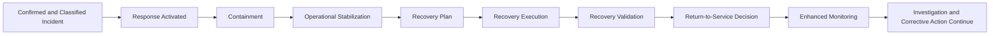

# AI Incident Response & Recovery

## Executive Summary

AI Incident Classification & Severity establishes the nature, seriousness, urgency, and escalation level of a confirmed AI incident.

AI Incident Response & Recovery governs the actions required to contain the incident, stabilize affected operations, preserve evidence, coordinate stakeholders, and authorize a controlled return to service.

This artifact applies to incidents involving the Megastar Intelligent Processor (MIP) and other governed AI systems. It establishes the response structure, containment options, recovery planning, validation requirements, and return-to-service decision process.

It does not perform detailed investigation, root-cause analysis, permanent corrective-action design, formal control-effectiveness testing, residual-risk acceptance, or final incident closure.

---

## Purpose

The purpose of this document is to establish a consistent process for managing the immediate response and operational recovery of confirmed AI incidents.

It enables Megastar Mortgage to:

- assign response ownership;
- coordinate participating functions;
- reduce ongoing harm;
- preserve incident evidence;
- contain affected systems, data flows, users, providers, or business processes;
- stabilize operations;
- activate fallback arrangements;
- define recovery objectives and acceptance criteria;
- validate recovery readiness;
- authorize restricted or full return to service;
- establish post-recovery monitoring; and
- update the Enterprise AI Incident Register.

---

## Scope

This process applies after an AI incident has been confirmed and assigned an initial classification and severity.

It covers:

- response activation;
- containment;
- evidence preservation during response;
- operational stabilization;
- provider coordination;
- communication coordination;
- fallback arrangements;
- recovery planning;
- recovery validation;
- restricted operation;
- return-to-service approval; and
- enhanced post-recovery monitoring.

It does not own:

- incident triage;
- incident taxonomy or severity methodology;
- detailed investigation;
- root-cause analysis;
- permanent remediation design;
- formal assurance conclusions;
- risk acceptance;
- or incident closure.

---

## Response & Recovery Lifecycle

Investigation may proceed in parallel where evidence and resources permit.

---

## Response Ownership

Each response shall identify:

- Incident Owner;
- Response Lead;
- AI System Owner;
- Technical Owner;
- Business Process Owner;
- provider owner, where applicable;
- participating specialist functions;
- communication owner;
- recovery approval authority; and
- return-to-service authority.

The Incident Owner retains end-to-end accountability for the incident lifecycle.

---

## Response Activation

Response activation shall confirm:

- incident severity and escalation level;
- affected AI system and business process;
- current operating condition;
- ongoing exposure;
- immediate stakeholders;
- required specialist functions;
- evidence-preservation needs;
- initial containment options;
- provider involvement;
- business-continuity implications;
- decision authority; and
- response cadence.

High and Critical incidents shall use an appropriately accelerated response structure.

---

## Containment

Containment aims to prevent further impact while preserving control of the affected environment.

Possible measures include:

- restrict or suspend AI use;
- reduce automation;
- increase human review;
- hold affected transactions;
- disable a model, service, feature, prompt, or workflow;
- isolate an integration;
- stop an affected data flow;
- revoke or restrict access;
- block affected users or accounts;
- rotate credentials, keys, or secrets;
- revert a configuration or version;
- activate manual fallback;
- redirect processing;
- require additional approval;
- notify the provider;
- invoke contractual support;
- preserve affected data and logs; or
- activate enterprise incident or continuity processes.

Containment actions shall be proportionate, authorized, time-stamped, and recorded.

---

## Containment Status

| Status | Meaning |
|---|---|
| Not Required | No containment action is necessary. |
| Planned | Containment has been defined but not yet implemented. |
| In Progress | Containment actions are underway. |
| Contained | Further material impact is no longer expanding under the current controls. |
| Partially Contained | Some exposure remains. |
| Containment Failed | Actions did not control the incident sufficiently. |

Containment does not mean the incident is resolved.

---

## Evidence Preservation During Response

Response activity shall preserve evidence that may be needed for investigation, assurance, audit, legal review, provider dispute, or regulatory response.

Relevant evidence may include:

- system and workflow logs;
- prompts and outputs;
- affected records;
- model or service versions;
- configuration states;
- access records;
- human-review records;
- alerts and tickets;
- provider communications;
- decisions and approvals;
- screenshots;
- recovery actions; and
- change records.

Response teams shall avoid unnecessary alteration of the affected environment before required evidence is preserved.

---

## Operational Stabilization

Stabilization establishes a controlled operating state while investigation and recovery continue.

Stabilization may involve:

- maintaining restricted operation;
- using manual fallback;
- reducing transaction volume;
- routing cases to specialist review;
- increasing approval requirements;
- separating affected and unaffected workloads;
- using a previous approved version;
- limiting data categories;
- increasing monitoring frequency;
- allocating additional staff; or
- pausing non-essential activity.

A stabilized environment may still contain temporary controls or operational limitations.

---

## Provider Coordination

Where a third party is involved, response coordination may include:

- provider notification;
- incident acknowledgment;
- service suspension or isolation;
- evidence request;
- technical support;
- impact confirmation;
- subprocessor review;
- contractual notification;
- recovery commitment;
- root-cause commitment;
- corrective-action commitment; and
- escalation to provider leadership.

Provider response status shall be recorded in the Enterprise AI Incident Register and linked Third-Party AI Governance records.

Megastar Mortgage retains accountability for its own operational and governance decisions.

---

## Communication Coordination

Incident communications shall be coordinated through the appropriate enterprise functions.

Communication decisions may involve:

- internal operational notification;
- senior-management notification;
- employee or user communication;
- customer communication;
- provider communication;
- contractual notification;
- regulator notification;
- public communication; or
- legal hold or confidentiality instruction.

This artifact records the communication status and responsible function. The specialist function remains authoritative for the content and legal basis of the communication.

---

## Recovery Planning

The recovery plan shall define:

- recovery objective;
- target operating state;
- actions required;
- owner for each action;
- technical prerequisites;
- business prerequisites;
- provider dependencies;
- data-validation requirements;
- control-restoration requirements;
- human-oversight requirements;
- testing requirements;
- fallback plan;
- rollback conditions;
- recovery acceptance criteria;
- recovery approval authority; and
- target completion date.

Recovery may aim for:

- full restoration;
- restricted operation;
- manual operation;
- temporary alternative service;
- previous approved version;
- replacement service; or
- controlled retirement.

---

## Recovery Acceptance Criteria

Recovery acceptance criteria shall be specific to the incident.

They may include:

- incident condition no longer active;
- affected data validated;
- critical defects corrected;
- required access controls restored;
- affected configuration approved;
- provider action completed;
- required human oversight restored;
- business fallback tested;
- required monitoring active;
- security and privacy concerns addressed;
- required notifications completed or underway;
- rollback available;
- temporary restrictions documented; and
- decision authority satisfied.

Recovery shall not be approved solely because the system is technically available.

---

## Recovery Execution

Recovery execution shall:

- follow the approved recovery plan;
- preserve evidence of actions taken;
- use authorized changes;
- record deviations;
- maintain rollback capability where required;
- confirm dependencies;
- update stakeholders;
- track unresolved risks;
- and escalate failed or delayed recovery.

Material recovery changes shall proceed through AI Change Management where required.

---

## Recovery Validation

Recovery validation confirms whether the proposed operating state satisfies the approved acceptance criteria.

Validation may include:

- functional testing;
- data-quality review;
- access validation;
- control-restoration confirmation;
- output-quality review;
- human-oversight confirmation;
- provider evidence review;
- performance review;
- rollback testing;
- business-process confirmation;
- privacy or security validation; and
- monitoring readiness.

Independent assurance may be required for High or Critical incidents or where control effectiveness must be established formally.

---

## Recovery Outcomes

| Recovery Outcome | Meaning |
|---|---|
| Restricted Operation Approved | Limited operation may resume under defined conditions. |
| Return to Service Approved | Approved operation may resume. |
| Recovery Deferred | Additional work or evidence is required. |
| Recovery Failed | Acceptance criteria were not met. |
| Continued Suspension | Use remains suspended. |
| Alternative Operation Approved | Manual, fallback, or replacement process is approved. |
| Retirement Initiated | The affected service or system will not return to operation. |

The selected outcome shall include rationale, conditions, authority, and date.

---

## Return-to-Service Decision

The return-to-service decision shall confirm:

- recovery acceptance criteria are met;
- required controls are available;
- required monitoring is active;
- unresolved issues are understood;
- temporary restrictions are documented;
- responsible owners are assigned;
- provider obligations are addressed;
- required specialist functions have reviewed the recovery;
- rollback remains available where necessary; and
- the approving authority accepts the operating state.

Return to service does not close the incident.

---

## Enhanced Post-Recovery Monitoring

Post-recovery monitoring may be required to confirm stability and detect recurrence.

It may include:

- increased review frequency;
- tighter thresholds;
- expanded human review;
- targeted error monitoring;
- provider-performance monitoring;
- access monitoring;
- data-quality monitoring;
- control-health monitoring;
- recurrence indicators;
- action tracking; and
- defined review period.

The monitoring requirement shall identify:

- monitored condition;
- owner;
- metric or indicator;
- frequency;
- duration;
- threshold;
- escalation trigger; and
- review date.

Detailed metric governance remains within Continuous Monitoring.

---

## Cross-Capability Handoffs

Response and recovery may require:

| Condition | Receiving Capability |
|---|---|
| New or changed AI risk | AI Risk Management |
| Control repair or redesign | AI Controls |
| Independent recovery or control validation | AI Assurance |
| Provider failure or obligation breach | Third-Party AI Governance |
| Ongoing enhanced monitoring | Continuous Monitoring |
| Material technical, model, data, provider, or control change | AI Change Management |
| AI-system reassessment or approved-use review | AI Inventory & Assessment |
| Executive restriction, exception, or residual-risk decision | Governance Oversight & Continual Improvement |

The response record shall retain each handoff reference.

---

## Enterprise AI Incident Register Updates

Response and recovery shall update, where applicable:

- Containment Status;
- Containment Start Date;
- Containment Completion Date;
- Temporary Restriction;
- Temporary Suspension;
- Manual Fallback Activated;
- Recovery Status;
- Recovery Decision;
- Recovery Date;
- Return-to-Service Authority;
- Enhanced Monitoring Required;
- Escalation Status;
- Provider Notification Status;
- Next Required Activity; and
- linked evidence references.

---

## Completion Criteria

Response and recovery are complete for this lifecycle stage when:

- response ownership is established;
- containment status is determined;
- evidence-preservation actions are recorded;
- affected operations are stabilized or suspended;
- provider and specialist coordination is documented;
- recovery plan is approved;
- recovery actions are completed or formally deferred;
- recovery validation is performed;
- return-to-service outcome is approved;
- post-recovery monitoring is established where required;
- the Enterprise AI Incident Register is updated; and
- unresolved matters are transferred to investigation, corrective action, or another authoritative process.

---

## Related Artifacts

- Enterprise AI Incident Register
- AI Incident Classification & Severity
- AI Incident Investigation & Root-Cause Analysis
- AI Incident Corrective Action & Closure

---

## Document Control

| Field | Value |
|---|---|
| Document | AI Incident Response & Recovery |
| Capability | AI Incident Management |
| Repository | Enterprise AI Governance Playbook |
| Reference Organization | Megastar Mortgage |
| Reference AI System | Megastar Intelligent Processor (MIP) |
| Document Owner | AI Governance Lead |
| Version | 1.0 |
| Review Cycle | Annual |
| Status | Published Reference |

---

## Revision History

| Version | Date | Description |
|---|---|---|
| 1.0 | July 2026 | Initial release of the AI Incident Response & Recovery artifact. |