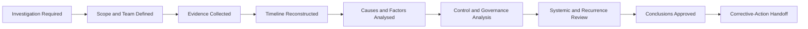

# AI Incident Investigation & Root-Cause Analysis

## Executive Summary

AI Incident Response & Recovery contains the immediate impact of an incident and restores the affected operation to an approved state.

AI Incident Investigation & Root-Cause Analysis determines what happened, why it happened, which conditions contributed, and what must change to reduce recurrence.

This artifact establishes a structured investigation method for incidents involving the Megastar Intelligent Processor (MIP) and other governed AI systems. It covers investigation planning, evidence review, timeline reconstruction, causal analysis, control and governance analysis, systemic-pattern review, and approved investigation conclusions.

It does not implement corrective actions, verify remediation, approve permanent changes, accept residual risk, or close the incident.

---

## Purpose

The purpose of this document is to establish a consistent and evidence-based approach for investigating AI incidents and determining root cause.

The process enables Megastar Mortgage to:

- define the investigation scope;
- assign appropriate investigators;
- preserve independence and objectivity;
- reconstruct the incident timeline;
- evaluate technical, data, human, process, control, provider, change, and governance factors;
- distinguish direct cause from contributing and systemic causes;
- assess why existing controls and monitoring did not prevent or detect the incident earlier;
- identify recurrence risk;
- produce supported investigation conclusions;
- recommend required governance actions; and
- update the Enterprise AI Incident Register.

---

## Scope

This process applies to confirmed AI incidents requiring formal investigation.

The investigation may cover:

- AI system behaviour;
- model or service performance;
- prompts, rules, configurations, and workflows;
- operational and reference data;
- human review and oversight;
- technical and governance controls;
- third-party providers and subprocessors;
- system or provider changes;
- monitoring and alerting;
- business-process execution;
- legal, privacy, security, and contractual obligations; and
- related incidents, findings, or corrective actions.

The investigation scope shall be proportionate to incident severity, complexity, recurrence, and potential consequence.

---

## Investigation Boundary

### This process owns

- investigation planning;
- investigation scope;
- evidence analysis;
- timeline reconstruction;
- cause analysis;
- contributing-factor analysis;
- control-failure analysis;
- provider-contribution analysis;
- human-factor analysis;
- change-contribution analysis;
- monitoring-gap analysis;
- systemic-cause analysis;
- recurrence assessment;
- investigation conclusions; and
- recommendations for downstream action.

### This process does not own

- incident triage;
- final severity methodology;
- containment;
- operational recovery;
- corrective-action implementation;
- change approval;
- assurance testing;
- residual-risk acceptance; or
- incident closure.

---

## Investigation Lifecycle

Investigation may begin while containment and recovery are still underway, provided evidence integrity and operational safety are maintained.

---

## Investigation Principles

Megastar Mortgage conducts AI incident investigations according to the following principles:

- Conclusions shall be based on evidence.
- Facts, assumptions, hypotheses, and confirmed findings shall remain distinguishable.
- Investigation scope shall include non-technical causes where relevant.
- Human error shall not be treated as root cause without examining process, control, workload, training, interface, and governance conditions.
- Provider involvement shall be evaluated independently of provider explanations.
- Investigation shall consider why preventive, detective, and corrective controls did not operate as intended.
- Missing or unreliable evidence shall be documented.
- Root cause shall be supported by a clear causal link to the incident.
- Multiple root causes may be recorded where supported.
- Recommendations shall address causes rather than symptoms.
- Investigation conclusions shall not assign disciplinary accountability unless owned by an authorized enterprise process.
- Material new information shall trigger incident severity or scope review where required.

---

## Investigation Initiation

An investigation shall begin when:

- the incident has been confirmed;
- an Incident Owner is assigned;
- immediate evidence-preservation requirements are addressed;
- an Investigation Lead is appointed;
- the initial investigation scope is approved; and
- relevant specialist functions are identified.

High and Critical incidents may require an independent or cross-functional Investigation Lead.

---

## Investigation Scope

The investigation scope shall define:

- incident and AI systems covered;
- business processes covered;
- time period;
- affected users, customers, employees, or providers;
- relevant models, services, versions, and environments;
- data sources and data flows;
- controls and human-oversight activities;
- provider and subprocessor involvement;
- relevant changes;
- relevant monitoring signals;
- investigation questions;
- known exclusions;
- dependencies; and
- expected completion date.

Scope changes shall be documented and approved.

---

## Investigation Roles

| Role | Responsibility |
|---|---|
| Investigation Lead | Directs the investigation and approves the analytical approach. |
| Incident Owner | Maintains lifecycle accountability and ensures access to required information. |
| AI System Owner | Provides business and system context. |
| Technical Investigator | Reviews architecture, configuration, logs, integrations, and system behaviour. |
| Data Specialist | Reviews data quality, lineage, processing, and data-related factors. |
| Control Owner | Provides control design and execution evidence. |
| Human-Oversight or Operations Representative | Provides workflow, reviewer, workload, and process context. |
| Third-Party Relationship Owner | Coordinates provider evidence and response. |
| Privacy, Security, or Legal & Compliance | Leads domain-specific investigation where applicable. |
| Assurance Function | Provides independent review or validation where required. |

Investigators shall disclose material conflicts of interest.

---

## Investigation Questions

The investigation should answer:

1. What happened?
2. When did it begin and when was it detected?
3. Which systems, data, users, processes, controls, and providers were affected?
4. What was the actual and potential impact?
5. What directly caused the incident?
6. Which factors allowed the cause to produce the incident?
7. Which controls failed, were missing, were bypassed, or were not applicable?
8. Did human oversight contribute?
9. Did a provider or subprocessor contribute?
10. Did a system, model, data, configuration, prompt, process, or policy change contribute?
11. Why was the incident not prevented or detected earlier?
12. Is the condition isolated, recurring, or systemic?
13. What actions are required to reduce recurrence?

---

## Evidence Collection and Review

Evidence may include:

- system and workflow logs;
- prompts and outputs;
- model or service versions;
- configuration records;
- access records;
- input and output data;
- data-lineage records;
- human-review records;
- control evidence;
- monitoring alerts;
- incident and service tickets;
- change records;
- provider reports and communications;
- assurance findings;
- policies and procedures;
- training records;
- interviews;
- customer or employee complaints;
- approvals and decision records; and
- recovery evidence.

For each evidence item, the investigation shall record:

- source;
- owner;
- date and time;
- relevance;
- integrity or reliability;
- access restrictions; and
- evidence reference.

---

## Evidence Limitations

The investigation shall disclose material limitations, including:

- missing logs;
- incomplete records;
- unavailable provider evidence;
- overwritten data;
- unreliable timestamps;
- conflicting accounts;
- inaccessible systems;
- insufficient data lineage;
- unavailable model detail;
- legal or contractual access restrictions; and
- incomplete historical information.

Where evidence is insufficient, the investigation conclusion shall state whether it is:

- Confirmed;
- Probable;
- Possible;
- Unsupported; or
- Unable to Conclude.

---

## Timeline Reconstruction

The investigation shall reconstruct material events from the earliest relevant condition through detection, response, recovery, and subsequent developments.

The timeline should identify:

- triggering event;
- system or provider changes;
- user actions;
- control execution or failure;
- monitoring signals;
- first affected output or transaction;
- detection;
- escalation;
- containment;
- recovery actions; and
- material decisions.

The timeline shall distinguish confirmed timestamps from estimated timestamps.

---

## Cause Structure

The investigation shall distinguish among the following.

### Direct Cause

The event or condition that immediately produced the incident.

### Contributing Factors

Conditions that increased the likelihood, scale, duration, or impact of the incident.

### Root Cause

The underlying condition that, if appropriately addressed, would materially reduce recurrence.

### Systemic Cause

A broader organizational, process, control, governance, provider, or operating-model weakness affecting more than the immediate incident.

### Detection Cause

The reason the incident was not identified earlier or was not escalated appropriately.

An incident may have more than one supported root or systemic cause.

---

## Causal Analysis Domains

### Technology and Model

Consider:

- model defect or degradation;
- incorrect configuration;
- integration failure;
- software defect;
- service instability;
- access failure;
- capacity constraint;
- version mismatch;
- prompt or rule failure;
- insufficient testing; and
- technical dependency failure.

### Data

Consider:

- inaccurate, incomplete, stale, or corrupted data;
- data drift;
- missing lineage;
- unauthorized data;
- inappropriate labels;
- data-transformation failure;
- field ambiguity;
- document-layout variation;
- retention or deletion failure; and
- provider-controlled data limitations.

### Human and Process

Consider:

- missed review;
- incorrect override;
- unclear procedure;
- excessive workload;
- inadequate training;
- poor interface design;
- inappropriate incentive;
- unclear ownership;
- escalation failure;
- staffing constraint; and
- process deviation.

### Controls

Consider:

- missing control;
- poor control design;
- incomplete implementation;
- failed execution;
- control circumvention;
- missing evidence;
- inadequate frequency;
- unclear ownership;
- ineffective dependency; and
- monitoring failure.

### Provider and Dependency

Consider:

- provider service failure;
- inadequate notification;
- provider model change;
- subprocessor failure;
- incomplete assurance;
- contractual gap;
- weak support;
- concentration;
- limited transparency; and
- poor recovery capability.

### Change

Consider:

- unauthorized change;
- emergency change;
- incomplete impact assessment;
- inadequate testing;
- failed deployment;
- incomplete rollback;
- undocumented configuration change;
- provider change; and
- control or process change.

### Governance

Consider:

- unclear decision rights;
- incomplete risk assessment;
- missing approved-use boundary;
- inadequate policy;
- weak oversight;
- delayed escalation;
- insufficient resources;
- unresolved prior finding;
- poor accountability;
- inadequate provider governance; and
- ineffective governance communication.

### Monitoring and Detection

Consider:

- missing indicator;
- inappropriate threshold;
- unreliable data;
- delayed reporting;
- alert not reviewed;
- alert fatigue;
- insufficient segmentation;
- unmonitored dependency;
- control-health blind spot; and
- repeated warning not escalated.

---

## Root-Cause Methods

The investigation may use one or more methods appropriate to the incident:

- Five Whys;
- causal-factor charting;
- fault-tree analysis;
- fishbone analysis;
- barrier analysis;
- event and causal-factor analysis;
- change analysis;
- comparative case analysis; or
- another approved method.

The method shall support, not replace, evidence-based judgment.

---

## Control Analysis

The investigation shall determine whether any relevant control:

- prevented part of the impact;
- detected the incident;
- operated too late;
- operated partially;
- failed;
- was bypassed;
- was missing;
- was poorly designed;
- lacked evidence;
- had unclear ownership; or
- depended on another failed control or provider.

A control-related investigation conclusion is not a formal assurance opinion.

Where independent effectiveness evaluation is required, the matter shall be handed to AI Assurance.

---

## Human-Factor Analysis

Where human action contributed, the investigation shall consider:

- role clarity;
- training;
- competence;
- workload;
- staffing;
- time pressure;
- interface design;
- instructions;
- escalation paths;
- automation bias;
- overreliance on confidence scores;
- override design;
- quality review; and
- management expectations.

The investigation shall avoid treating “human error” as a complete root cause without examining the conditions that shaped the action.

---

## Provider Analysis

Where a provider contributed, the investigation shall evaluate:

- service or model failure;
- notification timing;
- evidence quality;
- provider transparency;
- subprocessor involvement;
- contract obligations;
- assurance evidence;
- change communication;
- support responsiveness;
- recovery performance; and
- prior similar events.

Provider conclusions shall be handed to Third-Party AI Governance where relationship action is required.

---

## Change Analysis

The investigation shall determine whether a change contributed to the incident.

Relevant changes may include:

- model version;
- service release;
- prompt or rule;
- data source;
- workflow;
- threshold;
- access;
- control;
- provider;
- infrastructure;
- business process; or
- policy.

Where material change weaknesses are identified, the matter shall be handed to AI Change Management.

---

## Monitoring and Detection Analysis

The investigation shall determine:

- whether indicators existed;
- whether thresholds were appropriate;
- whether alerts occurred;
- whether alerts were reviewed;
- whether escalation was timely;
- whether data was reliable;
- whether segmentation concealed the condition;
- whether earlier warning signs existed; and
- whether enhanced monitoring is required.

Monitoring improvements shall be handed to Continuous Monitoring.

---

## Recurrence and Systemic Review

The investigation shall compare the incident with:

- prior incidents;
- monitoring findings;
- assurance findings;
- control exceptions;
- provider issues;
- complaints;
- change failures;
- overdue corrective actions; and
- known risk records.

The incident may be classified as:

- Isolated;
- Repeated;
- Persistent; or
- Systemic.

Repeated or systemic incidents shall trigger broader governance review.

---

## Investigation Conclusions

The investigation conclusion shall identify:

- confirmed facts;
- unresolved facts;
- direct cause;
- root cause or causes;
- contributing factors;
- systemic causes;
- affected controls;
- provider contribution;
- human contribution;
- change contribution;
- monitoring contribution;
- recurrence classification;
- evidence limitations;
- confidence level; and
- required downstream actions.

Conclusions shall be concise, supported, and traceable.

---

## Recommendation Boundary

The investigation may recommend:

- control repair or redesign;
- risk reassessment;
- provider remediation;
- model, data, system, or process change;
- monitoring enhancement;
- training;
- policy update;
- approved-use restriction;
- assurance activity;
- broader thematic review; or
- governance escalation.

Recommendations do not constitute approval or implementation.

---

## Cross-Capability Handoffs

| Investigation Conclusion | Receiving Capability |
|---|---|
| New or materially changed AI risk | AI Risk Management |
| Missing, failed, or weak control | AI Controls |
| Independent validation or retesting required | AI Assurance |
| Provider cause or obligation failure | Third-Party AI Governance |
| Monitoring or detection weakness | Continuous Monitoring |
| Material corrective change required | AI Change Management |
| AI-system reassessment required | AI Inventory & Assessment |
| Executive, policy, exception, or residual-risk decision | Governance Oversight & Continual Improvement |
| Regulatory or framework impact | Framework Alignment |

---

## Enterprise AI Incident Register Updates

The investigation shall update, where applicable:

- Investigation Status;
- Investigation Reference;
- Root-Cause Analysis Reference;
- Root Cause Status;
- Primary Root-Cause Category;
- Contributing Factors;
- Control Failure Identified;
- Human-Oversight Failure Identified;
- Provider Contribution Identified;
- Change-Related Cause;
- Monitoring Gap Identified;
- Recurrence Status;
- Related Risk IDs;
- Related Control IDs;
- Related Change IDs;
- Corrective-Action References; and
- Next Required Activity.

---

## Completion Criteria

The investigation stage is complete when:

- investigation scope is approved;
- required evidence has been reviewed;
- material evidence limitations are documented;
- the incident timeline is reconstructed;
- direct cause is identified where possible;
- root and contributing causes are supported;
- control, human, provider, change, governance, and monitoring factors are assessed;
- recurrence status is determined;
- investigation conclusions are approved;
- required recommendations and handoffs are recorded;
- the Enterprise AI Incident Register is updated; and
- corrective-action planning may begin.

---

## Related Artifacts

- Enterprise AI Incident Register
- AI Incident Response & Recovery
- AI Incident Corrective Action & Closure

---

## Document Control

| Field | Value |
|---|---|
| Document | AI Incident Investigation & Root-Cause Analysis |
| Capability | AI Incident Management |
| Repository | Enterprise AI Governance Playbook |
| Reference Organization | Megastar Mortgage |
| Reference AI System | Megastar Intelligent Processor (MIP) |
| Document Owner | AI Governance Lead |
| Version | 1.0 |
| Review Cycle | Annual |
| Status | Published Reference |

---

## Revision History

| Version | Date | Description |
|---|---|---|
| 1.0 | July 2026 | Initial release of the AI Incident Investigation & Root-Cause Analysis artifact. |