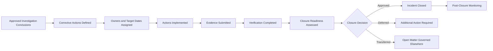

# AI Incident Corrective Action & Closure

## Executive Summary

AI Incident Investigation & Root-Cause Analysis determines what happened, why it happened, and which conditions contributed.

AI Incident Corrective Action & Closure converts those conclusions into accountable remediation and governs the final decision to close the incident.

This artifact establishes how Megastar Mortgage defines corrective actions, assigns ownership, tracks dependencies, verifies completion, assesses closure readiness, transfers unresolved matters to authoritative governance records, and approves formal closure for incidents involving the Megastar Intelligent Processor (MIP).

It does not redesign controls, approve material changes, perform independent assurance, accept residual risk, or make provider-continuation decisions. Those activities remain with their owning capabilities.

---

## Purpose

The purpose of this document is to establish a controlled process for completing incident remediation and closing AI incidents only when required governance conditions are satisfied.

It enables Megastar Mortgage to:

- convert approved investigation conclusions into actionable remediation;
- assign accountable owners and target dates;
- distinguish interim measures from permanent corrective actions;
- track dependencies, blockers, and overdue actions;
- define evidence and verification requirements;
- coordinate specialist-capability handoffs;
- determine whether unresolved matters can be transferred safely;
- assess closure readiness;
- approve, defer, or reopen incident closure;
- establish post-closure monitoring; and
- update the Enterprise AI Incident Register and related governance records.

---

## Scope

This process applies after:

- the incident has been confirmed;
- response and recovery activities are sufficiently complete;
- investigation conclusions are approved; and
- root causes or material contributing factors are documented, or the investigation has formally concluded that root cause cannot be determined.

It covers:

- corrective-action planning;
- remediation tracking;
- verification;
- closure-readiness assessment;
- closure approval;
- transfer of unresolved matters;
- reopening;
- post-closure monitoring; and
- authoritative record updates.

---

## Process Boundary

### This process owns

- corrective-action requirements;
- action ownership;
- target dates;
- priority;
- dependencies and blockers;
- remediation status;
- evidence requirements;
- verification planning;
- closure-readiness assessment;
- closure decision;
- transfer of unresolved matters;
- reopening criteria;
- post-closure monitoring handoff; and
- final incident-record updates.

### This process does not own

- root-cause analysis;
- enterprise risk analysis;
- control redesign or implementation;
- provider-contract action;
- material-change approval;
- independent assurance testing;
- residual-risk acceptance;
- management review; or
- strategic continual-improvement decisions.

---

## Corrective Action & Closure Lifecycle

---

## Corrective-Action Principles

Megastar Mortgage manages incident corrective actions according to the following principles:

- Every action shall address a documented root cause, contributing factor, control weakness, or closure requirement.
- Actions shall be specific, measurable, assigned, time-bound, and traceable.
- Interim containment shall not be represented as permanent remediation.
- Reported completion shall remain distinct from verified completion.
- Actions requiring material system, model, data, provider, process, or control change shall follow AI Change Management.
- Actions requiring independent confirmation shall follow AI Assurance.
- Open matters may transfer only when the receiving capability accepts ownership and an authoritative record exists.
- Closure shall not remove unresolved exposure from governance records.
- Repeated or systemic incidents shall require broader remediation than the immediate event.
- Closure shall require evidence and approval.

---

## Corrective-Action Sources

Corrective actions may arise from:

- root-cause conclusions;
- contributing factors;
- control failures;
- monitoring gaps;
- provider failures;
- data-quality failures;
- human-oversight weaknesses;
- process weaknesses;
- unauthorized or failed changes;
- recovery limitations;
- notification failures;
- policy or governance weaknesses; and
- recurrence or systemic-pattern analysis.

---

## Corrective-Action Record

Each corrective action shall contain:

| Field | Purpose |
|---|---|
| Action ID | Unique action reference. |
| Incident ID | Links the action to the incident. |
| Source Conclusion | Links the action to the root cause, factor, or closure requirement. |
| Action Description | Defines the required remediation. |
| Action Type | Classifies the remediation. |
| Action Owner | Accountable owner. |
| Priority | Establishes urgency. |
| Target Date | Sets expected completion. |
| Dependency | Identifies prerequisite work. |
| Interim Measure | Records temporary protection where applicable. |
| Evidence Required | Defines proof of completion. |
| Verification Required | Identifies whether validation is necessary. |
| Verification Owner | Assigns validation responsibility. |
| Current Status | Records action progress. |
| Escalation Trigger | Defines when delay or failure requires escalation. |
| Completion Date | Records reported completion. |
| Verification Date | Records validated completion. |

---

## Corrective-Action Types

Corrective actions may include:

- control repair;
- control redesign;
- new control implementation;
- model or configuration change;
- data remediation;
- workflow change;
- human-oversight improvement;
- access or security change;
- provider remediation;
- contract remediation;
- monitoring enhancement;
- threshold recalibration;
- training;
- procedure update;
- policy update;
- ownership clarification;
- capacity improvement;
- approved-use restriction;
- system reassessment;
- provider replacement;
- retirement; or
- another approved remediation.

---

## Action Status

| Status | Meaning |
|---|---|
| Planned | Action is defined but not yet started. |
| In Progress | Implementation is underway. |
| Blocked | Progress is prevented by a documented dependency. |
| Overdue | Target date has passed without approved completion. |
| Completed Pending Verification | Owner reports completion; verification remains outstanding. |
| Verified | Completion has been validated satisfactorily. |
| Transferred | Responsibility has moved to an accepted authoritative record. |
| Cancelled | Action is no longer required, with approved rationale. |

An action shall not move directly from In Progress to Closed without required evidence and verification.

---

## Action Prioritization

Corrective-action priority should consider:

- incident severity;
- ongoing exposure;
- root-cause significance;
- affected AI-system impact;
- control criticality;
- provider criticality;
- regulatory or contractual obligation;
- recurrence risk;
- dependency on the action for safe operation;
- interim-measure strength; and
- potential consequence of delay.

Priority shall not replace formal enterprise risk scoring.

---

## Dependencies and Blockers

Each material dependency or blocker shall identify:

- description;
- responsible owner;
- affected action;
- effect on target date;
- interim mitigation;
- escalation requirement; and
- revised date, where approved.

High or Critical incidents shall not remain blocked without documented governance escalation.

---

## Evidence Requirements

Completion evidence may include:

- approved change record;
- implementation evidence;
- updated configuration;
- control documentation;
- system logs;
- test results;
- provider confirmation;
- contract amendment;
- training completion;
- policy approval;
- updated procedure;
- monitoring result;
- assurance report;
- access review;
- data-validation result; or
- another authoritative record.

Evidence shall be traceable, current, and proportionate to the action.

---

## Verification

Verification confirms whether the action was completed as required and whether the relevant incident condition has been addressed sufficiently for closure consideration.

Verification may include:

- evidence review;
- functional testing;
- control-operation review;
- output-quality review;
- data validation;
- provider-evidence review;
- repeated-period monitoring;
- change verification;
- assurance testing;
- user or process confirmation; or
- another approved validation method.

Verification depth shall reflect:

- incident severity;
- action significance;
- control criticality;
- independence needs;
- recurrence risk; and
- regulatory or contractual requirements.

---

## Verification Outcomes

| Outcome | Meaning |
|---|---|
| Satisfactory | Action and evidence meet the approved requirement. |
| Partially Satisfactory | Some requirements are met, but further work is required. |
| Unsatisfactory | Action does not address the approved requirement adequately. |
| Unable to Conclude | Evidence is insufficient to determine completion. |

Only Satisfactory verification supports closure for actions requiring validation.

---

## Specialist Handoffs

Corrective actions may require formal transfer to another capability.

| Required Response | Receiving Capability |
|---|---|
| Risk reassessment or treatment | AI Risk Management |
| Control repair, redesign, or implementation | AI Controls |
| Independent verification or retesting | AI Assurance |
| Provider remediation, restriction, or exit review | Third-Party AI Governance |
| Ongoing monitoring or recurrence tracking | Continuous Monitoring |
| Material system, model, data, provider, process, or control change | AI Change Management |
| AI-system reassessment or approved-use review | AI Inventory & Assessment |
| Executive, exception, policy, or residual-risk decision | Governance Oversight & Continual Improvement |
| Regulatory or framework update | Framework Alignment |

A handoff is complete only when:

- the receiving capability accepts ownership;
- a receiving record exists;
- an owner and target date are assigned; and
- the incident record links to the receiving reference.

---

## Closure Readiness

An incident is ready for closure review when:

- immediate containment is complete;
- recovery outcome is approved;
- investigation is complete or formally concluded;
- root cause and contributing factors are documented where determinable;
- required notifications are completed or formally governed;
- required corrective actions are verified or formally transferred;
- open High or Critical matters remain governed through authoritative records;
- required risk, control, provider, change, inventory, and monitoring records are updated;
- post-closure monitoring is defined where required;
- no unresolved blocker prevents closure; and
- sufficient evidence supports the decision.

---

## Closure Outcomes

| Closure Outcome | Meaning |
|---|---|
| Closed — Resolved | Required remediation and verification are complete. |
| Closed — Transferred | Remaining matters are formally governed through accepted authoritative records. |
| Closed with Ongoing Monitoring | Immediate closure criteria are met, but recurrence monitoring continues. |
| Closure Deferred | Required action, evidence, verification, notification, or decision remains incomplete. |
| Reopened | The incident recurred, new material evidence emerged, or prior closure was not sustained. |
| Cancelled | The record was determined not to qualify as an AI incident through an approved process. |

---

## Closure Decision

The closure decision shall identify:

- closure outcome;
- closure rationale;
- closure authority;
- closure date;
- unresolved matters;
- receiving records;
- post-closure monitoring;
- recurrence review date;
- retention requirements; and
- conditions for reopening.

Closure shall not imply that all related enterprise risks have been eliminated.

---

## Conditions Requiring Closure Deferral

Closure shall be deferred where:

- containment remains incomplete;
- recovery is not approved;
- investigation remains materially incomplete;
- required notifications are unresolved;
- a Critical corrective action is open;
- required verification is unsatisfactory;
- material evidence is unavailable;
- an unresolved decision lacks an accountable authority;
- related governance records remain materially inaccurate; or
- the organization cannot demonstrate that the incident condition is controlled.

---

## Reopening Criteria

A closed incident may be reopened when:

- the incident recurs;
- the corrective action fails;
- post-closure monitoring shows renewed deterioration;
- new evidence changes the investigation conclusion;
- provider information materially changes;
- a transferred matter is not governed as agreed;
- closure evidence is found insufficient; or
- a regulator, auditor, or governance authority requires renewed review.

Reopening shall retain the original Incident ID.

---

## Post-Closure Monitoring

Post-closure monitoring may be required to confirm that remediation remains effective and recurrence does not emerge.

The monitoring requirement shall define:

- monitored condition;
- related metric or indicator;
- owner;
- frequency;
- duration;
- threshold;
- escalation trigger;
- review date; and
- monitoring record reference.

Continuous Monitoring owns ongoing indicator governance.

---

## Enterprise AI Incident Register Updates

Closure activities shall update, where applicable:

- Corrective-Action Status;
- Corrective-Action References;
- Reported Completion Date;
- Verification Status;
- Verification Reference;
- Closure Readiness;
- Closure Decision;
- Closure Rationale;
- Closure Authority;
- Closure Date;
- Closure Evidence Reference;
- Lessons-Learned Reference;
- Ongoing Monitoring Required;
- Authoritative Record Retaining Open Matter;
- Record Retention Date; and
- Incident Status.

---

## Related Governance Record Updates

Closure may require updates to:

### Enterprise AI System Inventory

- approved-use status;
- lifecycle status;
- restriction or suspension;
- reassessment status;
- incident reference.

### Enterprise AI Risk Register

- incident reference;
- current risk condition;
- treatment status;
- residual-risk review requirement;
- open action status.

### Enterprise AI Control Register

- control weakness;
- improvement action;
- implementation status;
- assurance status;
- monitoring requirement.

### Enterprise Third-Party AI Register

- provider incident status;
- corrective-action status;
- continuation or exit review;
- provider monitoring status.

### Continuous Monitoring Records

- recurrence indicator;
- enhanced monitoring;
- threshold status;
- corrective-action follow-up.

### AI Change Records

- corrective change status;
- implementation status;
- verification status.

---

## Completion Criteria

This stage is complete when:

- required corrective actions are defined;
- owners, priorities, and dates are assigned;
- blockers and dependencies are governed;
- required evidence is available;
- verification is complete where required;
- specialist handoffs are accepted;
- closure readiness is assessed;
- closure outcome is approved;
- related governance records are updated;
- post-closure monitoring is established where required; and
- the Enterprise AI Incident Register reflects the final status.

---

## Related Artifacts

- AI Incident Investigation & Root-Cause Analysis
- Enterprise AI Incident Register
- AI Incident Management Summary

---

## Document Control

| Field | Value |
|---|---|
| Document | AI Incident Corrective Action & Closure |
| Capability | AI Incident Management |
| Repository | Enterprise AI Governance Playbook |
| Reference Organization | Megastar Mortgage |
| Reference AI System | Megastar Intelligent Processor (MIP) |
| Document Owner | AI Governance Lead |
| Version | 1.0 |
| Review Cycle | Annual |
| Status | Published Reference |

---

## Revision History

| Version | Date | Description |
|---|---|---|
| 1.0 | July 2026 | Initial release of the AI Incident Corrective Action & Closure artifact. |