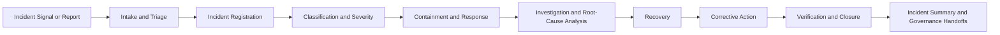

# AI Incident Management

## Document Control

| Field | Value |
|---|---|
| Document Name | AI Incident Management |
| Capability | AI Incident Management |
| Repository | Enterprise AI Governance Playbook |
| Reference Organization | Megastar Mortgage |
| Reference AI System | Megastar Intelligent Processor (MIP) |
| Document Owner | AI Governance Lead |
| Version | 1.0 |
| Classification | Public Reference Implementation |
| Status | Published |
| Review Cycle | Annual |
| Last Updated | July 2026 |

---

# Executive Summary

Continuous Monitoring identifies abnormal conditions, threshold breaches, control deterioration, provider concerns, and potential incident signals.

AI Incident Management governs what happens when an event may have caused, or could reasonably cause, material harm, disruption, control failure, unauthorized activity, regulatory exposure, or unacceptable AI behaviour.

This capability establishes how Megastar Mortgage records, triages, classifies, contains, investigates, resolves, and closes incidents involving the Megastar Intelligent Processor (MIP) and related AI systems.

It creates a consistent lifecycle for:

- incident reporting;
- initial triage;
- severity classification;
- containment;
- response coordination;
- investigation;
- root-cause analysis;
- recovery;
- corrective action;
- communication;
- evidence preservation;
- regulatory and contractual escalation;
- closure; and
- post-incident learning.

AI Incident Management does not replace enterprise cybersecurity, privacy, business continuity, legal, compliance, technology, or operational incident processes. It coordinates the AI-specific governance dimensions of the event and links them to the appropriate enterprise response mechanisms.

---

# Purpose

The purpose of this capability is to establish a controlled and auditable approach for managing AI-related incidents from initial detection through verified closure.

This capability defines:

- what qualifies as an AI incident;
- how potential incidents are reported and recorded;
- how incidents are triaged and classified;
- how severity is determined;
- how containment and recovery are coordinated;
- how evidence is preserved;
- how investigation and root-cause analysis are performed;
- how affected stakeholders and governance functions are engaged;
- how regulatory, contractual, privacy, security, and provider obligations are addressed;
- how corrective actions are assigned and tracked;
- how closure readiness is determined;
- how recurring or systemic incident themes are identified; and
- how incident outcomes update relevant governance records.

The capability ensures that material AI events do not remain fragmented across operational queues, monitoring alerts, provider notifications, control records, or informal discussions.

---

# Capability Scope

AI Incident Management applies to events involving governed AI systems, models, services, data, controls, providers, users, or dependent business processes.

Examples may include:

- materially incorrect or harmful AI outputs;
- unauthorized AI use;
- use outside approved scope;
- privacy or confidentiality breaches;
- security incidents affecting AI systems;
- material model-performance failure;
- control failure;
- human-oversight breakdown;
- inappropriate autonomous action;
- material data-quality failure;
- bias or discriminatory outcome;
- unexplained or untraceable output;
- provider-originated incident;
- unapproved model, service, prompt, data, or configuration change;
- prolonged service disruption;
- failure to meet regulatory or contractual obligations;
- evidence loss;
- repeated near misses;
- or another event requiring coordinated AI governance response.

This capability does not independently own:

- enterprise cybersecurity response;
- privacy-breach response;
- legal investigation;
- business-continuity execution;
- technology recovery;
- provider contract enforcement;
- risk reprioritization;
- control redesign;
- change approval;
- residual-risk acceptance; or
- management review.

Those activities remain with their accountable enterprise functions and governance capabilities.

---

# Governance Artifacts

| Governance Artifact | Purpose |
|---|---|
| AI Incident Management Framework | Defines the incident-management operating model, roles, lifecycle, decision rights, and cross-functional coordination. |
| Enterprise AI Incident Register | Maintains the authoritative living record of AI incidents and their current lifecycle status. |
| AI Incident Intake & Triage | Captures the initial event, validates scope, identifies immediate risk, and determines whether formal incident management is required. |
| AI Incident Classification & Severity | Establishes incident category, severity, urgency, escalation level, and response expectations. |
| AI Incident Response & Recovery | Coordinates containment, stabilization, communication, recovery, and return-to-service decisions. |
| AI Incident Investigation & Root-Cause Analysis | Determines what happened, why it happened, contributing conditions, affected controls, and recurrence drivers. |
| AI Incident Corrective Action & Closure | Tracks remediation, verifies closure criteria, updates governance records, and confirms formal incident closure. |
| AI Incident Management Summary | Consolidates the incident position, recurring themes, open actions, systemic concerns, and governance handoffs. |

Together, these artifacts establish the complete lifecycle for AI-specific incident governance.

---

# Incident Management Lifecycle

The lifecycle may accelerate for Critical incidents, but required evidence, ownership, and approvals shall remain traceable.

---

# Incident Management Principles

Megastar Mortgage manages AI incidents according to the following principles:

- Potential incidents shall be reported promptly.
- Immediate harm reduction takes priority over administrative completeness.
- Every formal AI incident shall be recorded in the Enterprise AI Incident Register.
- Incident severity shall reflect impact, scale, urgency, recurrence, and regulatory significance.
- Incident classification shall remain distinct from enterprise risk priority and monitoring-finding severity.
- Evidence shall be preserved before it is altered, deleted, or overwritten.
- Containment shall not be treated as final resolution.
- Recovery shall not occur without appropriate validation.
- Root-cause analysis shall distinguish direct cause, contributing factors, control failures, process weaknesses, and systemic conditions.
- Provider involvement shall not transfer Megastar Mortgage’s accountability.
- Corrective actions shall have accountable owners, target dates, and verification requirements.
- Reported remediation shall not equal verified closure.
- Material incidents shall update affected system, risk, control, provider, and change records.
- Repeated incidents shall be assessed for broader governance weakness.
- Incident closure shall require evidence and appropriate approval.
- Post-incident learning shall inform governance improvement without weakening accountability.

---

# Incident Sources

AI incidents may be identified through:

- Continuous Monitoring;
- monitoring findings;
- user reports;
- employee escalation;
- customer complaints;
- human-review activity;
- quality assurance;
- control monitoring;
- AI Assurance;
- security monitoring;
- privacy monitoring;
- provider notification;
- system logs;
- service-management records;
- change implementation;
- model-performance review;
- audit;
- regulator inquiry;
- legal escalation; or
- external intelligence.

A monitoring alert or near miss does not automatically become a formal incident. Intake and triage determine whether the event meets the incident threshold.

---

# Incident Categories

Incidents may be classified under one or more categories:

- Model Performance
- Data Quality
- Fairness & Bias
- Transparency & Explainability
- Human Oversight
- Privacy
- Security
- Reliability & Resilience
- Unauthorized Use
- Approved-Use Deviation
- Control Failure
- Provider or Third-Party
- Regulatory & Compliance
- Operational Disruption
- Change-Related
- Records or Evidence Failure
- Other AI Governance Incident

One primary category shall be selected, with secondary categories used where relevant.

---

# Incident Severity

AI incidents shall use a defined severity model.

| Severity | Meaning |
|---|---|
| Low | Limited impact, contained locally, with no material stakeholder, regulatory, or operational consequence. |
| Moderate | Material but manageable impact requiring formal action and coordinated resolution. |
| High | Significant impact, broad exposure, important control failure, or major operational, customer, privacy, security, provider, or compliance consequence. |
| Critical | Severe, systemic, potentially unacceptable, or rapidly escalating impact requiring immediate executive and cross-functional intervention. |

Severity assessment may consider:

- actual and potential harm;
- affected stakeholders;
- transaction or system scale;
- data sensitivity;
- financial impact;
- customer impact;
- operational disruption;
- regulatory exposure;
- privacy or security impact;
- provider criticality;
- control failure;
- recurrence;
- detectability;
- containment difficulty; and
- reputational significance.

Incident severity shall not replace formal enterprise risk scoring.

---

# Enterprise AI Incident Register

The Enterprise AI Incident Register is the authoritative living record for formal AI incidents.

It may contain:

- Incident ID;
- Incident Title;
- Related AI System Inventory ID;
- Related Third-Party Relationship ID;
- Incident Category;
- Severity;
- Detection Source;
- Detection Date;
- Occurrence Date;
- Triage Status;
- Containment Status;
- Investigation Status;
- Recovery Status;
- Root Cause;
- Related Risk IDs;
- Related Control IDs;
- Related Change IDs;
- Corrective Actions;
- Regulatory or Contractual Notification Status;
- Current Owner;
- Escalation Status;
- Closure Status;
- Closure Date; and
- supporting evidence references.

A separate register is justified because an AI incident is a distinct governed object with its own lifecycle, ownership, evidence, escalation, and closure requirements.

---

# Intake and Triage

Incident intake establishes the minimum facts required for immediate governance action.

Triage determines:

- whether the event involves a governed AI system;
- whether immediate containment is required;
- whether the event meets the AI-incident threshold;
- which enterprise response functions must be engaged;
- whether the provider must be notified or involved;
- whether legal, privacy, security, compliance, or regulatory escalation is required;
- whether service restriction or suspension is necessary; and
- what evidence must be preserved immediately.

Triage shall not delay urgent containment.

---

# Containment and Response

Containment seeks to limit further harm while preserving evidence and operational control.

Possible actions include:

- restrict or suspend AI use;
- reduce automation;
- increase human review;
- block affected transactions;
- revoke access;
- isolate systems;
- disable integrations;
- revert a model or configuration;
- stop affected data flows;
- activate manual fallback;
- notify the provider;
- preserve logs and records;
- initiate business-continuity measures; or
- engage specialist enterprise response teams.

Temporary containment shall be documented and reviewed until a stable recovery state is approved.

---

# Investigation and Root-Cause Analysis

Investigation shall establish:

- what happened;
- when it happened;
- how it was detected;
- what systems, data, users, customers, providers, or processes were affected;
- the actual and potential consequences;
- the direct cause;
- contributing factors;
- control failures or gaps;
- human-oversight conditions;
- change-related factors;
- provider-related factors;
- monitoring or detection weaknesses;
- why existing governance did not prevent or detect the event earlier; and
- what must change to reduce recurrence.

Root cause shall not be limited to the final technical failure where process, governance, ownership, control, provider, or operating-model weaknesses contributed.

---

# Recovery and Return to Service

Recovery confirms that affected operations may resume safely.

Return-to-service decisions may require confirmation that:

- immediate harm is contained;
- critical defects are corrected;
- required controls are restored;
- affected data is validated;
- access is appropriate;
- provider actions are complete;
- temporary restrictions are documented;
- required testing is complete;
- stakeholders are informed;
- monitoring is enhanced where required;
- rollback remains available where appropriate; and
- accountable authorities approve resumed operation.

Recovery does not automatically close the incident.

---

# Corrective Action and Closure

Corrective actions may address:

- control repair or redesign;
- process improvement;
- model or configuration change;
- data remediation;
- access change;
- provider remediation;
- policy update;
- training;
- monitoring improvement;
- assurance retesting;
- approved-use restriction;
- risk reassessment; or
- governance escalation.

Closure requires:

- containment completed;
- investigation completed;
- root cause documented;
- required notifications completed;
- recovery confirmed;
- corrective actions completed or formally transferred;
- required verification performed;
- related governance records updated;
- residual matters assigned;
- recurrence monitoring established where needed; and
- closure approved by the appropriate authority.

---

# Cross-Capability Handoffs

| Incident Matter | Capability Owner |
|---|---|
| AI-system reassessment or approved-use review | AI Inventory & Assessment |
| New or materially changed risk | AI Risk Management |
| Missing, failed, or inadequate control | AI Controls |
| Independent testing or remediation verification | AI Assurance |
| Provider-originated incident or obligation breach | Third-Party AI Governance |
| Ongoing indicator, threshold, or recurrence monitoring | Continuous Monitoring |
| Material system, model, data, prompt, provider, control, or policy change | AI Change Management |
| Executive, policy, exception, or residual-risk decision | Governance Oversight & Continual Improvement |
| Regulatory or framework-mapping update | Framework Alignment |

AI Incident Management coordinates these handoffs but does not perform the specialist work owned by the receiving capability.

---

# Living Governance Record Updates

Incident outcomes may require updates to:

## Enterprise AI System Inventory

- current lifecycle status;
- approved-use status;
- restriction or suspension;
- reassessment status;
- provider dependency;
- incident reference; and
- last review date.

## Enterprise AI Risk Register

- incident reference;
- current risk condition;
- new or changed risk;
- control impact;
- response status;
- residual-risk review requirement; and
- escalation status.

## Enterprise AI Control Register

- incident reference;
- control failure or weakness;
- control-health status;
- improvement action;
- assurance requirement; and
- monitoring requirement.

## Enterprise Third-Party AI Register

- provider incident reference;
- notification performance;
- provider issue status;
- corrective-action status;
- continued-use review status; and
- escalation.

## Continuous Monitoring Records

- incident indicator status;
- recurring pattern;
- threshold recalibration requirement;
- enhanced monitoring;
- corrective-action tracking; and
- monitoring finding linkage.

---

# Capability Outcomes

Upon completion of this capability, Megastar Mortgage will have established:

- an approved AI Incident Management Framework;
- an Enterprise AI Incident Register;
- a consistent intake and triage process;
- an approved classification and severity model;
- defined containment and recovery requirements;
- a structured investigation and root-cause method;
- corrective-action and closure governance;
- traceable cross-capability handoffs;
- updated living governance records; and
- an AI Incident Management Summary.

---

# Why This Capability Matters

AI incidents may begin as small signals: an incorrect extraction, unexplained override, provider outage, access exception, unusual output, data anomaly, or missed review.

Without a defined incident-management capability, those signals may be addressed locally without preserving evidence, understanding wider impact, identifying root cause, or correcting the governance weakness that allowed the event to occur.

AI Incident Management ensures that material AI events are handled consistently, transparently, and accountably from detection through verified closure.

---

# Relationship to Other Capabilities

This capability receives inputs from:

- Continuous Monitoring;
- AI Assurance;
- Third-Party AI Governance;
- AI Controls; and
- operational, privacy, security, compliance, and provider channels.

It provides inputs to:

- AI Risk Management;
- AI Controls;
- AI Assurance;
- Third-Party AI Governance;
- AI Change Management;
- Governance Oversight & Continual Improvement; and
- Framework Alignment.

---

# Capability Completion Criteria

This capability is complete when:

- the AI Incident Management Framework is approved;
- the Enterprise AI Incident Register is established;
- intake and triage requirements are operational;
- incident categories and severity criteria are approved;
- containment and recovery responsibilities are defined;
- investigation and root-cause requirements are established;
- corrective-action and closure requirements are operational;
- cross-capability handoffs are defined;
- living governance record updates are integrated; and
- the AI Incident Management Summary is completed.

---

# Capability Completion Checklist

| Status | Deliverable |
|---|---|
| ☐ | AI Incident Management Framework completed |
| ☐ | Enterprise AI Incident Register established |
| ☐ | AI Incident Intake & Triage completed |
| ☐ | AI Incident Classification & Severity completed |
| ☐ | AI Incident Response & Recovery completed |
| ☐ | AI Incident Investigation & Root-Cause Analysis completed |
| ☐ | AI Incident Corrective Action & Closure completed |
| ☐ | AI Incident Management Summary completed |

---

# Next Capability

Following completion of AI Incident Management, Megastar Mortgage proceeds to **AI Change Management**.

Incident Management determines what happened and how the organization responded.

AI Change Management governs the controlled changes required to correct, improve, replace, or materially alter the affected AI system, model, data, control, provider relationship, or operating process.

---

# Related Capabilities

- AI Inventory & Assessment
- AI Risk Management
- AI Controls
- AI Assurance
- Third-Party AI Governance
- Continuous Monitoring
- AI Change Management
- Governance Oversight & Continual Improvement
- Framework Alignment

---

# Revision History

| Version | Date | Description |
|---|---|---|
| 1.0 | July 2026 | Initial release of the AI Incident Management capability. |