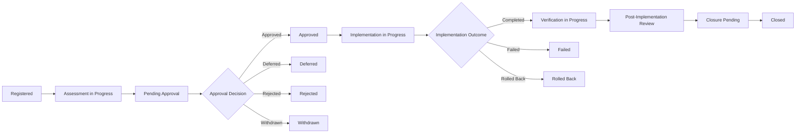

# Enterprise AI Change Register

## Executive Summary

The Enterprise AI Change Register is the authoritative living record for governed AI changes involving the Megastar Intelligent Processor (MIP) and other AI systems within Megastar Mortgage.

It tracks each governed change from registration through assessment, approval, implementation, verification, post-implementation review, and closure.

The register maintains the current status of the change and links it to the affected AI system, related risks, controls, providers, incidents, assurance findings, monitoring findings, implementation evidence, verification evidence, and governance decisions.

The register does not replace detailed change requests, impact assessments, approval records, implementation plans, validation records, emergency-change records, or post-implementation reviews. It records the current authoritative state and references those supporting artifacts.

---

## Purpose

The purpose of this document is to define the structure, ownership, lifecycle states, and minimum information requirements for the Enterprise AI Change Register.

The register enables Megastar Mortgage to:

- assign a unique identifier to every governed AI change;
- maintain one authoritative current-state record;
- track change ownership and lifecycle status;
- distinguish assessment, approval, implementation, verification, and closure;
- link changes to affected AI systems and governance records;
- preserve approval and decision history;
- identify delayed, failed, rolled-back, emergency, or unresolved changes;
- support portfolio reporting, audit, assurance, and governance oversight; and
- retain change history after closure.

---

## Register Scope

The Enterprise AI Change Register includes:

- proposed AI changes entering formal governance review;
- approved and conditionally approved changes;
- provider-initiated changes;
- emergency changes;
- corrective changes arising from incidents, assurance, monitoring, risks, or controls;
- changes that are deferred, rejected, withdrawn, cancelled, failed, or rolled back;
- retirement and replacement changes; and
- closed changes retained for historical traceability.

Routine administrative changes may remain outside this register only where documented criteria confirm that no material AI governance impact exists.

---

## Register Ownership

| Role | Responsibility |
|---|---|
| Register Owner | Maintains register structure, field standards, access, quality, and lifecycle rules. |
| Change Owner | Keeps the individual change record current from registration through closure. |
| AI System Owner | Confirms system, business, and approved-use information. |
| Technical Owner | Maintains technical implementation status and evidence references. |
| Verification Owner | Maintains verification and validation status. |
| AI Governance Lead | Oversees consistency, linkages, exceptions, and portfolio reporting. |
| Closure Authority | Approves formal change closure where required. |

The Change Owner is accountable for the completeness and timeliness of the individual change record.

---

## Register Lifecycle

Emergency changes may enter implementation through an accelerated route but remain subject to retrospective assessment, verification, review, and closure.

---

## Change Status Model

| Change Status | Meaning |
|---|---|
| Registered | A governed change record has been created. |
| Assessment in Progress | Materiality and impact assessment are underway. |
| Pending Approval | Required assessment is complete and an approval decision is pending. |
| Approved | The change may proceed according to approved scope and conditions. |
| Approved with Conditions | The change may proceed only after specified conditions are satisfied. |
| Deferred | Additional information, testing, consultation, or remediation is required. |
| Rejected | The change shall not proceed. |
| Withdrawn | The Change Owner has withdrawn the request. |
| Implementation Planned | Approved implementation has been scheduled. |
| Implementation in Progress | The change is being implemented. |
| Implemented | Implementation is complete and verification is pending. |
| Verification in Progress | Verification and validation are underway. |
| Verification Failed | The implemented change did not satisfy approved criteria. |
| Post-Implementation Review | Sustained outcome review is underway. |
| Closure Pending | Closure conditions are met and approval is pending. |
| Closed | Formal closure has been approved. |
| Failed | Implementation did not achieve the approved outcome. |
| Rolled Back | The prior approved state was restored. |
| Cancelled | The change record was terminated with documented rationale. |
| Superseded | The change was replaced by another approved change. |

The register shall preserve both current status and status history.

---

## Required Register Fields

### 1. Change Identification

| Field | Purpose |
|---|---|
| Change ID | Unique and permanent change identifier. |
| Change Title | Concise name of the proposed change. |
| Change Description | Brief factual summary of what is changing. |
| Change Category | Primary change category. |
| Secondary Categories | Additional relevant categories. |
| Change Classification | Standard, Normal, Major, Emergency, Provider-Initiated, or Retirement. |
| Change Source | Business, incident, assurance, monitoring, provider, risk, control, regulatory, or other source. |
| Registration Date | Date the change was entered into the register. |
| Requested Implementation Date | Proposed implementation date. |
| Current Change Status | Current lifecycle status. |

---

### 2. Affected AI Environment

| Field | Purpose |
|---|---|
| AI System Name | Affected governed AI system. |
| AI System Inventory ID | Link to the Enterprise AI System Inventory. |
| Business Process | Affected business process or workflow. |
| Business Function | Accountable business function. |
| Model or Service | Affected model, service, API, or external capability. |
| Current Version | Current approved version. |
| Proposed Version | Proposed new version, where applicable. |
| Deployment Environment | Production, test, development, or other environment. |
| Provider Relationship ID | Link to the relevant provider record. |
| Subprocessor or Fourth Party | Relevant downstream provider, where applicable. |
| Geographic or Jurisdictional Scope | Affected locations or jurisdictions. |

---

### 3. Change Ownership

| Field | Purpose |
|---|---|
| Change Owner | Accountable owner for the full change lifecycle. |
| AI System Owner | Business owner of the affected AI system. |
| Technical Owner | Owner of technical planning and implementation. |
| Business Process Owner | Owner of operational readiness and business impact. |
| Third-Party Relationship Owner | Provider owner, where applicable. |
| Verification Owner | Owner of verification and validation. |
| Approval Authority | Current approval authority. |
| Closure Authority | Authority required to approve closure. |

---

### 4. Materiality and Assessment

| Field | Purpose |
|---|---|
| Materiality Status | Not Assessed, Non-Material, Material, or Major. |
| Materiality Decision Date | Date materiality was determined. |
| Materiality Rationale | Concise rationale for the decision. |
| Impact Assessment Status | Not Started, In Progress, Complete, or Reassessment Required. |
| Risk Review Status | Current risk-review status. |
| Control Review Status | Current control-review status. |
| Privacy Review Status | Current privacy-review status. |
| Security Review Status | Current security-review status. |
| Provider Review Status | Current provider-review status. |
| Legal & Compliance Review Status | Current legal and compliance status. |
| Assurance Requirement | Whether independent review or testing is required. |
| Reassessment Requirement | Whether prior system, risk, control, or provider conclusions require reassessment. |

Detailed assessment content remains in the AI Change Request & Impact Assessment record.

---

### 5. Approval

| Field | Purpose |
|---|---|
| Approval Status | Pending, Approved, Approved with Conditions, Deferred, Rejected, or Withdrawn. |
| Approval Authority | Decision-maker or governance body. |
| Approval Date | Date of decision. |
| Approved Scope | Approved change boundary. |
| Approval Conditions | Conditions that must be satisfied. |
| Implementation Window | Approved implementation period. |
| Approval Expiry Date | Expiry where approval is time-limited. |
| Approval Reference | Link to the authoritative approval record. |

---

### 6. Implementation

| Field | Purpose |
|---|---|
| Implementation Status | Planned, In Progress, Implemented, Failed, Rolled Back, or Cancelled. |
| Planned Implementation Date | Approved implementation date. |
| Actual Implementation Date | Date implementation occurred. |
| Implementation Owner | Owner of implementation activity. |
| Implementation Environment | Environment where the change was applied. |
| Implementation Evidence Reference | Link to implementation evidence. |
| Deviation Identified | Whether implementation departed from approved scope. |
| Deviation Reference | Link to the deviation decision or record. |
| Rollback Required | Whether rollback capability was required. |
| Rollback Status | Not Required, Ready, Initiated, Completed, or Failed. |
| Incident Triggered | Whether the change caused or contributed to an incident. |
| Related Incident ID | Link to the Enterprise AI Incident Register. |

---

### 7. Verification and Validation

| Field | Purpose |
|---|---|
| Verification Status | Not Required, Planned, In Progress, Satisfactory, Unsatisfactory, or Unable to Conclude. |
| Validation Status | Not Required, Planned, In Progress, Satisfactory, Unsatisfactory, or Unable to Conclude. |
| Verification Owner | Owner of implementation verification. |
| Validation Owner | Owner of outcome validation. |
| Verification Date | Date verification concluded. |
| Validation Date | Date validation concluded. |
| Acceptance Criteria Met | Whether approved criteria were satisfied. |
| Independent Assurance Required | Whether independent assurance was required. |
| Assurance Reference | Link to applicable assurance record. |
| Verification Evidence Reference | Link to verification evidence. |
| Validation Evidence Reference | Link to validation evidence. |

---

### 8. Emergency Change

| Field | Purpose |
|---|---|
| Emergency Change | Indicates whether the change used the emergency route. |
| Emergency Justification | Reason the standard route could not be completed. |
| Emergency Approval Authority | Authority granting emergency authorization. |
| Emergency Approval Date | Date of authorization. |
| Retrospective Assessment Status | Current retrospective-review status. |
| Emergency Review Due Date | Required retrospective-review date. |
| Emergency Change Reference | Link to the emergency-change record. |

---

### 9. Post-Implementation Review

| Field | Purpose |
|---|---|
| PIR Required | Whether a post-implementation review is required. |
| PIR Status | Not Required, Planned, In Progress, Complete, or Overdue. |
| PIR Due Date | Required review date. |
| PIR Completion Date | Date review concluded. |
| PIR Outcome | Successful, Successful with Conditions, Partially Successful, Failed, or Rolled Back. |
| PIR Reference | Link to the post-implementation review. |
| Further Action Required | Whether additional action is required. |
| Post-Change Monitoring Reference | Link to enhanced monitoring requirements. |

---

### 10. Governance Linkages

| Field | Purpose |
|---|---|
| Related Risk IDs | Linked Enterprise AI Risk Register records. |
| Related Control IDs | Linked Enterprise AI Control Register records. |
| Related Provider ID | Linked Enterprise Third-Party AI Register record. |
| Related Incident IDs | Linked Enterprise AI Incident Register records. |
| Related Assurance Finding IDs | Linked assurance findings. |
| Related Monitoring Finding IDs | Linked monitoring findings. |
| Related Corrective-Action IDs | Linked remediation records. |
| Related Policy or Standard | Relevant policy or governance obligation. |
| Related Regulatory Requirement | Applicable regulatory requirement. |
| Related Decision IDs | Linked governance decisions. |

Detailed records shall be linked through identifiers rather than copied into the register.

---

### 11. Closure

| Field | Purpose |
|---|---|
| Closure Readiness | Ready, Conditionally Ready, or Not Ready. |
| Closure Status | Open, Closure Pending, Closed, Reopened, or Cancelled. |
| Closure Outcome | Implemented and Validated, Implemented with Conditions, Failed, Rolled Back, Withdrawn, Superseded, or Retired. |
| Closure Rationale | Concise rationale supporting closure. |
| Closure Authority | Approving authority. |
| Closure Date | Date closure was approved. |
| Closure Evidence Reference | Link to closure evidence. |
| Ongoing Monitoring Required | Whether follow-up monitoring remains active. |
| Authoritative Record Retaining Open Matter | Record retaining any unresolved issue after closure. |
| Record Retention Date | Required retention or review date. |

---

## Register Integrity Rules

The register shall comply with the following rules:

- Every governed AI change receives one unique Change ID.
- Change IDs shall not be reused.
- One change shall not be recorded separately by each participating function.
- Closed, rejected, cancelled, withdrawn, failed, rolled-back, or superseded records shall not be deleted.
- Current status shall be updated after each material lifecycle event.
- Status, ownership, approval, implementation, and closure changes shall retain history.
- Implementation shall remain distinct from verification.
- Verification shall remain distinct from validation.
- Validation shall remain distinct from closure.
- Detailed evidence and narratives shall be referenced rather than duplicated.
- Material deviations shall be recorded and governed.
- Emergency changes shall retain retrospective-review status.
- Reopened changes shall retain the original Change ID.
- Required fields shall not remain blank without an approved reason.
- Sensitive or confidential information shall be protected through role-based access.
- Portfolio reporting shall derive from the register without modifying source records.

---

## Data Quality Requirements

Register information shall be:

- complete;
- current;
- accurate;
- consistent;
- traceable;
- access-controlled; and
- supported by authoritative references.

Minimum quality checks shall confirm:

- valid Change ID;
- valid AI System Inventory ID;
- assigned Change Owner;
- current classification;
- current materiality status;
- current approval status;
- current implementation status;
- current verification status;
- current PIR status;
- current closure status;
- next required activity; and
- supporting references where required.

---

## Access and Confidentiality

Register access shall reflect:

- system criticality;
- security sensitivity;
- personal or confidential information;
- provider confidentiality;
- contractual restrictions;
- legal privilege;
- investigation sensitivity;
- unreleased product or model information; and
- need to know.

Controls may include:

- role-based access;
- restricted fields;
- limited export;
- access logging;
- periodic access review; and
- controlled external sharing.

---

## Register Review

The register shall be reviewed periodically to identify:

- unassessed changes;
- approvals awaiting decision;
- approvals nearing expiry;
- changes implemented without approval;
- implementations outside approved scope;
- failed or rolled-back changes;
- emergency changes awaiting retrospective review;
- changes awaiting verification;
- changes with failed verification;
- overdue post-implementation reviews;
- changes awaiting closure;
- missing ownership;
- incomplete governance linkages;
- stale records; and
- repeated change-related incidents.

Material themes shall feed the AI Change Management Summary and Continuous Monitoring.

---

## Register Maintenance

The register shall be updated when:

- a change is registered;
- ownership changes;
- materiality is assessed;
- impact review begins or completes;
- an approval decision is made;
- approval conditions change;
- implementation is scheduled;
- implementation begins or ends;
- a deviation occurs;
- rollback is initiated or completed;
- an incident is triggered;
- verification or validation status changes;
- a post-implementation review begins or completes;
- a specialist handoff is accepted;
- closure is approved; or
- the change is reopened, cancelled, superseded, or retired.

---

## Related Artifacts

- AI Change Management Framework
- AI Change Request & Impact Assessment
- AI Change Approval & Implementation
- AI Change Verification & Validation
- AI Emergency Change Management
- AI Post-Implementation Review
- AI Change Management Summary

---

## Document Control

| Field | Value |
|---|---|
| Document | Enterprise AI Change Register |
| Capability | AI Change Management |
| Capability Number | 10 |
| Repository | Enterprise AI Governance Playbook |
| Reference Organization | Megastar Mortgage |
| Reference AI System | Megastar Intelligent Processor (MIP) |
| Register Owner | AI Governance Lead |
| Version | 1.0 |
| Review Cycle | Quarterly |
| Status | Published Reference |

---

## Revision History

| Version | Date | Description |
|---|---|---|
| 1.0 | July 2026 | Initial release of the Enterprise AI Change Register artifact. |