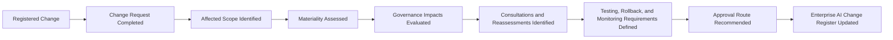

# AI Change Request & Impact Assessment

## Executive Summary

The AI Change Request & Impact Assessment determines what is changing, why the change is needed, whether it is material, and which governance reviews must occur before approval.

It applies to proposed changes involving the Megastar Intelligent Processor (MIP) and other governed AI systems.

The assessment evaluates the potential effect on approved use, stakeholders, model behaviour, data, human oversight, risks, controls, providers, privacy, security, legal and contractual obligations, resilience, monitoring, and lifecycle status.

Its output is a documented materiality decision, impact conclusion, required consultations, implementation prerequisites, testing and assurance requirements, rollback expectations, and recommended approval route.

It does not approve or implement the change.

---

## Purpose

The purpose of this document is to establish a consistent method for assessing proposed AI changes before approval.

It enables Megastar Mortgage to:

- document the proposed change and intended outcome;
- identify the affected AI system and operating scope;
- determine whether the change is Non-Material, Material, Major, or Unable to Determine;
- assess governance consequences proportionately;
- identify required specialist reviews;
- determine whether prior inventory, risk, control, provider, or assurance conclusions require reassessment;
- define implementation prerequisites;
- define testing, verification, validation, rollback, and monitoring expectations;
- recommend the appropriate approval authority; and
- update the Enterprise AI Change Register.

---

## Scope

This assessment applies to governed changes involving:

- AI models or model versions;
- prompts, rules, thresholds, or configurations;
- data sources, datasets, transformations, schemas, or document types;
- human-review requirements or override authority;
- controls;
- providers or subprocessors;
- integrations or infrastructure;
- business processes or user groups;
- approved-use boundaries;
- monitoring metrics or thresholds;
- policy, legal, regulatory, or contractual requirements;
- incident, assurance, risk, control, privacy, security, or provider remediation; and
- suspension, replacement, or retirement.

Standard changes may use a proportionate assessment where approved pre-authorization criteria are satisfied.

---

## Assessment Boundary

### This assessment owns

- change-request information;
- affected scope;
- materiality assessment;
- governance impact assessment;
- required consultations;
- required reassessments;
- implementation prerequisites;
- testing and assurance requirements;
- rollback and contingency expectations;
- monitoring requirements;
- approval-route recommendation; and
- Change Register updates.

### This assessment does not own

- final approval;
- implementation execution;
- verification results;
- validation conclusions;
- emergency-change authorization;
- post-implementation review; or
- change closure.

---

## Assessment Process

---

## Change Request Requirements

The change request shall define:

- Change ID;
- change title;
- change description;
- business or governance need;
- intended outcome;
- change source;
- affected AI system;
- current state;
- proposed state;
- affected business process;
- affected model, service, data, control, provider, or workflow;
- proposed implementation date;
- expected benefit;
- known dependencies;
- known constraints;
- urgency;
- requested classification; and
- supporting references.

The request shall be sufficiently specific to support materiality and impact review.

---

## Change Drivers

The proposed change may arise from:

- business improvement;
- performance enhancement;
- incident remediation;
- assurance finding;
- monitoring finding;
- risk treatment;
- control improvement;
- provider release;
- security remediation;
- privacy requirement;
- regulatory or contractual change;
- operating-model change;
- technology modernization;
- approved-use expansion;
- capacity or resilience need;
- replacement; or
- retirement.

The source of the change does not determine its materiality.

---

## Current and Proposed State

The assessment shall distinguish the current approved state from the proposed state.

| Area | Current State | Proposed State |
|---|---|---|
| Approved Use | | |
| Model or Service | | |
| Version | | |
| Data | | |
| Prompt, Rule, or Threshold | | |
| Human Oversight | | |
| Controls | | |
| Provider | | |
| Integration or Infrastructure | | |
| Monitoring | | |
| Business Process | | |
| Lifecycle Status | | |

Only affected areas need to be completed.

---

## Affected Scope

The assessment shall identify the effect on:

- AI systems;
- business processes;
- business functions;
- customers, employees, users, or other stakeholders;
- transaction or record populations;
- data categories;
- jurisdictions;
- providers and subprocessors;
- technical environments;
- controls;
- monitoring arrangements;
- continuity or fallback processes; and
- related governance records.

The scope shall identify both direct and reasonably foreseeable downstream effects.

---

## Materiality Assessment

A change is material where it may alter an existing governance conclusion, operating boundary, exposure, or obligation.

Materiality shall consider whether the change may affect:

- approved purpose or use;
- impact classification;
- stakeholder consequences;
- model behaviour or performance;
- data source, quality, lineage, or retention;
- privacy or security exposure;
- human-oversight requirements;
- risk likelihood or impact;
- residual risk;
- control design or operation;
- provider dependency or contractual obligation;
- transparency or explainability;
- reliability, resilience, or continuity;
- monitoring measures, baselines, or thresholds;
- incident likelihood;
- legal, regulatory, or policy obligations;
- deployment environment;
- user population;
- business-process scope; or
- lifecycle status.

---

## Materiality Outcomes

| Outcome | Meaning |
|---|---|
| Non-Material | No material AI-governance impact is expected and the change may follow the approved proportionate route. |
| Material | One or more governance conclusions may change and formal assessment and approval are required. |
| Major | The change may create significant, broad, high-impact, or strategic consequences requiring expanded review or elevated approval. |
| Unable to Determine | Information is insufficient and further analysis or specialist review is required. |

The materiality decision shall include rationale and evidence.

---

## Major Change Indicators

A change may be classified as Major where it:

- materially expands approved use;
- changes the AI system’s impact classification;
- introduces a new model or provider;
- materially reduces human oversight;
- changes an important decision boundary;
- affects a High or Critical risk;
- changes a key control;
- follows a High or Critical incident;
- introduces sensitive or regulated data;
- materially changes customer or employee impact;
- creates significant provider concentration;
- affects multiple business functions or jurisdictions;
- requires executive or committee decision;
- creates material regulatory or contractual implications; or
- materially changes retirement, fallback, or continuity arrangements.

No single indicator automatically determines the outcome unless an approved rule requires escalation.

---

## Impact Assessment Areas

Only relevant areas shall be assessed in detail.

### 1. Approved Use and Inventory

Assess whether the change affects:

- purpose;
- users;
- business process;
- deployment environment;
- geography;
- data;
- decision role;
- automation level;
- lifecycle status;
- system ownership; or
- inventory classification.

Potential output:

- inventory update;
- impact reassessment;
- approved-use review;
- new intake;
- lifecycle-status change.

---

### 2. Stakeholder and Business Impact

Assess:

- affected customers, employees, applicants, users, or third parties;
- scale;
- benefit;
- potential adverse effect;
- fairness implications;
- service impact;
- customer communication;
- operating-model implications; and
- business readiness.

---

### 3. Model, Prompt, Rule, and Performance Impact

Assess:

- expected behaviour change;
- accuracy;
- error rate;
- false positives or negatives;
- drift;
- explainability;
- decision thresholds;
- prompt behaviour;
- routing logic;
- version compatibility;
- benchmark impact; and
- validation need.

---

### 4. Data Impact

Assess:

- new or changed data source;
- data quality;
- lineage;
- transformation;
- schema;
- retention;
- deletion;
- document type;
- representativeness;
- bias;
- access;
- location;
- third-party data; and
- monitoring-data impact.

---

### 5. Human-Oversight Impact

Assess:

- review requirement;
- review population;
- override authority;
- escalation path;
- workload;
- staffing;
- training;
- reviewer competence;
- automation bias;
- approval boundary; and
- quality assurance.

---

### 6. Risk Impact

Assess whether the change:

- creates a new risk;
- changes likelihood or impact;
- changes current risk condition;
- changes response strategy;
- changes control dependency;
- requires residual-risk review;
- affects risk appetite or tolerance; or
- introduces concentration or systemic exposure.

Formal risk reassessment remains within AI Risk Management.

---

### 7. Control Impact

Assess whether the change:

- introduces a new control;
- changes control design;
- changes control ownership;
- changes control frequency;
- changes evidence;
- automates a control;
- retires a control;
- affects segregation of duties;
- changes a control dependency; or
- requires assurance or retesting.

Formal control design remains within AI Controls.

---

### 8. Privacy and Security Impact

Assess:

- personal or confidential information;
- lawful processing;
- retention;
- deletion;
- access;
- privileged use;
- logging;
- encryption;
- vulnerability;
- credential management;
- data transfer;
- cross-border processing;
- threat exposure;
- misuse; and
- incident response implications.

Privacy and Security remain authoritative for their specialist conclusions.

---

### 9. Third-Party Impact

Assess:

- provider service;
- model or platform version;
- subprocessor;
- contract;
- assurance evidence;
- service levels;
- notification obligations;
- support;
- lock-in;
- concentration;
- resilience;
- continuity;
- exit readiness; and
- data handling.

Third-Party AI Governance remains authoritative for provider decisions.

---

### 10. Legal, Regulatory, Policy, and Contractual Impact

Assess:

- applicable law or regulation;
- notification or approval requirement;
- customer commitment;
- policy alignment;
- contractual limitation;
- records requirement;
- transparency obligation;
- auditability;
- jurisdiction; and
- framework-mapping impact.

---

### 11. Reliability, Resilience, and Operational Impact

Assess:

- service availability;
- performance;
- latency;
- throughput;
- capacity;
- dependency;
- fallback;
- rollback;
- recovery;
- continuity;
- support model;
- operational readiness; and
- transition risk.

---

### 12. Monitoring Impact

Assess whether the change requires:

- new metric;
- revised KPI or KRI;
- baseline reset;
- threshold revision;
- new segment;
- additional source;
- higher monitoring frequency;
- temporary enhanced monitoring;
- new alert;
- control-health monitoring; or
- post-change review period.

Metric and threshold approval remains within Continuous Monitoring.

---

### 13. Incident and Remediation Impact

Assess whether the change:

- arises from an incident;
- addresses a root cause;
- affects incident containment or recovery;
- could create recurrence;
- requires incident-record update;
- closes a corrective action;
- requires verification before incident closure; or
- could itself trigger an incident if unsuccessful.

---

### 14. Change and Transition Risk

Assess:

- implementation complexity;
- dependency timing;
- migration;
- coexistence of old and new states;
- user readiness;
- data conversion;
- rollout strategy;
- rollback readiness;
- change freeze;
- provider timing;
- cutover risk; and
- failure impact.

---

## Required Reassessments

The assessment shall determine whether the change requires updates or reassessment within:

| Governance Area | Possible Requirement |
|---|---|
| AI System Inventory | Update or reclassification |
| AI Impact Assessment | Partial or full reassessment |
| AI Risk Register | New or changed risk |
| AI Control Register | New, changed, or retired control |
| AI Assurance | Testing, retesting, or independent validation |
| Third-Party AI Governance | Provider review or contract action |
| Continuous Monitoring | New measures, thresholds, or baseline |
| AI Incident Management | Incident or corrective-action linkage |
| Framework Alignment | Regulatory or mapping update |
| Governance Oversight | Exception, residual-risk, policy, or executive decision |

---

## Specialist Consultation

The assessment shall identify required consultation before approval.

| Condition | Required Function or Capability |
|---|---|
| New or expanded AI use | AI Inventory & Assessment |
| New or changed risk | AI Risk Management |
| Control impact | AI Controls |
| Independent evaluation required | AI Assurance |
| Provider impact | Third-Party AI Governance |
| Monitoring impact | Continuous Monitoring |
| Incident-linked change | AI Incident Management |
| Privacy impact | Privacy |
| Security impact | Information Security |
| Legal or contractual impact | Legal & Compliance |
| Operational impact | Business Operations |
| Major continuity impact | Business Continuity |
| Executive or residual-risk decision | Governance Oversight & Continual Improvement |

Consultation status and conclusions shall be recorded.

---

## Testing and Assurance Requirements

The assessment shall define the required testing depth before or after implementation.

Testing may include:

- functional testing;
- regression testing;
- model-performance testing;
- data-quality testing;
- fairness testing;
- privacy testing;
- security testing;
- control testing;
- human-oversight testing;
- provider evidence review;
- resilience testing;
- rollback testing;
- user acceptance testing;
- business-process validation; and
- independent assurance.

The assessment shall identify:

- test owner;
- environment;
- population;
- acceptance criteria;
- evidence;
- independence requirement; and
- timing.

---

## Rollback and Contingency Requirements

The assessment shall determine whether the change requires:

- rollback plan;
- fallback process;
- manual operation;
- previous approved version;
- transaction hold;
- data restore;
- provider contingency;
- increased human review;
- temporary restriction;
- suspension criteria;
- recovery trigger; and
- decision authority.

Where rollback is not practicable, the rationale and alternative contingency shall be documented.

---

## Monitoring Requirements

The assessment shall define post-change monitoring needs, including:

- monitored condition;
- metric or indicator;
- baseline;
- threshold;
- frequency;
- duration;
- owner;
- escalation trigger; and
- review date.

Detailed metric design remains within Continuous Monitoring.

---

## Approval Route Recommendation

The assessment shall recommend one approval level.

| Recommended Route | Typical Use |
|---|---|
| Operational | Non-Material or low-impact change within delegated authority. |
| Functional Governance | Material change requiring specialist review. |
| Governance Committee | Major or cross-functional change, restriction, or unresolved condition. |
| Executive | Strategic, enterprise-wide, potentially unacceptable, or Critical change. |
| Emergency Route | Urgent change meeting approved emergency criteria. |

The approval authority makes the final decision.

---

## Assessment Outcomes

The completed assessment shall produce:

- documented change request;
- affected scope;
- materiality outcome;
- impact conclusion;
- required consultations;
- required reassessments;
- testing and assurance requirements;
- implementation prerequisites;
- rollback and contingency requirements;
- monitoring requirements;
- recommended approval route;
- unresolved information needs; and
- Change Register updates.

---

## Assessment Completion Criteria

The assessment is complete when:

- the proposed change is clearly described;
- current and proposed states are documented;
- affected scope is identified;
- materiality is determined;
- relevant impact areas are assessed;
- required consultations are complete or tracked;
- required reassessments are identified;
- testing and assurance needs are defined;
- rollback and contingency expectations are defined;
- monitoring needs are identified;
- approval route is recommended;
- unresolved conditions are documented; and
- the Enterprise AI Change Register is updated.

---

## Related Artifacts

- AI Change Management Framework
- Enterprise AI Change Register
- AI Change Approval & Implementation
- AI Change Verification & Validation
- AI Emergency Change Management

---

## Document Control

| Field | Value |
|---|---|
| Document | AI Change Request & Impact Assessment |
| Capability | AI Change Management |
| Capability Number | 10 |
| Repository | Enterprise AI Governance Playbook |
| Reference Organization | Megastar Mortgage |
| Reference AI System | Megastar Intelligent Processor (MIP) |
| Document Owner | AI Governance Lead |
| Version | 1.0 |
| Review Cycle | Annual |
| Status | Published Reference |

---

## Revision History

| Version | Date | Description |
|---|---|---|
| 1.0 | July 2026 | Initial release of the AI Change Request & Impact Assessment artifact. |