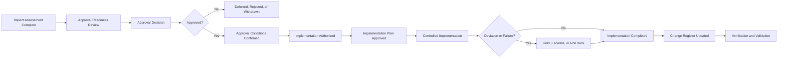

# AI Change Approval & Implementation

## Executive Summary

The AI Change Request & Impact Assessment determines whether a proposed AI change is Non-Material, Material, Major, or requires further analysis.

AI Change Approval & Implementation governs what happens next.

It establishes how Megastar Mortgage authorizes proposed changes involving the Megastar Intelligent Processor (MIP), sets implementation conditions, assigns execution responsibilities, controls deployment, manages deviations, preserves evidence, and determines whether the implemented change is ready to proceed to Verification & Validation.

This artifact does not reassess change impact, perform verification or validation, govern emergency changes, conduct post-implementation review, or close the change.

---

## Purpose

The purpose of this document is to establish a controlled and auditable process for approving and implementing governed AI changes.

It enables Megastar Mortgage to:

- route the change to the correct approval authority;
- confirm that required assessment and consultation are complete;
- record the approval decision and conditions;
- authorize implementation only within the approved scope;
- define implementation ownership and sequencing;
- confirm rollback and contingency readiness;
- control implementation evidence;
- manage deviations from the approved plan;
- stop or reverse implementation where required;
- record the implementation outcome; and
- update the Enterprise AI Change Register.

---

## Scope

This process applies to governed AI changes that have completed the required Change Request & Impact Assessment.

It covers:

- approval readiness;
- approval decision;
- approval conditions;
- implementation authorization;
- implementation planning;
- implementation prerequisites;
- implementation execution;
- implementation evidence;
- deviation management;
- rollback decisions;
- implementation outcome; and
- handoff to AI Change Verification & Validation.

Emergency changes follow the separate AI Emergency Change Management process.

---

## Process Boundary

### This process owns

- approval review;
- approval decision;
- approval conditions;
- implementation authorization;
- implementation plan governance;
- implementation responsibilities;
- implementation window;
- execution controls;
- implementation evidence;
- material deviation review;
- implementation hold;
- rollback authorization;
- implementation outcome;
- Change Register updates; and
- readiness for Verification & Validation.

### This process does not own

- change materiality assessment;
- detailed impact assessment;
- test methodology;
- verification conclusions;
- validation conclusions;
- emergency-change governance;
- post-implementation review;
- residual-risk acceptance; or
- change closure.

---

## Approval & Implementation Process

---

## Approval Readiness

A change is ready for approval review when:

- the change request is complete;
- the affected AI system is identified;
- current and proposed states are documented;
- materiality is determined;
- relevant impact areas are assessed;
- required specialist consultations are complete or formally conditioned;
- required reassessments are identified;
- implementation prerequisites are defined;
- testing requirements are defined;
- rollback or contingency requirements are defined;
- monitoring requirements are identified;
- unresolved issues are visible; and
- the recommended approval route is documented.

A change shall not be approved where material information is missing unless the approving authority explicitly accepts defined conditions or limitations.

---

## Approval Authorities

| Approval Level | Typical Scope |
|---|---|
| Operational | Non-Material or low-impact changes within delegated authority |
| Functional Governance | Material changes requiring specialist review |
| Governance Committee | Major, cross-functional, high-impact, or conditionally acceptable changes |
| Executive | Strategic, enterprise-wide, potentially unacceptable, or Critical changes |

Approval authority shall reflect:

- materiality;
- AI-system impact;
- risk exposure;
- affected stakeholders;
- control impact;
- provider dependency;
- privacy and security implications;
- legal or regulatory obligations;
- operational consequence; and
- requested exception or residual-risk decision.

---

## Approval Decisions

| Decision | Meaning |
|---|---|
| Approved | The change may proceed within the approved scope and conditions. |
| Approved with Conditions | The change may proceed only after specified conditions are satisfied. |
| Deferred | Further information, assessment, consultation, testing, or remediation is required. |
| Rejected | The change shall not proceed. |
| Withdrawn | The Change Owner has withdrawn the request. |
| Superseded | The change has been replaced by another governed change. |

Emergency authorization is governed separately.

---

## Approval Record

The approval decision shall record:

- Change ID;
- decision;
- decision authority;
- approval date;
- approved scope;
- approved implementation environment;
- approved implementation window;
- conditions before implementation;
- conditions during implementation;
- conditions after implementation;
- testing requirements;
- rollback requirements;
- evidence requirements;
- monitoring requirements;
- verification and validation requirements;
- expiry date, where applicable;
- escalation requirements; and
- decision rationale.

---

## Approval Conditions

Approval conditions may require:

- completion of a risk reassessment;
- implementation of a new or changed control;
- privacy or security approval;
- provider confirmation;
- contract amendment;
- completion of pre-production testing;
- independent assurance;
- increased human oversight;
- limited rollout;
- restricted user population;
- restricted data scope;
- phased implementation;
- rollback readiness;
- enhanced monitoring;
- temporary operating restrictions;
- post-implementation review; or
- Governance Committee or Executive review.

Every condition shall identify an owner, required evidence, and completion status.

---

## Implementation Authorization

Implementation may begin only when:

- the approval decision permits implementation;
- pre-implementation conditions are satisfied;
- the implementation owner is assigned;
- the approved implementation window is current;
- the approved scope is understood;
- required environments are ready;
- testing prerequisites are complete;
- rollback or contingency arrangements are available;
- communication requirements are addressed;
- required access is approved;
- required monitoring is ready; and
- no unresolved hold prevents execution.

Authorization shall be documented before implementation begins.

---

## Implementation Plan

The implementation plan shall define:

- implementation objective;
- approved scope;
- systems, services, models, data, controls, or processes affected;
- implementation owner;
- implementation team;
- implementation environment;
- implementation date and window;
- implementation sequence;
- prerequisites;
- dependencies;
- technical steps;
- business steps;
- provider activities;
- access requirements;
- communication requirements;
- evidence requirements;
- acceptance checkpoints;
- rollback triggers;
- rollback owner;
- contingency arrangements;
- hold points;
- escalation path; and
- transition to Verification & Validation.

---

## Segregation of Duties

Where proportionate to the change, the following responsibilities should remain appropriately separated:

- request;
- assessment;
- approval;
- implementation;
- verification;
- validation; and
- closure.

A person who implements a Major change should not independently approve the same change’s verification outcome unless an approved exception exists.

---

## Controlled Implementation

Implementation shall:

- occur within the approved window;
- remain within the approved scope;
- follow the approved sequence;
- use authorized access;
- use the approved environment;
- preserve evidence;
- record material decisions;
- track implementation status;
- confirm completion of critical steps;
- maintain rollback readiness;
- document provider activity;
- document deviations;
- stop or escalate where defined triggers occur; and
- preserve the previous approved state where practicable.

---

## Implementation Evidence

Implementation evidence may include:

- deployment record;
- change ticket;
- approved configuration;
- version record;
- migration record;
- execution log;
- approval confirmation;
- access record;
- data-conversion record;
- provider confirmation;
- control-implementation evidence;
- communication record;
- rollback evidence;
- screenshots;
- system logs; and
- implementation checklist.

The implementation record shall reference evidence rather than duplicate sensitive content unnecessarily.

---

## Implementation Checkpoints

Material changes may require formal checkpoints such as:

- pre-implementation readiness;
- deployment start authorization;
- data migration confirmation;
- control activation;
- provider readiness;
- human-oversight readiness;
- partial rollout review;
- production release confirmation;
- rollback decision point; and
- implementation completion.

Each checkpoint shall have a decision owner and recorded outcome.

---

## Deviation Management

A deviation occurs when implementation differs from:

- approved scope;
- approved timing;
- approved environment;
- approved sequence;
- approved configuration;
- approved data;
- approved provider condition;
- approved control;
- approved user population; or
- another material approval condition.

A deviation shall be classified as:

| Deviation Type | Meaning |
|---|---|
| Minor | Does not materially affect the approved outcome or governance position. |
| Material | May affect risk, controls, scope, stakeholders, or approval conditions. |
| Critical | Creates or may create unacceptable exposure, loss of control, or incident conditions. |

Material or Critical deviations shall trigger hold, reassessment, escalation, rollback, or a new change decision.

---

## Implementation Hold

Implementation shall be paused where:

- a precondition is not satisfied;
- a material deviation occurs;
- the approved environment is unavailable;
- required evidence cannot be preserved;
- rollback is no longer available where required;
- a control fails;
- unexpected stakeholder impact appears;
- security or privacy exposure emerges;
- provider activity differs materially from the plan;
- acceptance criteria are clearly unlikely to be met; or
- an incident condition is detected.

The hold decision, owner, time, reason, and next step shall be recorded.

---

## Rollback

Rollback may be required where:

- implementation fails;
- a Material or Critical deviation occurs;
- the system becomes unstable;
- performance deteriorates materially;
- required controls fail;
- data integrity is compromised;
- unauthorized impact occurs;
- provider dependency fails;
- acceptance criteria cannot be met; or
- the approval authority requires restoration of the prior state.

Rollback status shall be recorded as:

- Not Required;
- Ready;
- Initiated;
- Completed;
- Failed; or
- Not Practicable.

Where rollback is not practicable, the approved contingency shall be activated.

---

## Change-Related Incident

A change shall be referred to AI Incident Management where implementation causes or may cause:

- material harm;
- significant service disruption;
- privacy or security exposure;
- approved-use deviation;
- control failure;
- provider failure;
- data corruption;
- uncontrolled AI behaviour;
- repeated failure; or
- another condition meeting the AI-incident threshold.

The Change ID and Incident ID shall be cross-referenced.

---

## Implementation Outcome

| Outcome | Meaning |
|---|---|
| Implemented as Approved | Implementation completed within approved scope and conditions. |
| Implemented with Approved Deviation | Implementation completed with a formally accepted deviation. |
| Partially Implemented | Only part of the approved scope was completed. |
| Failed | Implementation did not achieve the planned technical or operational state. |
| Rolled Back | The previous approved state was restored. |
| Cancelled | Implementation was terminated before completion. |
| Deferred | Implementation was postponed after approval. |

Implementation outcome does not determine verification or validation success.

---

## Readiness for Verification & Validation

The change may proceed to Verification & Validation when:

- implementation status is recorded;
- implementation evidence is available;
- deviations are resolved or formally accepted;
- rollback outcome is recorded;
- incidents are linked where applicable;
- the implemented scope is clear;
- required testing evidence is available;
- the verification owner is confirmed;
- acceptance criteria remain current;
- required monitoring is active; and
- the Enterprise AI Change Register is updated.

---

## Enterprise AI Change Register Updates

This process shall update, where applicable:

- Approval Status;
- Approval Authority;
- Approval Date;
- Approved Scope;
- Approval Conditions;
- Implementation Window;
- Approval Expiry Date;
- Implementation Status;
- Planned Implementation Date;
- Actual Implementation Date;
- Implementation Owner;
- Implementation Environment;
- Implementation Evidence Reference;
- Deviation Identified;
- Deviation Reference;
- Rollback Required;
- Rollback Status;
- Incident Triggered;
- Related Incident ID;
- Current Change Status;
- Next Required Activity; and
- Next Review Date.

---

## Completion Criteria

This stage is complete when:

- approval readiness is confirmed;
- the approval decision is documented;
- implementation conditions are recorded;
- required preconditions are satisfied;
- implementation authorization is issued;
- the implementation plan is approved;
- implementation is completed, deferred, cancelled, failed, or rolled back;
- material deviations are governed;
- implementation evidence is retained;
- incidents are linked where required;
- the Enterprise AI Change Register is updated; and
- the change is ready for Verification & Validation or another approved disposition.

---

## Related Artifacts

- AI Change Request & Impact Assessment
- Enterprise AI Change Register
- AI Change Verification & Validation
- AI Emergency Change Management
- AI Post-Implementation Review

---

## Document Control

| Field | Value |
|---|---|
| Document | AI Change Approval & Implementation |
| Capability | AI Change Management |
| Capability Number | 10 |
| Repository | Enterprise AI Governance Playbook |
| Reference Organization | Megastar Mortgage |
| Reference AI System | Megastar Intelligent Processor (MIP) |
| Document Owner | AI Governance Lead |
| Version | 1.0 |
| Review Cycle | Annual |
| Status | Published Reference |

---

## Revision History

| Version | Date | Description |
|---|---|---|
| 1.0 | July 2026 | Initial release of the AI Change Approval & Implementation artifact. |