# AI Change Verification & Validation

## Executive Summary

AI Change Approval & Implementation confirms that an approved change was introduced within the authorized scope and implementation conditions.

AI Change Verification & Validation determines whether the change was implemented correctly, achieved its intended outcome, and remained within approved governance boundaries.

This artifact applies to governed changes involving the Megastar Intelligent Processor (MIP) and other AI systems within Megastar Mortgage.

It establishes the evidence, review, acceptance, independence, outcome, escalation, and handoff requirements used after implementation and before Post-Implementation Review.

It does not approve the original change, execute implementation, conduct sustained post-implementation monitoring, accept residual risk, or close the change.

---

## Purpose

The purpose of this document is to establish a consistent and defensible process for evaluating implemented AI changes.

It enables Megastar Mortgage to:

- confirm that the approved change was implemented as authorized;
- evaluate whether approval conditions and acceptance criteria were met;
- determine whether the intended business and governance outcomes were achieved;
- identify unintended consequences;
- assess whether risks, controls, providers, data, human oversight, privacy, security, and monitoring remain appropriate;
- determine whether independent assurance is required;
- assign a clear verification and validation outcome;
- recommend continued operation, restriction, remediation, rollback, or escalation;
- update the Enterprise AI Change Register; and
- determine readiness for Post-Implementation Review.

---

## Scope

This process applies after implementation has concluded or reached a sufficiently stable state for evaluation.

It covers:

- implementation verification;
- outcome validation;
- approval-condition confirmation;
- acceptance-criteria assessment;
- evidence sufficiency;
- testing-result review;
- governance-boundary review;
- unintended-consequence assessment;
- independent-review requirements;
- unsuccessful or inconclusive outcomes;
- required remediation and handoffs;
- Change Register updates; and
- readiness for Post-Implementation Review.

Emergency changes also require verification and validation after implementation.

---

## Process Boundary

### This process owns

- verification planning;
- validation planning;
- acceptance-criteria confirmation;
- evidence review;
- implementation-conformance assessment;
- intended-outcome assessment;
- unintended-consequence assessment;
- verification and validation conclusions;
- independence requirements;
- recommendation for continued, restricted, reversed, or suspended operation;
- required specialist handoffs;
- Change Register updates; and
- readiness for Post-Implementation Review.

### This process does not own

- change-request assessment;
- approval;
- implementation execution;
- emergency authorization;
- control redesign;
- formal risk acceptance;
- provider continuation decisions;
- sustained monitoring;
- post-implementation review; or
- final change closure.

---

## Verification and Validation Process

```mermaid
flowchart LR

A[Implementation Completed]
--> B[Verification Scope Confirmed]
--> C[Implementation Evidence Reviewed]
--> D[Approved Scope and Conditions Verified]
--> E[Validation Scope Confirmed]
--> F[Intended Outcomes Assessed]
--> G[Unintended Consequences Assessed]
--> H[Outcome Determined]
--> I[Remediation or Handoff, if Required]
--> J[Change Register Updated]
--> K[Post-Implementation Review]
```

---

## Core Distinction

### Verification

Verification answers:

> Was the approved change implemented correctly?

It considers:

- approved scope;
- approved environment;
- approved version;
- approved configuration;
- approved data;
- approved controls;
- approved implementation sequence;
- approval conditions;
- implementation evidence;
- deviations;
- rollback readiness; and
- technical and operational completion.

### Validation

Validation answers:

> Did the implemented change achieve its intended outcome without creating unacceptable unintended consequences?

It considers:

- business objective;
- model behaviour;
- output quality;
- data quality;
- human oversight;
- risk exposure;
- control operation;
- privacy and security;
- provider obligations;
- reliability and resilience;
- stakeholder impact;
- monitoring readiness; and
- continued alignment with approved use.

Verification and validation shall be recorded separately.

---

## Review Principles

Megastar Mortgage applies the following principles:

- Implementation completion shall not be treated as successful validation.
- Evaluation shall use approved acceptance criteria.
- Evidence shall be sufficient, traceable, and current.
- Material implementation deviations shall be assessed explicitly.
- Validation shall consider unintended effects, not only intended benefits.
- High-impact or sensitive changes may require independent review.
- Unsatisfactory or inconclusive results shall not be treated as success.
- Restricted operation may be used only with defined conditions and authority.
- Material findings shall be transferred to the capability that owns the required response.
- The Change Register shall reflect the current verified and validated state.

---

## Preconditions

Verification and validation may begin when:

- implementation status is recorded;
- the implemented scope is known;
- implementation evidence is available;
- deviations are documented;
- rollback status is known;
- related incidents are linked;
- acceptance criteria are current;
- verification and validation owners are assigned;
- required test results are available; and
- the evaluation environment is appropriate.

Where evidence is incomplete, the review may begin but the final outcome may be Unable to Conclude.

---

## Verification Scope

Verification shall assess only the requirements relevant to the approved change.

It may include:

- implemented model or service version;
- implemented prompt, rule, threshold, or configuration;
- implemented data source or transformation;
- implemented control;
- implemented human-oversight requirement;
- implemented provider change;
- implemented integration;
- implemented access or security configuration;
- implemented monitoring requirement;
- implementation timing and environment;
- approval-condition completion;
- implementation deviation treatment; and
- rollback readiness.

---

## Validation Scope

Validation shall assess whether the change achieved the intended outcome across applicable domains.

### Business and Operational Outcome

Assess:

- intended business objective;
- process performance;
- user readiness;
- customer or employee impact;
- service quality;
- throughput;
- backlog;
- operating capacity; and
- business continuity.

### Model and Output Outcome

Assess:

- expected model behaviour;
- accuracy;
- error rates;
- false positives and false negatives;
- output consistency;
- explainability;
- drift;
- threshold behaviour;
- prompt or rule behaviour; and
- performance by relevant segment.

### Data Outcome

Assess:

- data accuracy;
- completeness;
- validity;
- lineage;
- transformation;
- representativeness;
- retention;
- access;
- deletion; and
- data-quality monitoring.

### Human-Oversight Outcome

Assess:

- review coverage;
- override operation;
- escalation effectiveness;
- workload;
- staffing;
- reviewer competence;
- quality review;
- approval boundaries; and
- automation-bias exposure.

### Risk and Control Outcome

Assess:

- whether new or changed risks emerged;
- whether risk assumptions remain valid;
- whether controls were implemented as designed;
- whether control evidence is available;
- whether key controls operate as expected;
- whether compensating controls remain necessary;
- whether control retesting is required; and
- whether residual-risk review is required.

Formal risk reassessment and control-effectiveness conclusions remain with their owning capabilities.

### Privacy, Security, and Compliance Outcome

Assess:

- personal or confidential data use;
- access;
- logging;
- security configuration;
- vulnerabilities;
- data transfer;
- lawful processing;
- retention and deletion;
- policy requirements;
- contractual obligations;
- regulatory requirements; and
- notification obligations.

### Provider Outcome

Assess:

- provider implementation;
- provider version or service;
- subprocessor impact;
- contract conditions;
- service-level performance;
- support readiness;
- assurance evidence;
- data handling;
- continuity;
- exit readiness; and
- provider monitoring.

### Reliability and Resilience Outcome

Assess:

- availability;
- latency;
- throughput;
- stability;
- recovery;
- rollback;
- fallback;
- capacity;
- dependency performance; and
- resilience under expected operating conditions.

### Monitoring Outcome

Assess whether:

- required metrics are active;
- baselines are valid;
- thresholds are approved;
- alerts are operational;
- source data is reliable;
- segmentation is sufficient;
- enhanced monitoring is active; and
- escalation routes are clear.

---

## Acceptance Criteria

Acceptance criteria shall originate from:

- the Change Request & Impact Assessment;
- the approval decision;
- implementation conditions;
- control requirements;
- provider requirements;
- legal, privacy, security, or compliance requirements;
- testing plans;
- monitoring requirements; and
- incident or corrective-action dependencies.

Each criterion shall identify:

- criterion;
- owner;
- evidence;
- result;
- reviewer;
- exception, where applicable; and
- final disposition.

Acceptance criteria shall not be changed after implementation merely to obtain a favourable outcome without an approved decision.

---

## Evidence Requirements

Verification and validation evidence may include:

- implementation records;
- configuration records;
- version records;
- system logs;
- data-quality results;
- functional test results;
- regression results;
- model-performance results;
- fairness results;
- privacy or security results;
- control evidence;
- human-review results;
- provider evidence;
- monitoring results;
- incident records;
- rollback tests;
- business acceptance;
- user acceptance; and
- independent assurance reports.

Evidence shall be:

- traceable to the Change ID;
- relevant to the acceptance criterion;
- current;
- complete enough for the decision;
- protected from unauthorized alteration; and
- retained according to applicable requirements.

---

## Evidence Sufficiency

Evidence may be assessed as:

| Evidence Status | Meaning |
|---|---|
| Sufficient | Supports a defensible conclusion. |
| Sufficient with Limitations | Supports a conclusion with disclosed constraints. |
| Insufficient | Does not support a reliable conclusion. |
| Unavailable | Required evidence cannot be obtained. |

Insufficient or unavailable evidence may result in:

- additional testing;
- extended monitoring;
- restricted operation;
- rollback;
- escalation; or
- Unable to Conclude.

---

## Independence

Independent review may be required where the change:

- affects a High or Critical risk;
- changes a key control;
- materially changes approved use;
- materially reduces human oversight;
- follows a High or Critical incident;
- introduces a new model or provider;
- affects sensitive or regulated data;
- changes a material decision boundary;
- creates major cross-functional impact;
- requires regulatory independence; or
- is designated by the approval authority.

Independence may be provided by AI Assurance, Internal Audit, Security, Privacy, Legal & Compliance, or another qualified function.

---

## Unintended-Consequence Assessment

Validation shall assess whether the change created:

- unexpected performance deterioration;
- new or shifted errors;
- unfair or uneven outcomes;
- new privacy or security exposure;
- control failure;
- human-review burden;
- automation bias;
- monitoring blind spot;
- provider dependency;
- service instability;
- customer or employee harm;
- unapproved-use expansion;
- data-quality deterioration;
- new incident conditions;
- unexpected regulatory or contractual impact; or
- transition or rollback weakness.

Unintended consequences shall be recorded even where the primary objective was achieved.

---

## Outcome Model

Verification and validation shall result in one overall outcome.

| Outcome | Meaning |
|---|---|
| Satisfactory | The change was implemented correctly and achieved the intended outcome within approved boundaries. |
| Satisfactory with Conditions | Core criteria are met, but limited actions, restrictions, or monitoring remain. |
| Partially Satisfactory | Some criteria are met, but material remediation is required. |
| Unsatisfactory | The change failed approved criteria or created unacceptable consequences. |
| Unable to Conclude | Evidence is insufficient for a defensible conclusion. |

Verification and validation may have different individual results. The overall outcome shall reflect the more restrictive material conclusion.

---

## Outcome Responses

### Satisfactory

The change may proceed to Post-Implementation Review.

### Satisfactory with Conditions

The change may continue under approved conditions such as:

- limited scope;
- increased human review;
- enhanced monitoring;
- corrective action;
- restricted users;
- restricted data;
- temporary control;
- provider condition; or
- scheduled reassessment.

### Partially Satisfactory

Required response may include:

- remediation;
- additional testing;
- further validation;
- extended monitoring;
- partial rollback;
- restricted operation; or
- approval-authority review.

### Unsatisfactory

Required response may include:

- implementation hold;
- rollback;
- suspension;
- incident assessment;
- control remediation;
- provider escalation;
- change reassessment; or
- governance escalation.

### Unable to Conclude

Required response may include:

- additional evidence;
- repeated-period monitoring;
- independent assurance;
- restricted operation;
- deferred decision; or
- rollback where uncertainty is unacceptable.

---

## Restricted Operation

Restricted operation may be recommended where:

- core operation is stable;
- material uncertainty remains;
- risk is temporarily controlled;
- enhanced human oversight is available;
- monitoring is sufficient;
- restrictions are explicit;
- decision authority approves; and
- time-bound remediation exists.

Restricted operation shall define:

- scope;
- users;
- data;
- duration;
- controls;
- monitoring;
- owner;
- review date; and
- escalation trigger.

---

## Rollback or Suspension Recommendation

Rollback or suspension may be recommended where:

- acceptance criteria fail materially;
- unintended consequences are unacceptable;
- required controls are ineffective or unavailable;
- privacy or security exposure is unresolved;
- model behaviour is unstable;
- provider conditions are unacceptable;
- evidence cannot support safe operation;
- a material incident occurred; or
- the approval authority requires restoration of the prior state.

The final rollback or suspension decision shall follow the established decision authority.

---

## Specialist Handoffs

| Finding | Receiving Capability |
|---|---|
| Inventory or approved-use change | AI Inventory & Assessment |
| New or changed risk | AI Risk Management |
| Control weakness or redesign need | AI Controls |
| Independent retesting required | AI Assurance |
| Provider issue | Third-Party AI Governance |
| New or changed monitoring need | Continuous Monitoring |
| Incident condition | AI Incident Management |
| Corrective or follow-up change | AI Change Management |
| Executive, exception, or residual-risk decision | Governance Oversight & Continual Improvement |
| Regulatory or framework impact | Framework Alignment |

Each handoff shall include an owner, receiving record, status, and target date.

---

## Enterprise AI Change Register Updates

This process shall update, where applicable:

- Verification Status;
- Validation Status;
- Verification Owner;
- Validation Owner;
- Verification Date;
- Validation Date;
- Acceptance Criteria Met;
- Independent Assurance Required;
- Assurance Reference;
- Verification Evidence Reference;
- Validation Evidence Reference;
- Implementation Outcome;
- Further Action Required;
- Current Change Status;
- Next Required Activity; and
- Next Review Date.

---

## Readiness for Post-Implementation Review

The change is ready for Post-Implementation Review when:

- verification is complete;
- validation is complete or conditionally complete;
- evidence sufficiency is documented;
- acceptance-criteria results are recorded;
- unintended consequences are documented;
- restrictions and conditions are approved;
- required handoffs are accepted or tracked;
- rollback or suspension decisions are resolved;
- monitoring is active where required;
- the Change Register is updated; and
- the review period is defined.

---

## Completion Criteria

This stage is complete when:

- verification scope is defined;
- validation scope is defined;
- acceptance criteria are confirmed;
- required evidence is reviewed;
- evidence sufficiency is assessed;
- unintended consequences are evaluated;
- independent review is completed where required;
- verification and validation outcomes are approved;
- required conditions, remediation, rollback, or escalation are recorded;
- specialist handoffs are initiated;
- the Enterprise AI Change Register is updated; and
- readiness for Post-Implementation Review is determined.

---

## Related Artifacts

- AI Change Approval & Implementation
- Enterprise AI Change Register
- AI Emergency Change Management
- AI Post-Implementation Review

---

## Document Control

| Field | Value |
|---|---|
| Document | AI Change Verification & Validation |
| Capability | AI Change Management |
| Capability Number | 10 |
| Repository | Enterprise AI Governance Playbook |
| Reference Organization | Megastar Mortgage |
| Reference AI System | Megastar Intelligent Processor (MIP) |
| Document Owner | AI Governance Lead |
| Version | 1.0 |
| Review Cycle | Annual |
| Status | Published Reference |

---

## Revision History

| Version | Date | Description |
|---|---|---|
| 1.0 | July 2026 | Initial release of the AI Change Verification & Validation artifact. |