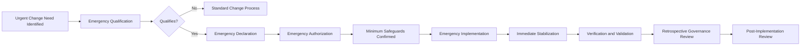

# AI Emergency Change Management

## Executive Summary

AI Emergency Change Management governs urgent AI-related changes when following the standard change process would create greater risk than acting immediately.

It applies to emergency changes involving the Megastar Intelligent Processor (MIP) and other governed AI systems within Megastar Mortgage.

The process establishes how an emergency is declared, authorized, implemented, stabilized, verified, retrospectively reviewed, and transferred back into the standard AI Change Management lifecycle.

Emergency status accelerates governance. It does not remove accountability, evidence, verification, or post-implementation review requirements.

---

## Purpose

The purpose of this document is to establish a controlled and auditable process for urgent AI changes.

It enables Megastar Mortgage to:

- determine whether a proposed change genuinely qualifies as an emergency;
- assign an accountable Emergency Change Owner;
- obtain proportionate authorization;
- define minimum pre-implementation safeguards;
- implement the change under controlled conditions;
- preserve evidence and decision history;
- stabilize the affected AI system or business process;
- verify the immediate outcome;
- complete retrospective impact assessment and governance review;
- identify required remediation or follow-up changes;
- update the Enterprise AI Change Register; and
- transition the change into Post-Implementation Review.

---

## Scope

This process applies where delay through the normal AI Change Management lifecycle is reasonably expected to increase:

- harm to customers, employees, or other stakeholders;
- privacy or security exposure;
- operational disruption;
- AI-system instability;
- regulatory or contractual exposure;
- provider-related service failure;
- business-continuity impact;
- data loss or corruption;
- control failure; or
- another material enterprise consequence.

Emergency changes may involve:

- model rollback;
- service disablement;
- prompt or rule correction;
- threshold adjustment;
- access restriction;
- provider isolation;
- data-flow suspension;
- emergency control implementation;
- manual fallback activation;
- security remediation;
- privacy containment;
- critical configuration change;
- urgent provider migration; or
- restoration of a previous approved state.

---

## Process Boundary

### This process owns

- emergency qualification;
- emergency declaration;
- emergency authorization;
- minimum impact review;
- emergency implementation conditions;
- temporary controls and restrictions;
- emergency evidence;
- immediate stabilization;
- retrospective assessment;
- emergency-governance outcome;
- required standard-lifecycle handoffs; and
- Enterprise AI Change Register updates.

### This process does not own

- standard change approval;
- routine impact assessment;
- detailed technical release procedures;
- incident investigation;
- permanent control redesign;
- formal assurance testing;
- residual-risk acceptance;
- sustained post-change monitoring;
- Post-Implementation Review; or
- final change closure.

---

## Emergency Change Lifecycle

---

## Emergency Qualification

A change qualifies as an emergency only when:

- a material threat, disruption, or obligation exists;
- delay is likely to increase impact;
- the normal approval timeline is not practicable;
- immediate action is proportionate to the condition;
- an accountable owner is available;
- an authorized decision-maker can approve the emergency route; and
- minimum evidence and safeguards can still be maintained.

Urgency caused by poor planning, missed deadlines, convenience, or avoidable delay does not qualify by itself.

---

## Typical Emergency Conditions

Emergency status may be appropriate for:

- active cybersecurity compromise;
- urgent privacy-breach containment;
- severe model malfunction;
- critical production failure;
- widespread harmful or incorrect output;
- major provider outage;
- failed deployment requiring immediate rollback;
- loss of a key control;
- uncontrolled approved-use deviation;
- material data corruption;
- business-continuity activation;
- urgent regulatory direction; or
- another condition requiring immediate harm reduction.

---

## Emergency Decisions

| Decision | Meaning |
|---|---|
| Qualifies as Emergency | The accelerated emergency route may be used. |
| Does Not Qualify | The proposed change shall follow the standard lifecycle. |
| Emergency Authorization Granted | Implementation may proceed within defined emergency conditions. |
| Emergency Authorization Denied | Implementation shall not proceed through the emergency route. |
| Emergency Implementation Stopped | The change is paused because conditions are no longer acceptable. |
| Emergency Change Stabilized | Immediate implementation objective has been achieved sufficiently for further review. |
| Requires Further Governance | Additional assessment, remediation, change, incident, or oversight activity is required. |

---

## Emergency Roles

| Role | Primary Responsibility |
|---|---|
| Emergency Change Owner | Owns the emergency change from declaration through retrospective review. |
| AI System Owner | Provides business accountability for the affected AI system. |
| Technical Owner | Owns emergency implementation and technical evidence. |
| Incident Owner | Coordinates where the emergency change arises from an AI incident. |
| Business Process Owner | Manages operational impact and fallback. |
| AI Governance Lead | Coordinates governance, register updates, and retrospective review. |
| Security, Privacy, or Legal & Compliance | Provides specialist authority where applicable. |
| Third-Party Relationship Owner | Coordinates provider activity. |
| Emergency Approval Authority | Authorizes the emergency route and implementation conditions. |
| Verification Owner | Reviews immediate implementation outcome. |

---

## Emergency Authorization

Emergency authorization shall record:

- Change ID;
- emergency condition;
- justification;
- affected AI system;
- intended emergency action;
- expected benefit;
- known risks;
- minimum safeguards;
- implementation owner;
- implementation window;
- rollback or contingency approach;
- required specialist participation;
- temporary restrictions;
- evidence requirements;
- verification requirement;
- retrospective-review due date; and
- approving authority.

Authorization may be verbal only where unavoidable, but it shall be documented as soon as practicable.

---

## Minimum Impact Review

Before implementation, the Emergency Change Owner shall assess, to the extent practicable:

- affected system and process;
- stakeholder impact;
- current harm or exposure;
- privacy and security implications;
- control impact;
- provider involvement;
- data impact;
- operational dependency;
- rollback feasibility;
- fallback availability;
- expected duration;
- possible unintended consequences; and
- incident linkage.

The review shall be proportionate to the urgency but shall not be omitted.

---

## Minimum Safeguards

Before implementation, the following shall be confirmed where practicable:

- accountable owner assigned;
- emergency authority identified;
- affected scope understood;
- backup or previous approved state available;
- evidence preservation initiated;
- privileged access approved;
- rollback or contingency defined;
- required specialist functions engaged;
- communication path established;
- temporary controls defined;
- monitoring activated;
- implementation stop conditions defined; and
- Change Register entry created or initiated.

Where a safeguard cannot be completed, the limitation and compensating action shall be recorded.

---

## Emergency Implementation

Emergency implementation shall:

- remain within the authorized scope;
- use approved access;
- preserve evidence;
- record execution steps;
- record material decisions;
- maintain rollback readiness where practicable;
- document deviations;
- track provider activity;
- monitor immediate system and business effects;
- stop where defined conditions are triggered; and
- escalate any incident expansion.

---

## Temporary Controls and Restrictions

Emergency changes may require temporary measures such as:

- increased human review;
- reduced automation;
- restricted users;
- restricted data;
- limited business scope;
- transaction hold;
- manual fallback;
- additional approval;
- provider isolation;
- enhanced logging;
- increased monitoring;
- temporary suspension; or
- use of a prior approved version.

Every temporary measure shall identify:

- owner;
- scope;
- start date;
- review date;
- expiry or removal condition; and
- escalation trigger.

---

## Emergency Evidence

Emergency evidence may include:

- emergency declaration;
- authorization;
- system logs;
- implementation steps;
- access records;
- configuration or version evidence;
- provider communications;
- screenshots;
- incident references;
- decision records;
- rollback evidence;
- monitoring results;
- communication records; and
- stabilization evidence.

Evidence shall be linked to the Change ID.

---

## Stabilization

An emergency change is stabilized when:

- the immediate threat or disruption is contained;
- the affected system or process is in a controlled state;
- temporary restrictions are operating;
- critical controls are available;
- immediate monitoring is active;
- unresolved exposure is known;
- required owners are assigned; and
- the next governance activity is clear.

Stabilization does not mean the change is validated or closed.

---

## Verification and Validation

After implementation, the emergency change shall enter AI Change Verification & Validation.

The review shall confirm:

- the authorized change was implemented;
- immediate objectives were achieved;
- critical controls remain available;
- no unacceptable unintended consequence is evident;
- temporary restrictions remain appropriate;
- rollback status is known;
- further testing is identified;
- continued operation is justified; and
- additional change or incident activity is initiated where required.

An emergency change shall not bypass verification because it restored service or reduced harm.

---

## Retrospective Governance Review

The retrospective review shall be completed within the approved emergency-review timeframe.

It shall determine:

- whether emergency classification was justified;
- whether authorization was appropriate;
- whether the implemented scope matched the authorized scope;
- whether minimum safeguards were sufficient;
- whether approval, assessment, or evidence gaps remain;
- whether new risks or control weaknesses emerged;
- whether an incident or provider issue requires further action;
- whether the temporary state should continue;
- whether a standard follow-up change is required;
- whether Post-Implementation Review is ready to begin; and
- whether governance improvements are required.

---

## Retrospective Outcomes

| Outcome | Meaning |
|---|---|
| Emergency Governance Satisfactory | The emergency route was justified and sufficiently controlled. |
| Satisfactory with Follow-Up | The emergency action was appropriate, but additional standard-lifecycle work is required. |
| Governance Deficiency Identified | Material approval, control, evidence, or process weakness occurred. |
| Emergency Classification Not Justified | The emergency route was used without sufficient basis. |
| Further Incident Action Required | The condition remains within AI Incident Management. |
| Further Change Required | A new or follow-up governed change is required. |
| Rollback or Suspension Required | Continued operation is not supportable. |

---

## Misuse of Emergency Classification

Potential misuse includes:

- repeated emergency changes for the same condition;
- avoidable late submissions;
- missing pre-production planning;
- bypassing specialist review;
- bypassing approval authority;
- implementing scope beyond the emergency need;
- using emergency classification to avoid documentation;
- repeated provider changes without notice; or
- repeated rollback caused by weak release discipline.

Material misuse shall be escalated and may trigger:

- change-process improvement;
- control redesign;
- assurance review;
- governance exception review;
- provider action; or
- management intervention.

---

## Cross-Capability Handoffs

| Emergency Change Condition | Receiving Capability |
|---|---|
| New or changed AI-system scope | AI Inventory & Assessment |
| New or materially changed risk | AI Risk Management |
| Control failure or temporary control | AI Controls |
| Independent verification required | AI Assurance |
| Provider-related emergency | Third-Party AI Governance |
| Enhanced monitoring required | Continuous Monitoring |
| Incident-related condition | AI Incident Management |
| Follow-up governed change | AI Change Management |
| Executive, exception, or residual-risk decision | Governance Oversight & Continual Improvement |
| Regulatory or framework impact | Framework Alignment |

---

## Enterprise AI Change Register Updates

This process shall update, where applicable:

- Emergency Change;
- Emergency Justification;
- Emergency Approval Authority;
- Emergency Approval Date;
- Current Change Status;
- Implementation Status;
- Implementation Evidence Reference;
- Temporary Restriction;
- Rollback Status;
- Incident Triggered;
- Related Incident ID;
- Verification Status;
- Validation Status;
- Retrospective Assessment Status;
- Emergency Review Due Date;
- Emergency Change Reference;
- Further Action Required;
- Next Required Activity; and
- Next Review Date.

---

## Readiness for Post-Implementation Review

The emergency change is ready for Post-Implementation Review when:

- implementation outcome is recorded;
- stabilization is confirmed;
- required verification and validation are complete or conditionally complete;
- retrospective governance review is complete;
- temporary controls and restrictions are documented;
- follow-up actions and handoffs are assigned;
- ongoing monitoring is active where required;
- the Enterprise AI Change Register is updated; and
- the review period is defined.

---

## Completion Criteria

This stage is complete when:

- emergency qualification is documented;
- authorization is recorded;
- minimum safeguards are addressed;
- implementation is completed, stopped, or rolled back;
- evidence is retained;
- stabilization status is confirmed;
- verification and validation are initiated or completed;
- retrospective review is completed;
- required follow-up actions are assigned;
- the Enterprise AI Change Register is updated; and
- the change is handed to Post-Implementation Review or another authoritative process.

---

## Related Artifacts

- AI Change Management Framework
- Enterprise AI Change Register
- AI Change Approval & Implementation
- AI Change Verification & Validation
- AI Post-Implementation Review
- AI Incident Management

---

## Document Control

| Field | Value |
|---|---|
| Document | AI Emergency Change Management |
| Capability | AI Change Management |
| Capability Number | 10 |
| Repository | Enterprise AI Governance Playbook |
| Reference Organization | Megastar Mortgage |
| Reference AI System | Megastar Intelligent Processor (MIP) |
| Document Owner | AI Governance Lead |
| Version | 1.0 |
| Review Cycle | Annual |
| Status | Published Reference |

---

## Revision History

| Version | Date | Description |
|---|---|---|
| 1.0 | July 2026 | Initial release of the AI Emergency Change Management artifact. |