# AI Post-Implementation Review

## Executive Summary

AI Change Verification & Validation determines whether an implemented change initially met its approved requirements.

The AI Post-Implementation Review determines whether that change continues to operate effectively after a defined period of real-world use.

This artifact establishes how Megastar Mortgage evaluates sustained performance, operational stability, control operation, monitoring results, incidents, provider outcomes, human oversight, unintended consequences, approval conditions, and closure readiness for changes involving the Megastar Intelligent Processor (MIP).

It does not repeat implementation testing, perform formal risk reassessment, issue control-effectiveness conclusions, approve provider continuation, accept residual risk, or conduct management review.

---

## Purpose

The purpose of this document is to establish a proportionate and evidence-based process for reviewing AI changes after implementation.

It enables Megastar Mortgage to:

- compare expected and actual outcomes;
- assess whether the change remains stable and effective;
- review post-change monitoring results;
- identify delayed or unintended consequences;
- evaluate incidents, exceptions, overrides, and operational issues;
- confirm whether approval conditions and temporary restrictions remain satisfied;
- identify required follow-up actions or specialist handoffs;
- determine whether the change is ready for closure; and
- update the Enterprise AI Change Register.

---

## Scope

This process applies to governed AI changes that:

- have been implemented;
- have completed Verification & Validation, or have received conditional authorization to continue;
- require review after a defined operating period; or
- were implemented through the emergency-change route.

The review depth shall be proportionate to:

- change classification;
- materiality;
- affected AI-system impact;
- incident linkage;
- provider dependency;
- approval conditions;
- verification outcome;
- residual uncertainty; and
- potential consequence.

---

## Process Boundary

### This process owns

- review scope and timing;
- expected-versus-actual outcome comparison;
- sustained-performance assessment;
- post-change monitoring review;
- review of incidents, exceptions, and operational conditions;
- delayed and unintended-consequence assessment;
- approval-condition review;
- temporary-restriction review;
- lessons learned;
- follow-up-action recommendations;
- closure-readiness recommendation; and
- Enterprise AI Change Register updates.

### This process does not own

- original impact assessment;
- change approval;
- implementation execution;
- initial Verification & Validation;
- formal risk reassessment;
- control-effectiveness conclusions;
- provider continuation decisions;
- residual-risk acceptance;
- management review; or
- final strategic-improvement decisions.

---

## Post-Implementation Review Lifecycle

```mermaid
flowchart LR

A[Verified or Conditionally Verified Change]
--> B[Operating Period Completed]
--> C[Post-Change Evidence Collected]
--> D[Expected and Actual Outcomes Compared]
--> E[Performance, Controls, Risks, Incidents, and Monitoring Reviewed]
--> F[Delayed or Unintended Effects Assessed]
--> G[Review Outcome Determined]
--> H[Follow-Up Actions and Handoffs]
--> I[Closure Readiness Recommended]
--> J[Enterprise AI Change Register Updated]
```

---

## Review Triggers

A Post-Implementation Review may be required when:

- the change is classified as Major;
- the change affects a High or Critical risk;
- the change alters approved use;
- the change reduces or materially changes human oversight;
- the change affects a key control;
- the change follows an AI incident;
- the change involves a material provider release or migration;
- the change is implemented through the emergency route;
- Verification & Validation concluded with conditions;
- temporary restrictions remain active;
- enhanced monitoring was required;
- the approval authority requires review; or
- unexpected conditions emerge after implementation.

---

## Review Timing

The review period shall allow enough operating evidence to assess sustained performance.

Timing may be based on:

- elapsed time;
- transaction volume;
- number of reviewed outputs;
- completion of a monitoring cycle;
- provider reporting period;
- risk level;
- approval condition;
- regulatory requirement; or
- incident-recurrence window.

The review may be:

- early;
- standard;
- extended; or
- event-triggered.

The basis for the selected review period shall be documented.

---

## Review Inputs

Relevant inputs may include:

- approved Change Request & Impact Assessment;
- approval decision and conditions;
- implementation evidence;
- Verification & Validation outcome;
- Enterprise AI Change Register;
- Enterprise AI System Inventory;
- Enterprise AI Risk Register;
- Enterprise AI Control Register;
- Enterprise Third-Party AI Register;
- Continuous Monitoring results;
- AI Governance Dashboard;
- monitoring findings;
- incident records;
- assurance findings;
- user or stakeholder feedback;
- provider reports;
- operational performance data;
- quality-review results; and
- corrective-action records.

Only authoritative and relevant evidence shall be used.

---

## Expected and Actual Outcomes

The review shall compare the approved expectation with the observed operating result.

| Review Area | Expected Outcome | Actual Outcome |
|---|---|---|
| Business Objective | | |
| Model or Service Performance | | |
| Data Quality | | |
| Human Oversight | | |
| Operational Performance | | |
| Control Operation | | |
| Risk Condition | | |
| Provider Performance | | |
| Privacy and Security | | |
| Reliability and Resilience | | |
| Monitoring Performance | | |
| Stakeholder Outcome | | |

Material differences shall be explained and assessed.

---

## Review Areas

Only relevant areas shall be reviewed in detail.

### Business and Operational Outcome

Assess:

- intended benefit;
- process efficiency;
- service quality;
- throughput;
- backlog;
- operating cost;
- business readiness;
- user adoption;
- operational workarounds;
- continuity; and
- whether the change remains fit for purpose.

---

### Model and Output Performance

Assess:

- accuracy;
- extraction quality;
- error rate;
- false positives;
- false negatives;
- exception rate;
- drift;
- output consistency;
- explainability;
- prompt or rule behaviour;
- threshold performance; and
- performance by relevant segment.

Aggregate results shall not conceal material segment-level deterioration.

---

### Data Outcome

Assess:

- completeness;
- accuracy;
- validity;
- lineage;
- transformation;
- representativeness;
- retention;
- deletion;
- access;
- quality exceptions;
- data drift; and
- downstream data impact.

---

### Human-Oversight Outcome

Assess:

- review coverage;
- override activity;
- correct-override rate;
- reviewer error;
- escalation use;
- workload;
- staffing;
- training;
- reviewer competence;
- approval boundaries;
- automation bias; and
- unresolved oversight gaps.

---

### Risk and Control Outcome

Assess whether:

- new risks emerged;
- known risks changed materially;
- assumptions remain valid;
- controls were implemented;
- controls operate as expected;
- control evidence is available;
- control exceptions occurred;
- compensating controls remain necessary;
- further assurance is required; and
- residual-risk review may be required.

Formal risk and control conclusions remain with their owning capabilities.

---

### Provider Outcome

Assess:

- provider service performance;
- release stability;
- provider incident activity;
- notification quality;
- support responsiveness;
- contractual compliance;
- subprocessor changes;
- assurance currency;
- continuity;
- concentration;
- exit readiness; and
- unresolved provider conditions.

---

### Privacy, Security, Legal, and Compliance Outcome

Assess:

- data use;
- access;
- logging;
- confidentiality;
- retention;
- deletion;
- lawful processing;
- security configuration;
- vulnerabilities;
- regulatory obligations;
- contractual obligations;
- transparency requirements;
- notification obligations; and
- policy compliance.

---

### Reliability and Resilience Outcome

Assess:

- availability;
- latency;
- throughput;
- capacity;
- service stability;
- fallback operation;
- rollback readiness;
- recovery performance;
- dependency resilience; and
- continuity.

---

### Monitoring Outcome

Assess whether:

- required metrics are active;
- baselines are valid;
- thresholds are appropriate;
- alerts are operating;
- source data is reliable;
- segmentation is sufficient;
- enhanced monitoring is complete or still required;
- findings are open; and
- escalation routes are functioning.

Metric definitions and threshold governance remain within Continuous Monitoring.

---

### Incident, Exception, and Change Outcome

Assess:

- incidents since implementation;
- near misses;
- monitoring findings;
- control exceptions;
- provider issues;
- unapproved deviations;
- emergency follow-up actions;
- failed or repeated changes;
- rollback activity; and
- unresolved corrective actions.

---

## Approval Conditions and Temporary Restrictions

The review shall confirm the status of:

- pre-implementation conditions;
- post-implementation conditions;
- temporary controls;
- restricted users;
- restricted data;
- limited rollout;
- additional human review;
- enhanced monitoring;
- provider conditions;
- expiry dates;
- follow-up testing; and
- required governance decisions.

Each condition shall be classified as:

- Satisfied;
- Partially Satisfied;
- Not Satisfied;
- No Longer Required; or
- Extended with Approval.

---

## Delayed and Unintended Consequences

The review shall assess whether the change created:

- performance deterioration;
- shifted error patterns;
- fairness concerns;
- privacy or security exposure;
- new control gaps;
- increased reviewer burden;
- reduced effective oversight;
- automation bias;
- provider concentration;
- service instability;
- monitoring blind spots;
- new incident conditions;
- customer or employee impact;
- data-quality deterioration;
- operational workarounds;
- cost or capacity pressure; or
- another condition not identified during initial assessment.

Delayed consequences shall be recorded even where the intended objective was achieved.

---

## Review Outcomes

| Outcome | Meaning |
|---|---|
| Successful | The change remains effective, stable, controlled, and aligned with its intended outcome. |
| Successful with Conditions | The change may continue with defined actions, restrictions, or monitoring. |
| Partially Successful | Some objectives were achieved, but material follow-up is required. |
| Unsuccessful | The change did not remain effective or created unacceptable consequences. |
| Rolled Back | The previous approved state was restored. |
| Unable to Conclude | Evidence or operating history is insufficient for a defensible conclusion. |

---

## Outcome Responses

### Successful

The change may be recommended for closure.

### Successful with Conditions

The change may continue with:

- time-bound corrective actions;
- defined restrictions;
- enhanced monitoring;
- additional human oversight;
- provider conditions;
- further testing; or
- scheduled reassessment.

### Partially Successful

The review may require:

- remediation;
- follow-up change;
- extended review period;
- additional assurance;
- risk reassessment;
- control redesign;
- provider action; or
- restricted operation.

### Unsuccessful

The review may require:

- rollback;
- suspension;
- incident assessment;
- change reassessment;
- provider escalation;
- control remediation;
- governance escalation; or
- retirement review.

### Unable to Conclude

The review may require:

- more operating evidence;
- extended monitoring;
- independent assurance;
- further testing;
- restricted operation; or
- deferred closure.

---

## Lessons Learned

The review should identify lessons concerning:

- assessment quality;
- approval quality;
- implementation planning;
- testing;
- provider coordination;
- human oversight;
- control design;
- monitoring readiness;
- emergency governance;
- rollback readiness;
- communication;
- evidence quality; and
- cross-capability coordination.

Lessons shall be concise and linked to actionable improvements where appropriate.

---

## Closure Readiness Recommendation

The review may recommend:

- Close — Implemented and Validated;
- Close with Ongoing Monitoring;
- Continue with Conditions;
- Extend Review Period;
- Initiate Remediation;
- Initiate Follow-Up Change;
- Reassess Risk;
- Review Controls;
- Initiate Assurance;
- Initiate Incident Assessment;
- Restrict Operation;
- Suspend Operation;
- Roll Back; or
- Defer Closure.

The final closure decision remains within the established change authority.

---

## Specialist Handoffs

| Review Finding | Receiving Capability |
|---|---|
| Inventory or approved-use update | AI Inventory & Assessment |
| New or materially changed risk | AI Risk Management |
| Control weakness or redesign need | AI Controls |
| Independent testing or assurance required | AI Assurance |
| Provider issue or obligation failure | Third-Party AI Governance |
| Ongoing or revised monitoring need | Continuous Monitoring |
| Incident condition | AI Incident Management |
| Follow-up change | AI Change Management |
| Executive, exception, or residual-risk decision | Governance Oversight & Continual Improvement |
| Regulatory or framework impact | Framework Alignment |

Each handoff shall identify a receiving record, owner, target date, and acceptance status.

---

## Enterprise AI Change Register Updates

The review shall update, where applicable:

- PIR Required;
- PIR Status;
- PIR Due Date;
- PIR Completion Date;
- PIR Outcome;
- PIR Reference;
- Further Action Required;
- Post-Change Monitoring Reference;
- Verification Status;
- Validation Status;
- Approval Condition Status;
- Temporary Restriction Status;
- Related Incident IDs;
- Related Risk IDs;
- Related Control IDs;
- Related Provider ID;
- Closure Readiness;
- Closure Outcome Recommendation;
- Current Change Status;
- Next Required Activity; and
- Next Review Date.

---

## Review Completion Criteria

The Post-Implementation Review is complete when:

- the operating period is sufficient;
- required evidence is available;
- expected and actual outcomes are compared;
- relevant review areas are assessed;
- approval conditions are reviewed;
- temporary restrictions are reviewed;
- incidents, exceptions, and findings are assessed;
- delayed and unintended consequences are evaluated;
- lessons learned are documented;
- follow-up actions and handoffs are assigned;
- closure readiness is determined; and
- the Enterprise AI Change Register is updated.

---

## Related Artifacts

- Enterprise AI Change Register
- AI Change Verification & Validation
- AI Emergency Change Management
- AI Change Management Summary

---

## Document Control

| Field | Value |
|---|---|
| Document | AI Post-Implementation Review |
| Capability | AI Change Management |
| Capability Number | 10 |
| Repository | Enterprise AI Governance Playbook |
| Reference Organization | Megastar Mortgage |
| Reference AI System | Megastar Intelligent Processor (MIP) |
| Document Owner | AI Governance Lead |
| Version | 1.0 |
| Review Cycle | Annual |
| Status | Published Reference |

---

## Revision History

| Version | Date | Description |
|---|---|---|
| 1.0 | July 2026 | Initial release of the AI Post-Implementation Review artifact. |