# AI Change Management

## Document Control

| Field | Value |
|---|---|
| Document Name | AI Change Management |
| Capability | AI Change Management |
| Capability Number | 10 |
| Repository | Enterprise AI Governance Playbook |
| Reference Organization | Megastar Mortgage |
| Reference AI System | Megastar Intelligent Processor (MIP) |
| Document Owner | AI Governance Lead |
| Version | 1.0 |
| Classification | Public Reference Implementation |
| Status | Published |
| Review Cycle | Annual |
| Last Updated | July 2026 |

---

# Executive Summary

AI systems do not remain static after approval.

Models are updated. Data sources change. prompts and rules evolve. Providers release new versions. Controls are redesigned. Business teams expand use. Infrastructure changes. Incident remediation introduces new configurations. Even changes intended to improve an AI system can alter its risk, performance, oversight requirements, or approved operating boundaries.

AI Change Management establishes how Megastar Mortgage identifies, assesses, approves, implements, verifies, and records material changes involving the Megastar Intelligent Processor (MIP) and other governed AI systems.

The capability ensures that changes are evaluated before implementation, authorized by the appropriate decision-maker, introduced through controlled execution, validated against approved acceptance criteria, and reflected in applicable governance records.

AI Change Management does not replace technical release management, software development, cybersecurity change control, provider governance, risk assessment, assurance, or incident management. It governs the AI-specific consequences and decision requirements associated with change.

---

# Purpose

The purpose of this capability is to establish a consistent and auditable lifecycle for governing AI-related changes.

It defines:

- what constitutes an AI change;
- which changes require formal governance review;
- how proposed changes are recorded;
- how materiality and impact are assessed;
- which governance capabilities must be consulted;
- how approval authority is determined;
- how implementation conditions are established;
- how emergency changes are governed;
- how changes are verified after implementation;
- how failed or unsuccessful changes are rolled back or remediated;
- how post-implementation outcomes are reviewed; and
- how authoritative governance records are updated.

The capability prevents material AI changes from being implemented solely as technical or operational updates without appropriate governance consideration.

---

# Capability Scope

AI Change Management applies to proposed, approved, emergency, implemented, failed, reversed, or provider-initiated changes involving:

- AI models;
- model versions;
- externally supplied AI services;
- prompts and system instructions;
- business rules;
- confidence thresholds;
- automation levels;
- human-oversight requirements;
- decision or recommendation logic;
- training, validation, or operational data;
- data sources and data flows;
- document types or input populations;
- system integrations;
- technical architecture;
- deployment environments;
- user groups;
- business processes;
- approved-use boundaries;
- controls;
- monitoring metrics or thresholds;
- third-party providers or subprocessors;
- privacy, security, legal, or compliance obligations;
- fallback or recovery arrangements; and
- retirement or replacement decisions.

Routine administrative or technical changes may follow established enterprise change processes without full AI governance review where documented criteria confirm that no material AI-related impact exists.

---

# Change Sources

AI changes may originate from:

- business improvement;
- model enhancement;
- performance deterioration;
- data-quality remediation;
- AI incident corrective action;
- assurance findings;
- monitoring findings;
- risk treatment;
- control improvement;
- provider release or migration;
- regulatory change;
- security remediation;
- privacy requirement;
- operational transformation;
- technology modernization;
- approved-use expansion;
- system replacement; or
- retirement planning.

The source of a change does not determine whether governance review is required. Its potential impact does.

---

# Governance Artifacts

| Governance Artifact | Purpose |
|---|---|
| AI Change Management Framework | Defines the operating model, lifecycle, roles, decision rights, and governance boundaries for AI-related changes. |
| Enterprise AI Change Register | Maintains the authoritative living record of governed AI changes and their lifecycle status. |
| AI Change Request & Impact Assessment | Records the proposed change and evaluates its effect on systems, risks, controls, providers, stakeholders, and obligations. |
| AI Change Approval & Implementation | Establishes approval conditions, implementation responsibilities, sequencing, evidence, rollback, and execution control. |
| AI Change Verification & Validation | Determines whether the implemented change met approved requirements without introducing unintended consequences. |
| AI Emergency Change Management | Governs urgent changes that cannot complete the standard pre-implementation lifecycle. |
| AI Post-Implementation Review | Evaluates sustained outcomes, unexpected effects, lessons learned, and further governance action. |
| AI Change Management Summary | Consolidates the change portfolio, material outcomes, failed changes, emergency activity, and matters requiring governance attention. |

Together, these artifacts establish the full AI Change Management lifecycle.

---

# Change Management Lifecycle

```mermaid
flowchart LR

A[Change Need Identified]
--> B[Change Request Registered]
--> C[Materiality and Impact Assessment]
--> D[Governance Consultation]
--> E[Approval Decision]
--> F[Implementation Planning]
--> G[Controlled Implementation]
--> H[Verification and Validation]
--> I[Post-Implementation Review]
--> J[Closure and Governance Record Updates]
```

Emergency changes follow an accelerated route but remain subject to retrospective review, evidence requirements, and approval.

---

# Change Management Principles

Megastar Mortgage governs AI changes according to the following principles:

- Material AI changes shall be assessed before implementation.
- Every governed change shall have an accountable Change Owner.
- Change materiality shall consider more than technical complexity.
- Changes shall be evaluated against the approved purpose, risk profile, controls, data, provider dependencies, and human-oversight model.
- Approval authority shall be proportionate to impact and risk.
- Implementation shall follow approved conditions and maintain traceable evidence.
- Testing shall reflect the nature and consequence of the change.
- Rollback or contingency arrangements shall exist where practicable.
- Emergency status shall not be used to bypass governance for convenience.
- Provider-initiated changes remain subject to Megastar Mortgage’s governance obligations.
- Implementation completion shall remain distinct from successful verification.
- Failed or partially successful changes shall be escalated and governed.
- Material changes shall trigger reassessment where prior governance conclusions may no longer remain valid.
- Authoritative governance records shall be updated after implementation.
- Changes shall not be closed until required verification and record updates are complete.

---

# Material Change

A material AI change is a change that may alter one or more of the following:

- approved purpose or use;
- affected stakeholders;
- impact classification;
- risk exposure;
- residual risk;
- control design or operation;
- model behaviour;
- data quality or data use;
- privacy or security exposure;
- human-oversight requirements;
- explainability or transparency;
- provider dependency;
- regulatory or contractual obligations;
- system reliability or resilience;
- monitoring requirements;
- incident likelihood;
- business continuity;
- decision authority; or
- lifecycle status.

Materiality shall be assessed using documented criteria rather than relying solely on the Change Owner’s judgment.

---

# Change Categories

Changes may be classified as:

| Change Category | Examples |
|---|---|
| Model | New model, model version, retraining, fine-tuning, calibration, or algorithm change |
| Prompt or Rule | System prompt, business rule, confidence threshold, routing logic, or automation condition |
| Data | New data source, changed dataset, schema change, document type, retention rule, or transformation |
| Human Oversight | Review requirement, override authority, escalation path, staffing model, or approval boundary |
| Control | New control, redesigned control, retired control, changed control frequency, or control automation |
| Provider | Provider release, service migration, subprocessor change, contract change, or replacement |
| Integration or Infrastructure | API, platform, architecture, deployment environment, security configuration, or dependency |
| Business Process | Workflow, user group, business function, operating procedure, or approved-use expansion |
| Monitoring | Metric, indicator, threshold, alert, monitoring source, or reporting frequency |
| Policy or Regulatory | Governance policy, legal requirement, regulatory obligation, or contractual condition |
| Remediation | Incident, assurance, risk, control, provider, privacy, or security corrective action |
| Retirement | Suspension, decommissioning, provider exit, replacement, archival, or data disposition |

One primary category shall be recorded, with secondary categories where necessary.

---

# Change Classification

Governed changes may follow one of the following routes:

| Change Classification | Meaning |
|---|---|
| Standard | Pre-authorized, repeatable, low-impact change meeting approved criteria. |
| Normal | Change requiring documented assessment and approval before implementation. |
| Major | Material or high-impact change requiring expanded assessment, testing, assurance, or committee approval. |
| Emergency | Urgent change required to contain harm, restore service, address a critical vulnerability, or meet another immediate obligation. |
| Provider-Initiated | Change initiated by an external provider and requiring organizational impact review. |
| Retirement | Controlled suspension, replacement, decommissioning, or termination of an AI system or service. |

Classification determines the depth of assessment, approval, testing, and review required.

---

# Enterprise AI Change Register

The Enterprise AI Change Register is the authoritative living record for governed AI changes.

It may contain:

- Change ID;
- Change Title;
- Change Category;
- Change Classification;
- Related AI System Inventory ID;
- Change Source;
- Change Owner;
- Business Owner;
- Technical Owner;
- Provider Relationship ID;
- Requested Implementation Date;
- Materiality Status;
- Impact-Assessment Status;
- Approval Status;
- Implementation Status;
- Verification Status;
- Post-Implementation Review Status;
- Rollback Status;
- Emergency Change Status;
- Related Risk IDs;
- Related Control IDs;
- Related Incident IDs;
- Related Assurance Findings;
- Related Monitoring Findings;
- Decision References;
- Closure Status; and
- supporting evidence references.

A separate register is justified because an AI change is a distinct governed object with its own request, assessment, approval, implementation, verification, and closure lifecycle.

---

# Change Request & Impact Assessment

Every governed change request shall establish:

- what is changing;
- why the change is required;
- affected systems, processes, users, data, controls, and providers;
- intended benefit;
- expected implementation date;
- technical and operational dependencies;
- materiality;
- actual and potential governance impact;
- testing requirements;
- rollback or fallback arrangements;
- specialist consultations;
- required reassessments;
- approval authority; and
- conditions for implementation.

Impact assessment may require review by:

- AI Inventory & Assessment;
- AI Risk Management;
- AI Controls;
- AI Assurance;
- Third-Party AI Governance;
- Continuous Monitoring;
- AI Incident Management;
- Privacy;
- Security;
- Legal & Compliance;
- Technology;
- Business Operations; or
- Governance Oversight & Continual Improvement.

---

# Change Approval

A change may receive one of the following decisions:

| Decision | Meaning |
|---|---|
| Approved | Change may proceed according to the approved plan. |
| Approved with Conditions | Change may proceed only after specified conditions are satisfied. |
| Deferred | Additional information, testing, consultation, or remediation is required. |
| Rejected | Change shall not proceed. |
| Withdrawn | Request has been withdrawn by the Change Owner. |
| Emergency Authorization | Temporary authorization is granted under the emergency-change process. |

Approval shall identify:

- decision authority;
- approved scope;
- implementation conditions;
- required evidence;
- testing requirements;
- rollback requirements;
- monitoring requirements;
- expiry or implementation window; and
- required post-implementation review.

---

# Controlled Implementation

Implementation shall follow the approved change plan.

The implementation record shall capture:

- implementation owner;
- approved implementation window;
- affected environment;
- deployment or execution steps;
- dependencies;
- segregation of duties;
- approvals;
- testing performed;
- deviations;
- incidents or failures;
- rollback status;
- provider activity;
- evidence retained; and
- implementation outcome.

Unapproved material deviations shall trigger reassessment, escalation, or rollback.

---

# Verification & Validation

Verification confirms that the approved change was implemented correctly.

Validation confirms that the change achieved its intended governance and business outcome without creating unacceptable unintended consequences.

Review may include:

- functional performance;
- output quality;
- model behaviour;
- data quality;
- human-oversight operation;
- control operation;
- privacy and security;
- provider obligations;
- monitoring readiness;
- business-process performance;
- rollback readiness;
- stakeholder impact; and
- alignment with approval conditions.

Implementation shall not be treated as successful solely because deployment was technically completed.

---

# Emergency Change Management

Emergency changes may be necessary to:

- contain an active incident;
- resolve a critical vulnerability;
- restore essential service;
- meet an urgent legal or regulatory obligation;
- prevent material harm;
- address provider failure; or
- preserve business continuity.

Emergency changes shall still require:

- an accountable owner;
- defined emergency justification;
- minimum impact review;
- authorized approval;
- evidence preservation;
- implementation tracking;
- rollback or contingency planning where practicable;
- retrospective assessment;
- verification; and
- post-implementation review.

Emergency classification shall not remove the requirement for governance accountability.

---

# Post-Implementation Review

A post-implementation review determines whether:

- the intended objective was achieved;
- approved conditions were satisfied;
- expected performance was realized;
- unintended consequences occurred;
- new risks emerged;
- controls operated as expected;
- incidents or exceptions occurred;
- provider obligations were met;
- monitoring is sufficient;
- rollback remains necessary;
- further corrective action is required; and
- the change may be closed.

The review depth shall be proportionate to the change classification and outcome.

---

# Change Outcomes

A change may conclude as:

| Change Outcome | Meaning |
|---|---|
| Implemented and Validated | Change achieved the approved objective and required validation is satisfactory. |
| Implemented with Conditions | Change remains active under defined restrictions, actions, or monitoring. |
| Partially Successful | Some objectives were achieved, but additional action is required. |
| Failed | Change did not meet approved acceptance criteria. |
| Rolled Back | Previous approved state was restored. |
| Withdrawn | Change was not implemented. |
| Superseded | Change was replaced by another approved change. |
| Retired | The affected AI system or service was decommissioned through the approved process. |

---

# Cross-Capability Handoffs

| Change Condition | Receiving Capability |
|---|---|
| New AI use, expanded scope, or changed classification | AI Inventory & Assessment |
| New or materially changed risk | AI Risk Management |
| New, changed, failed, or retired control | AI Controls |
| Independent validation or control testing required | AI Assurance |
| Provider change, service migration, or contract impact | Third-Party AI Governance |
| New metrics, thresholds, or enhanced monitoring | Continuous Monitoring |
| Change failure or event meeting incident criteria | AI Incident Management |
| Executive, policy, exception, or residual-risk decision | Governance Oversight & Continual Improvement |
| Regulatory or framework-mapping impact | Framework Alignment |

AI Change Management coordinates these handoffs but does not perform the specialist work owned by the receiving capability.

---

# Living Governance Record Updates

Material change outcomes may require updates to:

## Enterprise AI System Inventory

- system purpose;
- approved use;
- business owner;
- technical owner;
- model or service version;
- deployment environment;
- data sources;
- user groups;
- provider dependency;
- lifecycle status;
- impact classification;
- reassessment status; and
- Change ID.

## Enterprise AI Risk Register

- new or changed risks;
- current risk condition;
- risk response;
- control linkage;
- residual-risk review requirement;
- monitoring requirement; and
- Change ID.

## Enterprise AI Control Register

- control design;
- control owner;
- implementation status;
- evidence requirement;
- monitoring requirement;
- assurance requirement;
- retirement status; and
- Change ID.

## Enterprise Third-Party AI Register

- provider service;
- subprocessor;
- contract condition;
- assurance status;
- service dependency;
- continuation status;
- exit readiness; and
- Change ID.

## Enterprise AI Incident Register

- related Change ID;
- corrective-change status;
- implementation outcome;
- verification status; and
- recurrence-monitoring requirement.

## Continuous Monitoring Records

- changed metric or indicator;
- threshold;
- monitoring source;
- reporting frequency;
- baseline;
- post-change monitoring period; and
- Change ID.

---

# Capability Outcomes

Upon completion of this capability, Megastar Mortgage will have established:

- an approved AI Change Management Framework;
- an Enterprise AI Change Register;
- a standardized Change Request & Impact Assessment process;
- proportionate approval and implementation governance;
- change verification and validation requirements;
- an Emergency Change Management process;
- a Post-Implementation Review process;
- traceable cross-capability handoffs;
- current living governance records; and
- an AI Change Management Summary.

---

# Why This Capability Matters

AI systems can change materially without appearing to change visibly.

A provider may update a model. A confidence threshold may be adjusted. A new document type may be introduced. Human review may be reduced. A prompt may be rewritten. A control may be automated. A new data source may alter performance. A corrective action may resolve one weakness while creating another.

Without AI Change Management, these changes may bypass the governance conclusions established through assessment, risk management, controls, assurance, provider review, monitoring, and incident response.

AI Change Management ensures that material changes are understood before implementation, authorized by the right decision-maker, introduced under controlled conditions, and validated before becoming part of the approved operating environment.

---

# Relationship to Other Capabilities

This capability receives inputs from:

- AI Inventory & Assessment;
- AI Risk Management;
- AI Controls;
- AI Assurance;
- Third-Party AI Governance;
- Continuous Monitoring;
- AI Incident Management;
- Privacy;
- Security;
- Legal & Compliance;
- Technology; and
- Business Operations.

It provides inputs to:

- Governance Oversight & Continual Improvement; and
- Framework Alignment.

---

# Capability Completion Criteria

This capability is complete when:

- the AI Change Management Framework is approved;
- the Enterprise AI Change Register is established;
- change-request and impact-assessment requirements are operational;
- change approval and implementation controls are defined;
- verification and validation requirements are established;
- emergency-change governance is operational;
- post-implementation review requirements are established;
- cross-capability handoffs are defined;
- living governance record updates are integrated; and
- the AI Change Management Summary is completed.

---

# Capability Completion Checklist

| Status | Deliverable |
|---|---|
| ☐ | AI Change Management Framework completed |
| ☐ | Enterprise AI Change Register established |
| ☐ | AI Change Request & Impact Assessment completed |
| ☐ | AI Change Approval & Implementation completed |
| ☐ | AI Change Verification & Validation completed |
| ☐ | AI Emergency Change Management completed |
| ☐ | AI Post-Implementation Review completed |
| ☐ | AI Change Management Summary completed |

---

# Next Capability

Following completion of AI Change Management, Megastar Mortgage proceeds to **Governance Oversight & Continual Improvement**.

AI Change Management governs individual changes.

Governance Oversight & Continual Improvement evaluates the combined state of the governance program, makes enterprise-level decisions, governs residual risk and exceptions, conducts management review, and directs strategic improvement.

---

# Related Capabilities

- AI Inventory & Assessment
- AI Risk Management
- AI Controls
- AI Assurance
- Third-Party AI Governance
- Continuous Monitoring
- AI Incident Management
- Governance Oversight & Continual Improvement
- Framework Alignment

---

# Revision History

| Version | Date | Description |
|---|---|---|
| 1.0 | July 2026 | Initial release of the AI Change Management capability. |