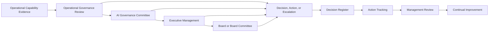

# AI Governance Oversight Framework

## Executive Summary

The AI Governance Oversight Framework establishes how Megastar Mortgage governs enterprise-level AI decisions across its AI portfolio.

Operational capabilities identify AI systems, assess impact, manage risk, implement controls, perform assurance, govern providers, monitor performance, respond to incidents, and control changes.

This framework defines how the resulting evidence is escalated, reviewed, decided, recorded, assigned, and followed through at the appropriate governance level.

It establishes:

- governance forums;
- membership and accountability;
- delegated decision rights;
- escalation pathways;
- quorum and conflict requirements;
- meeting cadence;
- standing oversight inputs;
- decision-recording expectations;
- action tracking;
- management-review linkage; and
- continual-improvement linkage.

The framework does not replace the operational capabilities that produce specialist conclusions. It governs how material matters move from evidence to enterprise decision.

---

## Purpose

The purpose of this framework is to establish a consistent, proportionate, and auditable oversight model for AI governance.

It enables Megastar Mortgage to:

- assign clear governance authority;
- route matters to the appropriate forum;
- make decisions using authoritative evidence;
- escalate material or unresolved matters;
- avoid implicit acceptance of risk or exceptions;
- record governance decisions and conditions;
- track actions to completion;
- manage conflicts of interest;
- maintain accountability across capabilities;
- conduct management review; and
- direct continual improvement.

---

## Scope

This framework applies to enterprise-level governance matters involving:

- AI-system approval, restriction, suspension, or retirement;
- material AI risks;
- residual-risk acceptance;
- governance exceptions;
- control or assurance concerns;
- provider risks and failures;
- significant monitoring trends;
- High or Critical incidents;
- Major or failed changes;
- repeated or systemic weaknesses;
- policy or operating-model changes;
- regulatory developments;
- resource and capability constraints;
- governance priorities; and
- continual-improvement decisions.

It applies across the AI governance lifecycle and to all governed AI systems, including the Megastar Intelligent Processor (MIP).

---

## Framework Boundary

### This framework owns

- enterprise AI governance forums;
- forum mandates;
- membership expectations;
- delegated authority;
- decision rights;
- escalation thresholds;
- quorum requirements;
- conflict-of-interest requirements;
- meeting cadence;
- standing oversight inputs;
- decision-recording requirements;
- action tracking;
- management-review integration;
- continual-improvement integration; and
- board or executive escalation where required.

### This framework does not own

- AI-system intake or impact assessment;
- risk identification, analysis, or scoring;
- control design or operation;
- assurance testing;
- provider due diligence;
- monitoring calculation;
- incident investigation;
- change implementation;
- privacy, security, legal, or compliance analysis;
- individual residual-risk decisions;
- individual exception requests; or
- framework mapping.

Those activities remain with their accountable capabilities and functions.

---

## Oversight Objectives

The framework is designed to ensure that:

- material AI matters reach the correct authority;
- decisions are evidence-based;
- authority is proportionate to consequence;
- ownership is explicit;
- conditions and actions are traceable;
- unresolved matters are escalated;
- risk and exceptions are not accepted implicitly;
- cross-capability themes are identified;
- repeated weaknesses receive systemic treatment;
- management review evaluates the governance system;
- improvement decisions are prioritized; and
- executive and board oversight is supported where required.

---

## Oversight Model

Not every matter passes through every forum.

Routing depends on:

- delegated authority;
- materiality;
- risk;
- urgency;
- regulatory significance;
- strategic impact;
- stakeholder consequence; and
- unresolved escalation.

---

## Governance Principles

Megastar Mortgage applies the following principles:

- Governance authority shall be explicit.
- Decisions shall use current and authoritative evidence.
- Specialist conclusions shall remain with specialist capabilities.
- Decision rationale and conditions shall be recorded.
- Residual risk shall not be accepted implicitly.
- Exceptions shall be temporary, controlled, and reviewed.
- Material conflicts of interest shall be declared and managed.
- Quorum and delegated authority shall be confirmed before decisions are made.
- High and Critical matters shall remain visible.
- Repeated incidents, control failures, failed changes, and recurring exceptions shall be reviewed for systemic weakness.
- Actions shall have accountable owners and due dates.
- Overdue or ineffective actions shall be escalated.
- Management review shall evaluate the governance system, not only individual AI systems.
- Continual improvement shall address causes rather than symptoms.
- Board or executive escalation shall occur where authority, regulation, or significance requires it.

---

## Governance Forums

### Operational Governance Review

The Operational Governance Review provides routine oversight of current governance activity.

It may review:

- open actions;
- overdue actions;
- portfolio changes;
- monitoring breaches;
- incident status;
- change status;
- provider issues;
- assurance findings;
- exception aging;
- decision aging; and
- matters requiring escalation.

It may decide matters within delegated operational authority.

It shall escalate matters that exceed its authority or remain unresolved.

---

### AI Governance Committee

The AI Governance Committee is the principal cross-functional decision forum for material AI governance matters.

It may:

- review material AI risks;
- approve or recommend residual-risk decisions;
- review exceptions;
- direct control or assurance action;
- require provider remediation;
- review significant incidents and changes;
- approve restrictions or conditions;
- prioritize governance improvements;
- direct policy or operating-model changes;
- escalate matters to Executive Management; and
- review management-system effectiveness.

Its detailed authority shall be documented in the decision-rights matrix.

---

### Executive Management

Executive Management governs matters that are:

- strategic;
- enterprise-wide;
- Critical;
- potentially unacceptable;
- beyond committee authority;
- resource-intensive;
- regulatory-significant; or
- material to enterprise reputation or operations.

Executive Management may:

- approve major strategic decisions;
- accept or reject significant residual risk;
- authorize suspension or retirement;
- allocate resources;
- approve major policy changes;
- direct provider exit or replacement review;
- escalate to the Board; and
- require enterprise-wide improvement.

---

### Board or Board Committee

Board or Board Committee oversight may be required where:

- organizational governance requires it;
- law or regulation requires it;
- enterprise risk significance warrants it;
- a matter exceeds executive authority;
- a Critical or systemic issue persists;
- a strategic AI decision affects enterprise direction; or
- management-system effectiveness is materially deficient.

The framework does not presume that every AI decision requires board involvement.

---

## Governance Forum Design

Each governance forum shall define:

- purpose;
- scope;
- chair;
- membership;
- standing attendees;
- subject-matter participants;
- quorum;
- meeting cadence;
- decision authority;
- delegated authority;
- escalation thresholds;
- standing agenda;
- conflict-of-interest rules;
- decision-recording requirements;
- action-tracking requirements; and
- review of prior actions.

---

## Membership

Forum membership should include representation appropriate to the matters governed.

Possible members include:

- AI Governance;
- AI System Owners;
- Business Leadership;
- Risk;
- Controls;
- AI Assurance;
- Third-Party Risk;
- Technology;
- Security;
- Privacy;
- Legal & Compliance;
- Internal Audit;
- Operations;
- Data Governance; and
- Executive Management.

Membership shall reflect decision accountability, not attendance convenience.

---

## Chair Responsibilities

The chair shall:

- confirm agenda and purpose;
- confirm quorum;
- confirm delegated authority;
- identify conflicts;
- ensure relevant evidence is available;
- maintain decision discipline;
- prevent specialist conclusions from being overridden without evidence;
- confirm decisions, owners, and due dates;
- confirm escalation where required; and
- ensure formal records are completed.

---

## Secretariat Responsibilities

The secretariat or designated coordinator shall:

- maintain the governance calendar;
- distribute materials;
- record attendance;
- confirm quorum;
- record decisions;
- assign Decision IDs;
- record actions;
- track due dates;
- maintain meeting records;
- escalate overdue actions; and
- update the AI Governance Decision Register.

---

## Quorum

Quorum shall be defined for each forum.

Quorum may require:

- the chair or delegate;
- AI Governance representation;
- the accountable business or AI System Owner;
- relevant specialist representation;
- a minimum number of voting members; and
- required authority for the decision being considered.

A decision shall not be treated as valid where required quorum or authority is absent.

Where an urgent decision must be made outside normal quorum, the decision shall follow an approved emergency or delegated-authority route and be ratified where required.

---

## Conflict of Interest

Participants shall declare actual, potential, or perceived conflicts.

Conflict controls may include:

- disclosure;
- recusal;
- removal from voting;
- independent review;
- additional assurance;
- escalation; or
- appointment of an alternate decision-maker.

The conflict and its treatment shall be recorded.

---

## Decision Rights

The framework shall define who may:

- approve an AI system for use;
- approve restricted operation;
- suspend an AI system;
- retire an AI system;
- accept residual AI risk;
- approve a governance exception;
- require control remediation;
- require independent assurance;
- require provider remediation;
- approve a provider continuation condition;
- require provider exit review;
- approve enhanced monitoring;
- direct incident escalation;
- approve a material governance change;
- approve policy updates;
- prioritize improvement initiatives;
- allocate governance resources; and
- escalate to Executive Management or the Board.

Decision rights shall be proportionate to:

- impact classification;
- residual-risk level;
- stakeholder consequence;
- provider criticality;
- legal or regulatory significance;
- operational dependency;
- strategic importance; and
- decision reversibility.

---

## Decision Authority Levels

| Authority Level | Typical Decision Scope |
|---|---|
| Operational | Routine matters within approved policy, thresholds, and delegated authority |
| Functional Governance | Material matters requiring cross-functional specialist input |
| AI Governance Committee | High-impact, cross-capability, exception, restriction, or material residual-risk matters |
| Executive Management | Critical, enterprise-wide, strategic, or potentially unacceptable matters |
| Board or Board Committee | Matters requiring formal board oversight or exceeding executive authority |

---

## Escalation Triggers

Escalation may be required where:

- a matter exceeds delegated authority;
- a High or Critical risk remains unresolved;
- residual-risk acceptance is requested beyond authority;
- an exception is material or repeatedly renewed;
- a key control is ineffective;
- assurance results are unsatisfactory;
- a Critical provider issue persists;
- a High or Critical incident remains open;
- a Major or failed change creates material exposure;
- regulatory or legal obligations are affected;
- a decision is overdue;
- an action is repeatedly delayed;
- evidence is insufficient;
- forum members cannot reach a decision;
- a conflict prevents objective decision-making;
- resource constraints prevent required treatment; or
- a repeated pattern indicates systemic weakness.

---

## Escalation Requirements

Each escalation shall identify:

- matter;
- urgency;
- source capability;
- supporting evidence;
- current owner;
- decision required;
- reason current authority is insufficient;
- target governance forum;
- due date;
- interim controls or restrictions; and
- consequences of delay.

---

## Governance Inputs

Standing oversight inputs may include:

- AI portfolio status;
- AI-system inventory coverage;
- impact-assessment outcomes;
- material AI risks;
- residual-risk proposals;
- control implementation and health;
- AI Assurance results;
- provider-governance status;
- monitoring trends;
- KPI and KRI status;
- incidents and recurrence;
- changes and failures;
- overdue findings and actions;
- open exceptions;
- regulatory developments;
- audit findings;
- stakeholder concerns;
- resource constraints; and
- prior governance decisions.

Each source capability remains authoritative for its underlying evidence.

---

## Standing Agenda

A proportionate standing agenda may include:

1. Prior decisions and overdue actions  
2. Material portfolio changes  
3. High and Critical risks  
4. Residual-risk acceptance requests  
5. Open exceptions  
6. Assurance outcomes  
7. Key-control concerns  
8. Provider issues  
9. Monitoring trends  
10. Significant incidents  
11. Major or failed changes  
12. Regulatory developments  
13. Decisions required  
14. Continual-improvement priorities  

The agenda may be adjusted to the forum’s scope.

---

## Governance Decision Record

Every material decision shall be recorded in the AI Governance Decision Register.

The decision record shall include:

- Decision ID;
- date;
- governance forum;
- matter considered;
- supporting references;
- decision authority;
- decision;
- rationale;
- conditions;
- dissent or challenge, where material;
- accountable owner;
- required actions;
- target dates;
- review date;
- expiry date, where applicable;
- related risk, control, exception, provider, incident, change, or improvement records;
- escalation status; and
- closure status.

---

## Decision Outcomes

Possible outcomes include:

- Approved;
- Approved with Conditions;
- Deferred;
- Rejected;
- Escalated;
- Information Requested;
- Restricted;
- Suspended;
- Retired;
- Exception Approved;
- Residual Risk Accepted;
- Additional Assurance Required;
- Additional Treatment Required; or
- Closed.

The selected outcome shall remain within the authority of the deciding forum.

---

## Action Management

Every decision action shall identify:

- Action ID;
- action;
- owner;
- priority;
- due date;
- receiving capability or function;
- receiving record;
- evidence requirement;
- status;
- escalation trigger; and
- closure evidence.

Action completion shall remain distinct from action effectiveness.

---

## Overdue and Unresolved Matters

Overdue matters shall be reviewed according to:

- risk significance;
- impact;
- age;
- reason for delay;
- interim controls;
- recurrence;
- owner performance; and
- consequence of continued delay.

Possible responses include:

- revised date;
- additional controls;
- increased monitoring;
- reassignment;
- escalation;
- restriction;
- suspension;
- additional assurance; or
- executive intervention.

---

## Relationship to Residual-Risk Acceptance

This framework defines which forum may decide residual-risk acceptance and when escalation is required.

The detailed evaluation, decision record, expiry, renewal, revocation, and monitoring requirements are defined in the AI Residual Risk Acceptance artifact.

Residual-risk acceptance shall use authoritative inputs from:

- Enterprise AI Risk Register;
- Enterprise AI Control Register;
- AI Assurance;
- Continuous Monitoring;
- AI Incident Management;
- Third-Party AI Governance; and
- AI Change Management.

---

## Relationship to Exception Management

This framework defines which forum may approve, renew, revoke, or escalate governance exceptions.

The detailed exception lifecycle is defined in the AI Governance Exception Management artifact.

Exceptions shall not be used to:

- avoid risk treatment indefinitely;
- bypass legal obligations;
- replace required residual-risk acceptance;
- conceal control failure; or
- create permanent undocumented practices.

---

## Relationship to Management Review

Management Review is the formal evaluation of whether the AI governance management system remains suitable, adequate, and effective.

This framework establishes:

- the responsible forum;
- review cadence;
- required inputs;
- required authority;
- decision recording;
- action tracking; and
- escalation.

The detailed Management Review process is defined in the AI Governance Management Review artifact.

---

## Relationship to Continual Improvement

Systemic weaknesses, repeated failures, management-review conclusions, and strategic priorities may create continual-improvement initiatives.

The framework ensures that improvement matters are:

- formally identified;
- prioritized;
- assigned;
- resourced;
- tracked;
- reviewed for effectiveness; and
- closed through the appropriate improvement record.

The detailed improvement lifecycle is governed through the AI Continual Improvement Register and AI Governance Improvement Plan.

---

## Cross-Capability Handoffs

| Oversight Decision | Receiving Capability |
|---|---|
| AI-system reassessment, restriction, suspension, or retirement | AI Inventory & Assessment |
| Risk reassessment or treatment | AI Risk Management |
| Control implementation, redesign, or retirement | AI Controls |
| Independent testing or assurance | AI Assurance |
| Provider remediation, restriction, or exit review | Third-Party AI Governance |
| Monitoring change or enhanced oversight | Continuous Monitoring |
| Incident investigation or response | AI Incident Management |
| Material governance or system change | AI Change Management |
| Regulatory or framework update | Framework Alignment |

Governance Oversight assigns and tracks the decision.

The receiving capability performs the specialist activity.

---

## Oversight Calendar

The governance calendar may include:

- monthly Operational Governance Review;
- quarterly AI Governance Committee review;
- periodic Executive Management review;
- annual Management Review;
- scheduled residual-risk reviews;
- exception-expiry reviews;
- improvement-plan reviews;
- policy reviews;
- assurance-plan reviews; and
- event-triggered escalation.

Cadence shall reflect organizational scale, risk, regulatory expectations, and AI portfolio maturity.

---

## Oversight Effectiveness

The framework may be evaluated using measures such as:

- decisions made within required time;
- decisions with complete evidence;
- actions with accountable owners;
- overdue action rate;
- exception aging;
- residual-risk review completion;
- escalation timeliness;
- decision reversal or reopening;
- repeated unresolved matters;
- management-review completion;
- improvement delivery;
- improvement effectiveness; and
- unresolved High or Critical governance matters.

Definitions and thresholds remain within Continuous Monitoring and the Governance Metrics Catalogue.

---

## Framework Review Triggers

This framework shall be reviewed when:

- decision authority is unclear;
- governance forums duplicate one another;
- material matters are repeatedly delayed;
- quorum frequently fails;
- conflicts are not managed effectively;
- decisions lack sufficient evidence;
- High or Critical issues remain unresolved;
- repeated exceptions emerge;
- management review identifies a structural weakness;
- regulation changes;
- the operating model changes; or
- the oversight structure no longer remains proportionate.

---

## Framework Approval Criteria

Before approval, Megastar Mortgage confirms that:

- governance forums are defined;
- forum purposes do not overlap unnecessarily;
- membership is appropriate;
- quorum is established;
- conflicts are governed;
- decision rights are clear;
- delegated authority is documented;
- escalation triggers are defined;
- standing inputs are identified;
- meeting cadence is established;
- Decision Register use is mandatory;
- action tracking is defined;
- residual-risk and exception authority is clear;
- Management Review is integrated;
- continual improvement is integrated; and
- cross-capability handoffs are defined.

---

## Related Artifacts

- AI Governance Decision Register
- AI Residual Risk Acceptance
- AI Governance Exception Management
- AI Governance Management Review
- AI Continual Improvement Register
- AI Governance Improvement Plan
- AI Governance Oversight Summary

---

## Document Control

| Field | Value |
|---|---|
| Document | AI Governance Oversight Framework |
| Capability | Governance Oversight & Continual Improvement |
| Capability Number | 11 |
| Repository | Enterprise AI Governance Playbook |
| Reference Organization | Megastar Mortgage |
| Reference AI System | Megastar Intelligent Processor (MIP) |
| Document Owner | AI Governance Lead |
| Version | 1.0 |
| Review Cycle | Annual |
| Status | Published Reference |

---

## Revision History

| Version | Date | Description |
|---|---|---|
| 1.0 | July 2026 | Initial release of the AI Governance Oversight Framework. |