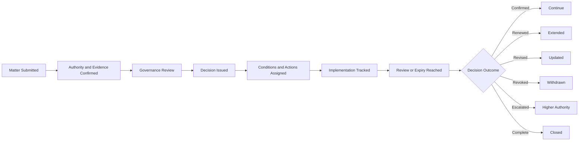

# AI Governance Decision Register

## Executive Summary

The AI Governance Decision Register is the authoritative record of material AI governance decisions made across Megastar Mortgage.

It records what matter was considered, which authority decided it, what evidence supported the decision, what outcome was reached, which conditions or restrictions apply, who owns the required actions, and when the decision must be reviewed, renewed, revised, revoked, or closed.

The register supports traceability across the AI governance operating model by linking decisions to the relevant AI systems, risks, controls, assurance outcomes, providers, monitoring results, incidents, changes, exceptions, residual-risk acceptances, management reviews, and improvement initiatives.

The register records the decision and its lifecycle. It does not replace the underlying specialist assessment, operational record, meeting minutes, or evidence source.

---

## Purpose

The purpose of this document is to establish the structure, ownership, lifecycle rules, and minimum information requirements for the AI Governance Decision Register.

The register enables Megastar Mortgage to:

- assign a unique identifier to every material governance decision;
- maintain one authoritative decision record;
- confirm that decisions were made by the correct authority;
- preserve the evidence and rationale supporting each decision;
- record conditions, restrictions, review dates, and expiry dates;
- assign accountable owners and actions;
- track implementation and condition status;
- identify overdue, expired, unresolved, revised, or revoked decisions;
- connect decisions to authoritative governance records;
- support management review, audit, assurance, and executive oversight; and
- retain decision history after closure.

---

## Register Scope

The AI Governance Decision Register includes material decisions concerning:

- AI-system approval;
- restricted operation;
- suspension;
- retirement;
- residual-risk acceptance;
- governance exceptions;
- control remediation;
- assurance requirements;
- provider remediation, restriction, continuation, or exit review;
- enhanced monitoring;
- incident escalation;
- material AI changes;
- policy or operating-model changes;
- governance priorities;
- resource allocation;
- improvement initiatives;
- management-review actions;
- executive escalation; and
- board escalation.

Routine operational decisions may remain within their owning capability where they do not require enterprise governance authority.

---

## Register Boundary

### The register owns

- unique Decision ID;
- decision identity;
- decision type;
- matter submitted;
- source capability;
- decision authority;
- governance forum;
- authority level;
- quorum and conflict status;
- evidence references;
- evidence sufficiency;
- decision outcome;
- rationale;
- conditions and restrictions;
- accountable owner;
- required actions;
- review and expiry dates;
- implementation status;
- condition status;
- escalation status;
- renewal, revision, revocation, and closure status;
- governance linkages; and
- decision history.

### The register does not own

- risk identification, analysis, or scoring;
- residual-risk assessment;
- exception assessment;
- control design or testing;
- assurance conclusions;
- provider assessment;
- monitoring calculations;
- incident investigation;
- change implementation;
- management-review analysis;
- improvement delivery; or
- meeting minutes.

Those remain within their authoritative capabilities and records.

---

## Register Ownership

| Role | Responsibility |
|---|---|
| Register Owner | Maintains the register structure, standards, access, quality, and lifecycle rules. |
| Decision Owner | Ensures the individual decision record remains current. |
| Governance Secretariat | Records decisions, assigns Decision IDs, tracks actions, and updates status. |
| Decision Authority | Confirms the decision, rationale, conditions, and required review. |
| Action Owner | Delivers the assigned action and provides evidence. |
| AI Governance Lead | Oversees consistency, escalation, linkage, and portfolio reporting. |
| Closure Authority | Confirms that decision obligations are complete and approves closure. |

The Decision Owner is accountable for the completeness and timeliness of the individual decision record.

---

## Decision Lifecycle

The register shall preserve the full decision history.

---

## Decision Types

| Decision Type | Typical Use |
|---|---|
| AI-System Approval | Approve an AI system or use case for operation. |
| Restriction | Limit scope, users, data, automation, provider use, or operating conditions. |
| Suspension | Temporarily stop use or operation. |
| Retirement | Permanently discontinue an AI system, service, or governed activity. |
| Residual-Risk Acceptance | Accept remaining risk under defined authority and conditions. |
| Governance Exception | Approve a temporary deviation from an established requirement. |
| Control Direction | Require control implementation, redesign, strengthening, or retirement. |
| Assurance Direction | Require independent evaluation, testing, or retesting. |
| Provider Direction | Require remediation, restriction, continuation review, or exit review. |
| Monitoring Direction | Require new, revised, or enhanced monitoring. |
| Incident Direction | Require escalation, investigation, restriction, or response action. |
| Change Approval | Approve or direct a material AI or governance change. |
| Policy or Operating-Model Decision | Approve changes to governance requirements or structure. |
| Improvement Priority | Approve and prioritize a continual-improvement initiative. |
| Resource Decision | Allocate people, budget, technology, or specialist support. |
| Escalation | Transfer the matter to a higher authority. |
| Closure | Confirm that required obligations are complete. |

---

## Decision Outcomes

| Outcome | Meaning |
|---|---|
| Approved | The proposed decision is granted. |
| Approved with Conditions | Approval is granted subject to defined requirements. |
| Deferred | Additional evidence, assessment, remediation, or consultation is required. |
| Rejected | The request is not approved. |
| Escalated | The matter exceeds the current authority or requires higher review. |
| Restricted | Operation or use may continue only within defined limits. |
| Suspended | Operation or use must stop temporarily. |
| Retired | The AI system, service, or governed activity must be discontinued. |
| Renewed | A time-bound decision is extended after authorized review. |
| Revised | A prior decision or its conditions are changed. |
| Revoked | A prior approval, acceptance, or exception is withdrawn. |
| Confirmed | A prior decision remains valid without change. |
| Closed | All required obligations and review conditions are complete. |

---

## Required Register Fields

### 1. Decision Identification

| Field | Purpose |
|---|---|
| Decision ID | Unique and permanent decision identifier. |
| Decision Title | Concise name of the decision. |
| Decision Type | Classification of the governance decision. |
| Matter Description | Factual description of the matter considered. |
| Submission Date | Date the matter entered governance review. |
| Decision Date | Date the decision was issued. |
| Effective Date | Date the decision became effective. |
| Current Decision Status | Current lifecycle position. |
| Decision Version | Current approved version of the decision. |

---

### 2. Governance Authority

| Field | Purpose |
|---|---|
| Governance Forum | Forum that considered the matter. |
| Decision Authority | Individual or body authorized to decide. |
| Authority Level | Operational, Functional, Committee, Executive, or Board. |
| Delegated Authority Reference | Applicable delegation, where used. |
| Quorum Required | Whether formal quorum applied. |
| Quorum Confirmed | Whether quorum was satisfied. |
| Conflict Identified | Whether a conflict was declared. |
| Conflict Treatment | How the conflict was managed. |
| Voting or Consensus Outcome | Decision process outcome, where applicable. |

---

### 3. Source and Evidence

| Field | Purpose |
|---|---|
| Source Capability | Capability or function that submitted the matter. |
| Requesting Owner | Owner of the request or escalation. |
| Supporting Evidence References | Links to authoritative supporting records. |
| Evidence Sufficiency | Sufficient, Sufficient with Limitations, Insufficient, or Unavailable. |
| Material Evidence Limitations | Known constraints affecting the decision. |
| Specialist Conclusions | Relevant conclusions from accountable functions. |
| Urgency | Routine, Time-Sensitive, Urgent, or Critical. |
| Consequence of Delay | Potential impact if the decision is delayed. |

---

### 4. Decision

| Field | Purpose |
|---|---|
| Decision Outcome | Approved, Deferred, Rejected, Escalated, Restricted, or other outcome. |
| Decision Rationale | Concise explanation supporting the decision. |
| Conditions | Requirements attached to the decision. |
| Restrictions | Operating boundaries imposed by the decision. |
| Dissent or Challenge | Material disagreement or challenge raised. |
| Dissent Treatment | How the challenge was considered. |
| Review Date | Date the decision must be reviewed. |
| Expiry Date | Date the decision ceases to remain valid, where applicable. |
| Renewal Permitted | Whether renewal is allowed. |
| Revocation Triggers | Conditions requiring withdrawal of the decision. |

---

### 5. Accountability and Actions

| Field | Purpose |
|---|---|
| Decision Owner | Accountable owner for the decision lifecycle. |
| AI System Owner | Relevant system owner, where applicable. |
| Risk Owner | Relevant risk owner, where applicable. |
| Action IDs | Linked actions arising from the decision. |
| Action Owners | Accountable owners for required actions. |
| Target Dates | Required completion dates. |
| Evidence Required | Evidence needed to confirm completion. |
| Action Status | Current action position. |
| Escalation Trigger | Condition requiring escalation. |
| Escalation Authority | Authority receiving escalation. |
| Interim Controls or Restrictions | Temporary protection pending completion. |

---

### 6. Governance Linkages

| Field | Purpose |
|---|---|
| AI System Inventory ID | Link to the affected AI system. |
| Related Risk IDs | Linked Enterprise AI Risk Register records. |
| Related Control IDs | Linked Enterprise AI Control Register records. |
| Assurance References | Linked AI Assurance records. |
| Provider Relationship IDs | Linked third-party governance records. |
| Monitoring References | Linked monitoring records or summaries. |
| Incident IDs | Linked AI incident records. |
| Change IDs | Linked AI change records. |
| Exception IDs | Linked governance exception records. |
| Residual-Risk Acceptance IDs | Linked residual-risk decisions. |
| Improvement IDs | Linked continual-improvement records. |
| Management Review Reference | Linked management-review record. |
| Policy or Framework Reference | Relevant governance obligation. |

Detailed evidence shall be referenced, not duplicated.

---

### 7. Decision Implementation

| Field | Purpose |
|---|---|
| Implementation Required | Whether the decision requires execution. |
| Implementation Status | Not Required, Planned, In Progress, Complete, Failed, or Overdue. |
| Implementation Owner | Owner responsible for execution. |
| Implementation Reference | Link to the authoritative implementation record. |
| Condition Status | Not Applicable, Open, Partially Satisfied, Satisfied, Breached, or Overdue. |
| Restriction Status | Active, Modified, Removed, Expired, or Breached. |
| Monitoring Requirement | Required monitoring linked to the decision. |
| Monitoring Status | Current monitoring position. |
| Effectiveness Review Required | Whether implementation effectiveness must be evaluated. |
| Effectiveness Review Reference | Link to the relevant review. |

---

### 8. Review, Renewal, Revision, and Revocation

| Field | Purpose |
|---|---|
| Review Status | Not Due, Due, In Progress, Complete, or Overdue. |
| Review Outcome | Confirmed, Renewed, Revised, Revoked, Escalated, or Closed. |
| Review Date Completed | Date the review concluded. |
| Renewal Status | Not Applicable, Requested, Approved, Rejected, or Expired. |
| Renewal Period | Approved extension period. |
| Revision Status | Whether the decision was amended. |
| Revised Decision Reference | Link to the updated decision. |
| Revocation Status | Whether withdrawal was considered or approved. |
| Revocation Date | Date the decision was withdrawn. |
| Revocation Reason | Basis for withdrawal. |
| Superseding Decision ID | Decision that replaced the prior decision. |

---

### 9. Closure

| Field | Purpose |
|---|---|
| Closure Readiness | Ready, Conditionally Ready, or Not Ready. |
| Closure Status | Open, Closure Pending, Closed, Reopened, or Cancelled. |
| Closure Rationale | Reason supporting closure. |
| Closure Authority | Authority approving closure. |
| Closure Date | Date closure was approved. |
| Closure Evidence Reference | Link to closure evidence. |
| Open Matter Retained Elsewhere | Any unresolved matter transferred to another authoritative record. |
| Record Retention Date | Required retention or review date. |

---

## Decision Status Model

| Status | Meaning |
|---|---|
| Submitted | Matter has entered formal governance review. |
| Under Review | Evidence, authority, or consultation is being evaluated. |
| Decision Pending | Review is complete and the formal decision is pending. |
| Approved | Decision is effective. |
| Approved with Conditions | Decision is effective subject to defined conditions. |
| Deferred | Additional work is required before decision. |
| Rejected | Request was not approved. |
| Escalated | Matter was transferred to a higher authority. |
| Restricted | Decision imposes operating limitations. |
| Suspended | Decision requires temporary cessation. |
| Retired | Decision requires permanent discontinuation. |
| Review Due | Scheduled review has become due. |
| Renewal Pending | Extension is under consideration. |
| Revised | Prior decision has been amended. |
| Revoked | Prior decision has been withdrawn. |
| Closure Pending | Closure criteria are met and approval is pending. |
| Closed | Decision obligations are complete. |
| Reopened | New evidence or noncompliance requires renewed review. |
| Superseded | A later decision replaced this decision. |

---

## Decision Integrity Rules

The register shall comply with the following rules:

- Every material governance decision receives one unique Decision ID.
- Decision IDs shall not be reused.
- One decision shall not be recorded separately by each participating function.
- Underlying evidence shall be linked rather than copied.
- Decision authority and quorum shall be recorded.
- Material conflicts shall be disclosed and treated.
- Rationale shall be recorded for all material outcomes.
- Conditions, restrictions, owners, and dates shall be explicit.
- Time-bound decisions shall include review or expiry dates.
- Expired decisions shall not continue implicitly.
- Action completion shall remain distinct from effectiveness.
- Revised, revoked, rejected, expired, and superseded decisions shall remain retained.
- Decision history shall not be overwritten.
- Reopened decisions shall retain the original Decision ID.
- Manual amendments shall identify who changed the record, when, and why.
- Sensitive information shall be protected through role-based access.
- Portfolio reporting shall derive from the register without changing source records.

---

## Evidence Sufficiency

Evidence shall be classified as:

| Status | Meaning |
|---|---|
| Sufficient | Supports a defensible governance decision. |
| Sufficient with Limitations | Supports a decision with disclosed constraints or conditions. |
| Insufficient | Does not support a reliable decision. |
| Unavailable | Required evidence cannot be obtained. |

Insufficient or unavailable evidence may result in:

- deferral;
- additional assurance;
- increased monitoring;
- temporary restriction;
- escalation;
- rejection; or
- inability to approve the requested outcome.

---

## Condition Management

Each condition shall identify:

- Condition ID;
- requirement;
- owner;
- due date;
- evidence required;
- monitoring requirement;
- escalation trigger;
- current status; and
- closure reference.

Condition status shall be one of:

- Open;
- In Progress;
- Partially Satisfied;
- Satisfied;
- Breached;
- Overdue;
- Waived through Authorized Decision; or
- No Longer Applicable.

A breached or overdue material condition shall trigger review or escalation.

---

## Decision Review

A decision shall be reviewed when:

- the scheduled review date is reached;
- the expiry date approaches;
- conditions are not satisfied;
- the operating environment changes;
- residual risk changes;
- a key control becomes ineffective;
- assurance results change;
- a material incident occurs;
- a major change occurs;
- provider conditions change;
- regulation changes;
- new evidence emerges;
- the decision is challenged; or
- the decision no longer remains proportionate.

---

## Renewal

A time-bound decision may be renewed only when:

- the original decision remains within current authority;
- supporting evidence is current;
- material conditions are satisfied or formally revised;
- no legal or regulatory prohibition exists;
- risk and control information remain current;
- the need for continued approval is justified;
- monitoring remains adequate; and
- a new review and expiry date are assigned.

Repeated renewal shall trigger review of the underlying governance requirement, control, resource constraint, or operating model.

---

## Revision

A decision shall be revised where:

- scope changes;
- conditions change;
- restrictions change;
- authority changes;
- new evidence changes the rationale;
- implementation differs materially from the approved state; or
- the decision no longer reflects the current governance position.

Revisions shall preserve prior versions.

---

## Revocation

A decision may be revoked where:

- conditions are breached;
- material evidence was incomplete or inaccurate;
- risk materially increases;
- a key control fails;
- a significant incident occurs;
- provider conditions deteriorate;
- legal or regulatory requirements change;
- the decision is misused;
- continued operation becomes unacceptable; or
- the decision authority requires withdrawal.

Revocation shall identify the required operational response and receiving capability.

---

## Closure Criteria

A decision may be closed when:

- required actions are complete;
- required evidence is available;
- conditions are satisfied or formally transferred;
- restrictions are removed, expired, or governed elsewhere;
- linked authoritative records are updated;
- effectiveness review is complete where required;
- no unresolved material blocker remains;
- the closure authority approves; and
- closure evidence is recorded.

Closure does not erase the historical decision.

---

## Register Review

The register shall be reviewed periodically to identify:

- decisions awaiting review;
- expired decisions;
- renewal requests;
- overdue actions;
- breached conditions;
- active restrictions;
- unresolved escalations;
- decisions lacking evidence;
- decisions lacking owners;
- decisions without review dates;
- repeatedly renewed decisions;
- revised or revoked decisions;
- reopened decisions;
- unresolved High or Critical matters; and
- stale records.

Material trends shall feed Management Review and the AI Governance Oversight Summary.

---

## Register Maintenance

The register shall be updated when:

- a matter is submitted;
- authority is confirmed;
- quorum or conflict status changes;
- evidence is added or updated;
- a decision is issued;
- conditions or restrictions are imposed;
- an action is assigned;
- implementation status changes;
- a review becomes due;
- a decision is confirmed, renewed, revised, revoked, escalated, or superseded;
- a condition is breached;
- closure is approved; or
- the matter is reopened.

---

## Related Artifacts

- AI Governance Oversight Framework
- AI Residual Risk Acceptance
- AI Governance Exception Management
- AI Governance Management Review
- AI Continual Improvement Register
- AI Governance Improvement Plan
- AI Governance Oversight Summary

---

## Document Control

| Field | Value |
|---|---|
| Document | AI Governance Decision Register |
| Capability | Governance Oversight & Continual Improvement |
| Capability Number | 11 |
| Repository | Enterprise AI Governance Playbook |
| Reference Organization | Megastar Mortgage |
| Reference AI System | Megastar Intelligent Processor (MIP) |
| Register Owner | AI Governance Lead |
| Version | 1.0 |
| Review Cycle | Quarterly |
| Status | Published Reference |

---

## Revision History

| Version | Date | Description |
|---|---|---|
| 1.0 | July 2026 | Initial release of the AI Governance Decision Register. |