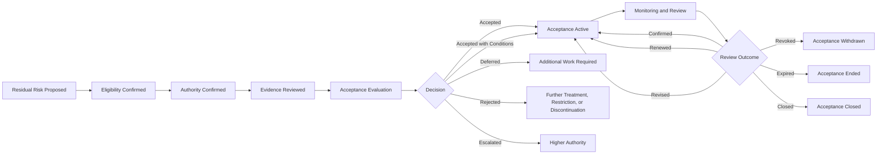

# AI Residual Risk Acceptance

## Executive Summary

AI Risk Management identifies, analyzes, evaluates, and treats AI risk.

AI Controls defines and implements the controls intended to reduce that risk.

AI Assurance provides independent confidence concerning control design, implementation, and effectiveness.

Continuous Monitoring provides current evidence about whether risk conditions, controls, thresholds, incidents, providers, and operating conditions remain within approved expectations.

AI Residual Risk Acceptance governs the formal decision concerning the risk that remains after relevant treatments and controls have been considered.

This artifact establishes how Megastar Mortgage evaluates, approves, conditions, reviews, renews, revises, revokes, expires, and closes residual-risk acceptance decisions involving the Megastar Intelligent Processor (MIP) and other governed AI systems.

Residual-risk acceptance does not remove the underlying risk, replace treatment, weaken accountability, or permit implicit acceptance through inaction.

---

## Purpose

The purpose of this document is to establish a controlled and auditable process for formal acceptance of residual AI risk.

It enables Megastar Mortgage to:

- confirm that the residual risk has been assessed through the authoritative risk process;
- determine whether sufficient treatment has been completed;
- confirm that relevant controls and assurance evidence are understood;
- identify the correct acceptance authority;
- evaluate whether acceptance is legally, operationally, and ethically permissible;
- apply conditions, restrictions, monitoring, and expiry where required;
- preserve the decision rationale and supporting evidence;
- monitor accepted risk throughout the acceptance period;
- review, renew, revise, revoke, expire, or close the acceptance; and
- maintain traceability through the AI Governance Decision Register and Enterprise AI Risk Register.

---

## Scope

This process applies where Megastar Mortgage proposes to continue an AI system, use case, provider relationship, business process, or operating condition despite remaining AI risk.

It may apply to residual risk arising from:

- model performance;
- data quality;
- fairness;
- transparency or explainability;
- privacy;
- security;
- human oversight;
- reliability or resilience;
- control limitations;
- provider dependency;
- legal or compliance exposure;
- approved-use constraints;
- incidents;
- changes;
- monitoring limitations;
- operational capacity;
- remediation delays; or
- another governed AI-risk condition.

It applies only after the relevant risk has been recorded in the Enterprise AI Risk Register.

---

## Governance Boundary

### This process owns

- residual-risk acceptance eligibility;
- acceptance authority;
- acceptance decision criteria;
- decision routing;
- acceptance conditions;
- acceptance duration;
- review cadence;
- renewal;
- revision;
- revocation;
- expiry;
- closure;
- decision linkage;
- acceptance history; and
- oversight of accepted residual risk.

### This process does not own

- risk identification;
- inherent-risk assessment;
- likelihood or impact scoring;
- risk treatment design;
- control implementation;
- control testing;
- assurance execution;
- monitoring calculation;
- incident investigation;
- provider due diligence;
- change implementation; or
- legal, privacy, security, or compliance analysis.

Those remain with their accountable capabilities and functions.

---

## Residual Risk Acceptance Lifecycle

---

## Residual Risk

Residual risk is the risk remaining after relevant controls, treatments, limitations, and operating conditions have been considered.

Residual-risk acceptance shall use the current authoritative position recorded in:

- Enterprise AI Risk Register;
- Enterprise AI Control Register;
- AI Assurance records;
- Continuous Monitoring records;
- AI Incident records;
- Third-Party AI Governance records;
- AI Change Management records;
- relevant Privacy, Security, Legal & Compliance conclusions; and
- the affected AI System Inventory record.

The acceptance artifact shall reference these records rather than reproduce their full analysis.

---

## Acceptance Principles

Megastar Mortgage governs residual-risk acceptance according to the following principles:

- Residual risk shall never be accepted implicitly.
- Acceptance shall be recorded explicitly.
- Acceptance authority shall be proportionate to the residual-risk level and potential consequence.
- Acceptance shall use current and sufficient evidence.
- Acceptance does not remove or reduce the underlying risk rating by itself.
- Acceptance does not replace reasonable treatment where further treatment remains proportionate and available.
- Acceptance shall not override legal, regulatory, contractual, privacy, security, or policy prohibitions.
- Acceptance may be time-bound.
- Acceptance may include restrictions, compensating controls, monitoring, actions, and review conditions.
- Accepted risk remains active in the Enterprise AI Risk Register.
- Material changes shall trigger reassessment.
- Significant incidents, control failures, assurance findings, or provider deterioration may trigger revocation.
- Repeated renewal shall trigger review of the underlying operating model, control environment, policy, resource constraint, or treatment strategy.
- Expired acceptance shall not continue through silence or administrative delay.
- Acceptance closure shall require authoritative record updates.

---

## Acceptance Eligibility

Residual risk may be considered for acceptance only when:

- the risk is recorded in the Enterprise AI Risk Register;
- the residual-risk rating is current;
- the relevant treatment plan has been completed, formally deferred, or determined to be disproportionate;
- material controls are identified;
- control implementation status is known;
- relevant assurance evidence is available or its absence is disclosed;
- current monitoring requirements are defined;
- material incidents and open findings are disclosed;
- provider dependencies are understood;
- available treatment alternatives are documented;
- the Risk Owner supports the request;
- the proposed acceptance authority is identified; and
- no legal or regulatory prohibition prevents acceptance.

Where these conditions are not met, the request shall be deferred or rejected.

---

## Conditions That May Prevent Acceptance

Acceptance shall not be granted where:

- continued operation would violate law or regulation;
- an explicit contractual prohibition applies;
- a Critical control is absent without approved compensating protection;
- the evidence is materially unreliable;
- the risk exceeds the authority of the proposed decision-maker;
- active harm remains uncontrolled;
- a High or Critical incident remains unresolved and directly relevant;
- the proposed acceptance would bypass mandatory treatment;
- the affected AI system is operating outside approved use;
- the risk is inconsistent with enterprise risk appetite or tolerance;
- the acceptance duration is undefined for a time-sensitive risk; or
- accountable ownership is absent.

---

## Acceptance Authority

Acceptance authority shall be proportionate to:

- residual-risk rating;
- potential stakeholder harm;
- impact classification;
- legal or regulatory significance;
- privacy or security exposure;
- provider criticality;
- operational dependency;
- strategic importance;
- reversibility;
- duration;
- control confidence; and
- uncertainty.

| Residual-Risk Position | Typical Authority |
|---|---|
| Low | Risk Owner or delegated operational authority |
| Moderate | Functional Governance or designated senior owner |
| High | AI Governance Committee or Executive Management |
| Critical | Executive Management, Board, or Board Committee where required |
| Beyond Defined Authority | Escalation to the next authorized level |

The final authority matrix shall be defined through the AI Governance Oversight Framework.

---

## Required Evidence

The acceptance decision shall consider, where applicable:

- Risk ID and current residual-risk rating;
- residual likelihood;
- residual impact;
- risk treatment completed;
- treatment not completed;
- control design status;
- control implementation status;
- control-effectiveness conclusion;
- assurance outcome;
- monitoring coverage;
- current KPI and KRI position;
- open findings;
- overdue corrective actions;
- relevant incidents;
- provider dependencies;
- change dependencies;
- operating restrictions;
- legal and regulatory conclusions;
- privacy and security conclusions;
- business justification;
- treatment alternatives;
- cost or feasibility constraints;
- consequences of rejection;
- proposed acceptance duration; and
- review and revocation triggers.

---

## Evidence Sufficiency

Evidence shall be classified as:

| Status | Meaning |
|---|---|
| Sufficient | Supports a defensible acceptance decision. |
| Sufficient with Limitations | Supports a decision subject to disclosed constraints and conditions. |
| Insufficient | Does not support a reliable decision. |
| Unavailable | Required evidence cannot be obtained. |

Insufficient or unavailable evidence may lead to:

- deferral;
- additional treatment;
- additional assurance;
- increased monitoring;
- restricted operation;
- escalation;
- rejection; or
- temporary decision under a higher authority.

---

## Acceptance Evaluation

The decision authority shall evaluate:

### Risk Position

- current residual-risk rating;
- trend;
- uncertainty;
- concentration;
- recurrence;
- potential systemic impact; and
- whether the risk remains within appetite or tolerance.

### Treatment Position

- controls implemented;
- treatment completed;
- treatment delayed;
- treatment alternatives;
- treatment feasibility;
- cost and proportionality;
- operational limitations; and
- expected remaining exposure.

### Control and Assurance Position

- control design;
- implementation;
- operating evidence;
- assurance result;
- evidence limitations;
- open deficiencies;
- compensating controls; and
- need for further testing.

### Monitoring Position

- relevant metrics;
- data quality;
- thresholds;
- alerting;
- monitoring frequency;
- escalation routes;
- duration; and
- ability to detect deterioration.

### Incident and Change Position

- relevant incidents;
- recurrence;
- recent changes;
- pending changes;
- corrective actions;
- unresolved root causes; and
- whether acceptance depends on future change.

### Provider Position

- provider criticality;
- provider performance;
- contract obligations;
- subprocessor dependency;
- assurance evidence;
- concentration;
- continuity;
- exit readiness; and
- unresolved provider actions.

### Legal, Privacy, Security, and Compliance Position

- legal permissibility;
- regulatory obligations;
- policy requirements;
- contractual obligations;
- privacy exposure;
- security exposure;
- notification obligations; and
- jurisdictional constraints.

### Business Justification

- business benefit;
- operational necessity;
- customer impact;
- alternatives;
- cost of discontinuation;
- timing;
- strategic significance; and
- consequence of rejection.

---

## Acceptance Outcomes

| Outcome | Meaning |
|---|---|
| Accepted | Residual risk is accepted within the current authority and approved terms. |
| Accepted with Conditions | Acceptance is granted subject to actions, restrictions, controls, monitoring, or review. |
| Deferred | Additional evidence, treatment, assurance, or consultation is required. |
| Rejected | Residual risk is not acceptable. |
| Escalated | The matter exceeds the current authority. |
| Renewed | A prior acceptance is extended after review. |
| Revised | Acceptance scope, conditions, duration, or authority are changed. |
| Revoked | Acceptance is withdrawn because circumstances materially changed or conditions were breached. |
| Expired | The acceptance period ended without approved renewal. |
| Closed | Acceptance is no longer required because the risk, system, or operating condition changed or ended. |

---

## Acceptance Conditions

Acceptance may include conditions such as:

- treatment completion;
- additional control implementation;
- compensating controls;
- additional assurance;
- enhanced monitoring;
- increased human oversight;
- restricted users;
- restricted data;
- limited transaction volume;
- restricted geography;
- provider remediation;
- contract update;
- temporary manual fallback;
- phased operation;
- change implementation;
- incident closure dependency;
- defined review cadence;
- maximum duration; or
- escalation on threshold breach.

Each condition shall identify:

- Condition ID;
- requirement;
- owner;
- due date;
- evidence required;
- monitoring requirement;
- escalation trigger; and
- current status.

---

## Acceptance Duration

Acceptance may be:

- indefinite, where the risk is stable, low, and regularly reviewed;
- time-bound;
- event-bound;
- change-bound;
- provider-contract-bound;
- incident-remediation-bound; or
- conditional upon a specific action.

High and Critical residual-risk acceptance should ordinarily be time-bound unless the appropriate authority explicitly approves otherwise.

The acceptance record shall identify:

- effective date;
- review date;
- expiry date;
- maximum renewal period; and
- conditions for early review.

---

## Monitoring Requirements

Accepted residual risk shall remain subject to defined monitoring.

Monitoring may include:

- residual-risk trend;
- control health;
- KRI status;
- incident activity;
- provider performance;
- change activity;
- exception status;
- action completion;
- assurance findings;
- stakeholder complaints;
- threshold breaches; and
- emerging external obligations.

The acceptance record shall identify:

- monitored condition;
- metric or indicator;
- source;
- owner;
- frequency;
- threshold;
- escalation route;
- review date; and
- monitoring reference.

Continuous Monitoring remains authoritative for metric design, calculation, thresholds, and escalation logic.

---

## Review Requirements

Residual-risk acceptance shall be reviewed:

- at the scheduled review date;
- before expiry;
- when the residual-risk rating changes;
- when a key control fails;
- when assurance results deteriorate;
- when a material incident occurs;
- when a Major change occurs;
- when the provider position changes materially;
- when legal or regulatory obligations change;
- when a condition is breached;
- when monitoring thresholds are exceeded;
- when a new treatment becomes reasonably available;
- when the AI system’s approved use changes;
- when the system is restricted, suspended, or retired; or
- when the decision authority requires review.

---

## Review Outcomes

| Review Outcome | Meaning |
|---|---|
| Confirmed | Acceptance remains valid without change. |
| Renewed | Acceptance is extended for a new period. |
| Revised | Scope, conditions, duration, monitoring, or authority are changed. |
| Revoked | Acceptance is withdrawn. |
| Expired | Acceptance ends without renewal. |
| Closed | Acceptance is no longer required. |
| Escalated | Continued acceptance requires higher authority. |
| Additional Treatment Required | Further risk reduction is required. |

---

## Renewal

Acceptance may be renewed only when:

- the current residual-risk rating is confirmed;
- supporting evidence remains current;
- material conditions are satisfied or formally revised;
- monitoring is adequate;
- no new prohibition applies;
- incidents and findings are disclosed;
- the continued business justification remains valid;
- treatment alternatives have been reconsidered;
- the original authority remains sufficient; and
- a new review and expiry date are assigned.

Repeated renewal shall trigger review of:

- treatment adequacy;
- control design;
- resource constraints;
- provider dependency;
- policy;
- process;
- approved use;
- system retirement; and
- the continued legitimacy of acceptance.

---

## Revision

Acceptance shall be revised where:

- the risk scope changes;
- the residual-risk rating changes;
- controls change;
- monitoring changes;
- business justification changes;
- operating restrictions change;
- provider dependency changes;
- acceptance duration changes;
- ownership changes;
- decision authority changes; or
- new evidence changes the rationale.

The revised decision shall preserve prior versions and history.

---

## Revocation

Acceptance may be revoked where:

- residual risk materially increases;
- a key control fails;
- assurance becomes unsatisfactory;
- a material incident occurs;
- conditions are breached;
- monitoring is ineffective;
- evidence was materially incomplete or inaccurate;
- legal or regulatory requirements change;
- provider performance deteriorates materially;
- operating scope expands beyond the approved boundary;
- treatment becomes reasonably available but is not pursued;
- the decision is misused; or
- continued operation becomes unacceptable.

Revocation shall identify the required response, which may include:

- additional treatment;
- increased monitoring;
- restriction;
- suspension;
- provider action;
- change;
- incident response;
- system retirement; or
- escalation.

---

## Expiry

An expired acceptance shall not remain valid.

Before expiry, the Risk Owner shall ensure one of the following:

- renewal is approved;
- the risk is further treated;
- the operating condition ends;
- the AI system is restricted;
- the AI system is suspended;
- the AI system is retired;
- the acceptance is revised; or
- the matter is escalated.

Expired acceptance without approved disposition shall be treated as a governance breach and escalated.

---

## Closure

Residual-risk acceptance may be closed when:

- the risk has been eliminated;
- the risk is reduced and no longer requires formal acceptance;
- the AI system or use case is retired;
- the relevant provider relationship ends;
- the operating condition ends;
- the risk is transferred to a new authoritative record;
- the acceptance is superseded by a new decision; or
- the acceptance is revoked and the required response is complete.

Closure shall update:

- the AI Governance Decision Register;
- Enterprise AI Risk Register;
- related control, provider, incident, change, monitoring, and inventory records; and
- any linked exception or improvement record.

---

## Decision and Register Linkages

Every residual-risk acceptance decision shall be linked to:

- Decision ID;
- Risk ID;
- AI System Inventory ID;
- Risk Owner;
- acceptance authority;
- supporting control references;
- assurance references;
- monitoring references;
- provider references;
- incident references;
- change references;
- exception references;
- acceptance conditions;
- review date;
- expiry date; and
- closure status.

The AI Governance Decision Register is the authoritative record of the decision.

The Enterprise AI Risk Register remains authoritative for the underlying risk.

---

## Recordkeeping Requirements

The acceptance record shall retain:

- original request;
- current residual-risk position;
- evidence references;
- decision authority;
- decision outcome;
- rationale;
- conditions;
- restrictions;
- owners;
- dates;
- monitoring requirements;
- review history;
- renewal history;
- revisions;
- revocation history;
- expiry status;
- closure evidence; and
- related record references.

Historical decisions shall not be deleted or overwritten.

---

## Quality Requirements

A valid residual-risk acceptance decision shall demonstrate:

- current Risk ID;
- current residual-risk rating;
- accountable Risk Owner;
- identified acceptance authority;
- sufficient evidence;
- disclosed limitations;
- documented treatment alternatives;
- documented decision rationale;
- explicit conditions;
- defined monitoring;
- review date;
- expiry date where required;
- clear revocation triggers;
- linked Decision ID; and
- updated authoritative records.

---

## Related Artifacts

- AI Governance Oversight Framework
- AI Governance Decision Register
- AI Governance Exception Management
- AI Governance Management Review
- AI Continual Improvement Register
- AI Governance Improvement Plan
- AI Governance Oversight Summary

---

## Document Control

| Field | Value |
|---|---|
| Document | AI Residual Risk Acceptance |
| Capability | Governance Oversight & Continual Improvement |
| Capability Number | 11 |
| Repository | Enterprise AI Governance Playbook |
| Reference Organization | Megastar Mortgage |
| Reference AI System | Megastar Intelligent Processor (MIP) |
| Document Owner | AI Governance Lead |
| Version | 1.0 |
| Review Cycle | Annual |
| Status | Published Reference |

---

## Revision History

| Version | Date | Description |
|---|---|---|
| 1.0 | July 2026 | Initial release of the AI Residual Risk Acceptance artifact. |