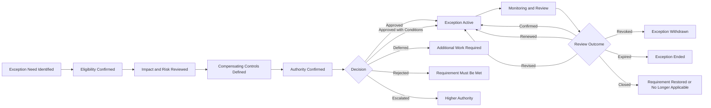

# AI Governance Exception Management

## Executive Summary

AI Governance Exception Management governs temporary, formally approved deviations from established AI governance requirements.

An exception may be necessary where Megastar Mortgage cannot meet a specific policy, control, evidence, timing, monitoring, provider, human-oversight, data, or operational requirement within the normal timeframe, but continued operation remains supportable under defined conditions.

This artifact establishes how exceptions involving the Megastar Intelligent Processor (MIP) and other governed AI systems are requested, assessed, approved, monitored, reviewed, renewed, revised, revoked, expired, and closed.

An exception does not remove the underlying requirement. It does not replace risk treatment, residual-risk acceptance, incident response, or permanent remediation. It creates a temporary, accountable, and traceable governance decision.

---

## Purpose

The purpose of this document is to establish a controlled and auditable process for AI governance exceptions.

It enables Megastar Mortgage to:

- identify the specific requirement from which temporary deviation is requested;
- confirm whether the matter is eligible for exception treatment;
- assess the affected scope, risk, and potential consequence;
- identify compensating controls and monitoring;
- assign an accountable Exception Owner;
- route the request to the correct authority;
- define conditions, restrictions, duration, and expiry;
- monitor compliance with approved exception terms;
- prevent expired or repeatedly renewed exceptions from becoming permanent practice;
- renew, revise, revoke, expire, or close the exception formally; and
- maintain traceability through the AI Governance Decision Register and related governance records.

---

## Scope

This process applies to temporary deviations from approved AI governance requirements involving:

- policy requirements;
- control requirements;
- evidence requirements;
- review or approval timing;
- assurance timing;
- monitoring requirements;
- human-oversight requirements;
- provider obligations;
- approval conditions;
- data requirements;
- access restrictions;
- technical standards;
- remediation deadlines;
- documentation requirements;
- operating procedures; or
- another formally established AI governance requirement.

The process applies only where the underlying requirement remains valid and the requested deviation is temporary.

---

## Governance Boundary

### This process owns

- exception eligibility;
- exception request requirements;
- affected-scope definition;
- exception impact review;
- compensating-control requirements;
- monitoring requirements;
- exception authority;
- decision routing;
- exception conditions;
- duration and expiry;
- review;
- renewal;
- revision;
- revocation;
- expiry;
- closure;
- decision linkage;
- exception history; and
- oversight of active exceptions.

### This process does not own

- risk identification or scoring;
- control design;
- control implementation;
- assurance testing;
- monitoring calculation;
- incident response;
- change implementation;
- legal or regulatory interpretation;
- provider due diligence;
- residual-risk acceptance; or
- permanent remediation.

Those activities remain with their accountable capabilities and functions.

---

## Exception Management Lifecycle

---

## Exception Principles

Megastar Mortgage governs AI exceptions according to the following principles:

- Exceptions shall be explicit and documented.
- Exceptions shall be temporary.
- The underlying requirement shall remain identifiable.
- Each exception shall have one accountable Exception Owner.
- The affected AI system, scope, users, data, processes, and duration shall be defined.
- The exception shall use current and sufficient evidence.
- Compensating controls shall be defined where proportionate.
- Monitoring shall be sufficient to identify deterioration or breach.
- Exceptions shall not override law, regulation, mandatory contractual obligations, or explicit prohibitions.
- Exceptions shall not replace residual-risk acceptance where material residual risk remains.
- Exceptions shall not replace permanent remediation where remediation is required.
- Repeated renewal shall trigger review of the underlying requirement, control, process, resource constraint, or operating model.
- Expired exceptions shall not continue through silence, delay, or informal agreement.
- Breached conditions may trigger restriction, revocation, incident review, or escalation.
- Historical exception records shall be retained.

---

## Exception Eligibility

A request may be eligible for exception treatment when:

- the underlying governance requirement is clearly identified;
- the requested deviation is temporary;
- the affected AI system and operating scope are known;
- the business justification is documented;
- the risk and impact of the deviation are understood;
- compensating controls are available or their absence is disclosed;
- monitoring can be established;
- an accountable owner is assigned;
- an exit or remediation plan exists;
- the requested duration is defined;
- the decision authority is identified; and
- no law, regulation, mandatory contract term, or explicit prohibition prevents the exception.

---

## Conditions That Prevent Exception Approval

An exception shall not be approved where:

- the deviation would violate law or regulation;
- a mandatory contractual obligation cannot be waived;
- the request seeks permanent noncompliance without formal requirement change;
- active harm remains uncontrolled;
- the request would bypass required incident response;
- the request would bypass residual-risk acceptance;
- a Critical control is absent without acceptable compensating protection;
- evidence is materially unreliable;
- the affected AI system is operating outside approved use without separate approval;
- no accountable owner exists;
- the requested scope or duration is undefined;
- the proposed authority lacks decision rights; or
- the requested deviation is inconsistent with enterprise risk appetite or tolerance.

---

## Exception Request Requirements

Every request shall identify:

- Exception ID;
- requirement from which deviation is requested;
- source policy, control, standard, contract, decision, or procedure;
- reason the requirement cannot currently be met;
- business justification;
- affected AI system;
- affected business process;
- affected users, data, providers, controls, and jurisdictions;
- requested scope;
- requested start date;
- requested expiry date;
- current risk and impact;
- compensating controls;
- monitoring requirements;
- remediation or exit plan;
- accountable owner;
- approval authority;
- consequences if the exception is rejected; and
- supporting evidence.

---

## Exception Categories

| Category | Typical Example |
|---|---|
| Policy | Temporary deviation from an approved governance policy. |
| Control | Temporary inability to meet a required control requirement. |
| Evidence | Required evidence cannot be produced within the normal timeframe. |
| Review Timing | Required review cannot be completed by the due date. |
| Assurance Timing | Required independent assurance is delayed. |
| Monitoring | Approved monitoring requirement is temporarily unavailable or reduced. |
| Human Oversight | Required review coverage or staffing cannot be met temporarily. |
| Provider | Provider obligation, evidence, notification, or remediation is delayed. |
| Data | Temporary deviation involving data quality, access, retention, location, or lineage. |
| Approval Condition | A condition attached to a prior approval cannot be met on schedule. |
| Technical Standard | Temporary deviation from a defined technical requirement. |
| Remediation Deadline | Corrective action requires additional time. |
| Other | Another approved temporary governance deviation. |

One primary category shall be recorded.

---

## Impact and Risk Review

The exception assessment shall consider:

### Requirement Impact

- purpose of the original requirement;
- consequence of noncompliance;
- affected governance objective;
- dependency on other requirements;
- whether the deviation weakens preventive, detective, or corrective protection.

### AI-System and Stakeholder Impact

- affected AI system;
- approved use;
- stakeholder impact;
- automation level;
- human-oversight impact;
- operational dependency;
- impact classification;
- potential harm.

### Risk Impact

- related Risk IDs;
- likelihood change;
- impact change;
- residual-risk effect;
- recurrence potential;
- concentration or systemic exposure;
- risk appetite or tolerance implications.

Formal risk reassessment remains within AI Risk Management.

### Control Impact

- control affected;
- design impact;
- implementation impact;
- operating impact;
- evidence impact;
- control dependency;
- compensating-control adequacy;
- need for Assurance.

### Provider Impact

- provider dependency;
- contractual requirement;
- service-level impact;
- provider evidence;
- subprocessor impact;
- continuity;
- exit readiness.

### Privacy, Security, Legal, and Compliance Impact

- legal permissibility;
- regulatory obligation;
- privacy impact;
- security exposure;
- contractual limitations;
- policy implications;
- notification requirements;
- jurisdictional constraints.

### Operational and Resilience Impact

- service continuity;
- fallback;
- recovery;
- capacity;
- manual process;
- workload;
- business disruption;
- duration of exposure.

---

## Compensating Controls

Compensating controls shall reduce the exposure created by the exception where proportionate and feasible.

They may include:

- increased human review;
- reduced automation;
- restricted users;
- restricted data;
- limited transaction volume;
- additional approval;
- manual validation;
- enhanced logging;
- increased monitoring;
- narrower operating scope;
- temporary access restrictions;
- provider escalation;
- additional quality review;
- shortened review cadence;
- temporary suspension criteria;
- independent review;
- manual fallback; or
- another approved protection.

Each compensating control shall identify:

- Control ID;
- description;
- owner;
- implementation date;
- evidence;
- monitoring;
- effectiveness expectation;
- expiry or removal condition; and
- failure trigger.

A compensating control does not automatically equal a permanent control.

---

## Monitoring Requirements

Every material exception shall have defined monitoring.

Monitoring shall identify:

- monitored condition;
- metric or indicator;
- source;
- owner;
- frequency;
- threshold;
- alert;
- escalation route;
- review date;
- exception breach trigger; and
- monitoring reference.

Continuous Monitoring remains authoritative for metric definition, calculation, thresholds, and escalation logic.

---

## Exception Authority

Approval authority shall be proportionate to:

- requirement importance;
- residual-risk impact;
- potential stakeholder harm;
- control criticality;
- provider criticality;
- legal or regulatory significance;
- duration;
- reversibility;
- scope;
- uncertainty; and
- proposed compensating controls.

| Exception Position | Typical Authority |
|---|---|
| Low-impact, short-duration, within delegated limits | Operational or Functional Authority |
| Material, cross-functional, or control-related | AI Governance Committee |
| High-impact, strategic, repeated, or beyond committee authority | Executive Management |
| Board-significant or formally reserved matter | Board or Board Committee |

The authority matrix shall be defined through the AI Governance Oversight Framework.

---

## Required Evidence

The decision shall consider:

- source requirement;
- business justification;
- affected scope;
- risk assessment reference;
- control references;
- assurance evidence;
- monitoring plan;
- provider evidence;
- incident history;
- change dependency;
- legal, privacy, security, and compliance conclusions;
- compensating-control evidence;
- remediation or exit plan;
- requested duration;
- prior exception history;
- consequence of rejection; and
- consequence of continued deviation.

---

## Evidence Sufficiency

| Status | Meaning |
|---|---|
| Sufficient | Supports a defensible exception decision. |
| Sufficient with Limitations | Supports a conditional decision with disclosed constraints. |
| Insufficient | Does not support reliable approval. |
| Unavailable | Required evidence cannot be obtained. |

Insufficient or unavailable evidence may lead to:

- deferral;
- additional assurance;
- additional controls;
- restricted operation;
- escalation;
- rejection; or
- temporary suspension.

---

## Exception Decisions

| Decision | Meaning |
|---|---|
| Approved | Temporary deviation is granted within the approved scope and duration. |
| Approved with Conditions | Exception is granted subject to defined controls, actions, restrictions, monitoring, or review. |
| Deferred | Additional evidence, consultation, treatment, or remediation is required. |
| Rejected | The deviation is not approved. |
| Escalated | The matter exceeds the current authority. |
| Renewed | The exception is extended after authorized review. |
| Revised | Scope, conditions, monitoring, ownership, or duration are changed. |
| Revoked | Approval is withdrawn before expiry. |
| Expired | The approved period ended without renewal. |
| Closed | The underlying requirement is satisfied, changed, or no longer applicable. |

---

## Exception Conditions

Conditions may include:

- implementation of compensating controls;
- additional assurance;
- increased monitoring;
- restricted AI-system use;
- limited data;
- limited users;
- limited geography;
- increased human oversight;
- provider remediation;
- contract update;
- corrective action;
- policy update;
- follow-up change;
- defined milestones;
- shorter review cadence;
- time-bound operating restriction;
- incident escalation on breach; or
- prohibition on further expansion.

Each condition shall identify:

- Condition ID;
- owner;
- due date;
- evidence required;
- current status;
- monitoring requirement;
- breach consequence; and
- closure reference.

---

## Exception Duration

Every exception shall identify:

- effective date;
- review date;
- expiry date;
- maximum duration;
- maximum renewal period;
- renewal limit, where applicable;
- early-review triggers;
- remediation milestone dates; and
- exit date.

Indefinite exceptions are not permitted.

---

## Review Requirements

An exception shall be reviewed:

- at the scheduled review date;
- before expiry;
- when a condition is breached;
- when a compensating control fails;
- when risk materially changes;
- when a material incident occurs;
- when a Major change occurs;
- when provider conditions change;
- when legal or regulatory obligations change;
- when new treatment becomes available;
- when monitoring thresholds are breached;
- when the affected scope expands;
- when the owner changes;
- when the remediation plan is delayed; or
- when the decision authority requires review.

---

## Review Outcomes

| Outcome | Meaning |
|---|---|
| Confirmed | Exception remains valid without change until the current expiry. |
| Renewed | Exception is extended for a new approved period. |
| Revised | Scope, conditions, controls, monitoring, or dates are changed. |
| Revoked | Exception is withdrawn. |
| Expired | Exception ends without renewal. |
| Closed | The requirement is satisfied or the exception is no longer needed. |
| Escalated | Continued deviation requires higher authority. |
| Remediation Required | Additional action is required before continued deviation can be supported. |

---

## Renewal

An exception may be renewed only when:

- the business need remains valid;
- the deviation remains temporary;
- the requirement is still applicable;
- supporting evidence is current;
- compensating controls are operating;
- monitoring is adequate;
- conditions are satisfied or formally revised;
- no legal or regulatory prohibition applies;
- remediation progress is acceptable;
- no material incident undermines the exception;
- the current authority remains sufficient; and
- a new review and expiry date are assigned.

Repeated renewal shall trigger review of:

- the original requirement;
- control design;
- policy design;
- process design;
- provider dependency;
- resource constraints;
- remediation feasibility;
- approved use;
- system retirement;
- whether the temporary exception has become a de facto permanent practice.

---

## Revision

An exception shall be revised where:

- scope changes;
- affected systems change;
- compensating controls change;
- monitoring changes;
- ownership changes;
- business justification changes;
- duration changes;
- risk changes;
- provider conditions change;
- remediation milestones change; or
- new evidence alters the original rationale.

Prior versions shall be retained.

---

## Revocation

An exception may be revoked where:

- conditions are breached;
- compensating controls fail;
- risk materially increases;
- a material incident occurs;
- evidence was materially incomplete or inaccurate;
- the scope exceeds the approved boundary;
- legal or regulatory requirements change;
- provider conditions deteriorate;
- remediation is abandoned;
- monitoring is ineffective;
- the exception is misused;
- the exception is repeatedly extended without credible resolution; or
- continued operation becomes unacceptable.

Revocation shall identify the required response, which may include:

- immediate compliance;
- restriction;
- suspension;
- additional control;
- incident review;
- provider action;
- change implementation;
- risk reassessment;
- residual-risk decision; or
- system retirement.

---

## Expiry

An expired exception is no longer valid.

Before expiry, the Exception Owner shall ensure that one of the following occurs:

- the underlying requirement is satisfied;
- renewal is approved;
- the exception is revised;
- the affected activity is stopped;
- the AI system is restricted;
- the AI system is suspended;
- the matter is escalated;
- the requirement is formally changed through governance; or
- the exception is closed.

Continued deviation after expiry without approval shall be treated as a governance breach.

---

## Closure

An exception may be closed when:

- the underlying requirement is satisfied;
- the AI system or activity ends;
- the requirement is formally changed;
- the provider obligation is fulfilled;
- the control is implemented;
- the required evidence becomes available;
- the remediation is complete;
- the exception is superseded by another authorized decision; or
- the exception is revoked and the required response is complete.

Closure shall update:

- AI Governance Decision Register;
- related Risk Register records;
- related Control Register records;
- provider records;
- monitoring records;
- incident records;
- change records;
- policy records; and
- any linked improvement record.

---

## Relationship to Residual-Risk Acceptance

Exception approval and residual-risk acceptance are separate decisions.

An exception authorizes temporary deviation from a requirement.

Residual-risk acceptance authorizes continued exposure to the risk remaining after controls and treatment.

Both may be required where:

- the exception creates or increases material residual risk;
- compensating controls do not reduce exposure sufficiently;
- continued operation remains outside the normal risk position; or
- the exception authority does not have authority to accept the resulting risk.

The records shall be linked where both decisions apply.

---

## Misuse and Systemic Review

Potential misuse includes:

- repeated renewals;
- exceptions without compensating controls;
- expired exceptions still in use;
- exceptions used to avoid remediation;
- exceptions used to bypass residual-risk acceptance;
- broad scope beyond the documented need;
- routine use of emergency or temporary approval;
- recurring exceptions for the same provider or control;
- exception decisions made below required authority; or
- missing evidence.

Material misuse shall trigger escalation and may create:

- assurance review;
- control redesign;
- policy review;
- provider action;
- process improvement;
- resource decision;
- management intervention; or
- continual-improvement initiative.

---

## Decision and Register Linkages

Every material exception shall be linked to:

- Exception ID;
- Decision ID;
- AI System Inventory ID;
- source requirement;
- related Risk IDs;
- related Control IDs;
- Assurance references;
- Provider Relationship ID;
- Monitoring references;
- Incident IDs;
- Change IDs;
- Residual-Risk Acceptance ID, where applicable;
- Improvement ID, where applicable;
- effective date;
- review date;
- expiry date;
- current status; and
- closure reference.

The AI Governance Decision Register remains authoritative for the governance decision.

The Exception Record remains authoritative for the detailed exception lifecycle.

---

## Recordkeeping Requirements

The exception record shall retain:

- original request;
- source requirement;
- business justification;
- affected scope;
- risk and impact references;
- evidence references;
- decision authority;
- decision outcome;
- rationale;
- conditions;
- restrictions;
- compensating controls;
- monitoring requirements;
- review and expiry dates;
- renewal history;
- revision history;
- revocation history;
- expiry status;
- closure evidence; and
- linked governance records.

Historical records shall not be deleted or overwritten.

---

## Quality Requirements

A valid exception shall demonstrate:

- unique Exception ID;
- clear source requirement;
- defined affected scope;
- temporary duration;
- accountable owner;
- documented justification;
- documented risk and impact;
- compensating controls where required;
- monitoring;
- authorized decision;
- conditions and restrictions;
- review date;
- expiry date;
- renewal criteria;
- revocation triggers;
- remediation or exit plan;
- linked Decision ID; and
- updated governance records.

---

## Related Artifacts

- AI Governance Oversight Framework
- AI Governance Decision Register
- AI Residual Risk Acceptance
- AI Governance Management Review
- AI Continual Improvement Register
- AI Governance Improvement Plan
- AI Governance Oversight Summary

---

## Document Control

| Field | Value |
|---|---|
| Document | AI Governance Exception Management |
| Capability | Governance Oversight & Continual Improvement |
| Capability Number | 11 |
| Repository | Enterprise AI Governance Playbook |
| Reference Organization | Megastar Mortgage |
| Reference AI System | Megastar Intelligent Processor (MIP) |
| Document Owner | AI Governance Lead |
| Version | 1.0 |
| Review Cycle | Annual |
| Status | Published Reference |

---

## Revision History

| Version | Date | Description |
|---|---|---|
| 1.0 | July 2026 | Initial release of the AI Governance Exception Management artifact. |