# AI Governance Management Review

## Executive Summary

AI Governance Management Review is the formal process through which Megastar Mortgage evaluates whether its AI governance management system remains suitable, adequate, effective, proportionate, and properly resourced.

The review consolidates authoritative evidence from across the AI governance operating model, including inventory, assessment, risk, controls, assurance, third-party governance, monitoring, incidents, changes, residual-risk decisions, exceptions, audit, regulatory developments, and prior management actions.

Its purpose is not to reperform operational analysis. Its purpose is to determine whether the governance system itself continues to work as intended, whether material weaknesses or systemic patterns remain unresolved, and what decisions or improvements are required.

The review produces a management-system effectiveness conclusion, governance decisions, accountable actions, resource and policy direction, and continual-improvement priorities.

---

## Purpose

The purpose of this document is to establish a consistent, evidence-based, and auditable Management Review process for AI governance.

It enables Megastar Mortgage to:

- evaluate the suitability of the AI governance operating model;
- assess whether governance remains adequate for the current AI portfolio;
- determine whether governance processes and controls remain effective;
- review material risks, residual risks, exceptions, incidents, changes, and provider concerns;
- evaluate decision quality, timeliness, and accountability;
- assess resource, capability, and capacity sufficiency;
- identify repeated or systemic weaknesses;
- determine whether policy, structural, control, assurance, monitoring, or operating-model changes are required;
- approve and prioritize governance improvements;
- assign accountable owners and target dates;
- update the AI Governance Decision Register; and
- direct matters into the AI Continual Improvement Register and AI Governance Improvement Plan.

---

## Scope

Management Review evaluates the AI governance management system across:

- governance objectives;
- governance forums;
- decision rights;
- accountability;
- AI-system coverage;
- impact assessment;
- AI risk management;
- AI controls;
- AI assurance;
- third-party AI governance;
- continuous monitoring;
- AI incident management;
- AI change management;
- residual-risk acceptance;
- governance exceptions;
- governance decisions;
- corrective actions;
- continual improvement;
- governance metrics;
- governance reporting;
- resource adequacy;
- policy adequacy;
- regulatory alignment; and
- stakeholder confidence.

The review may be enterprise-wide or limited to a defined business function, AI portfolio, geography, provider population, or governance period.

---

## Management Review Boundary

### This process owns

- review scope;
- review cadence;
- review preparation;
- required inputs;
- evidence sufficiency;
- management-system evaluation;
- suitability assessment;
- adequacy assessment;
- effectiveness assessment;
- resource review;
- maturity and capability review;
- systemic-theme assessment;
- management conclusions;
- governance decisions;
- action assignment;
- improvement prioritization;
- decision-record linkage; and
- continual-improvement handoff.

### This process does not own

- AI-system impact assessment;
- risk identification or scoring;
- control design or operation;
- assurance testing;
- provider due diligence;
- metric calculation;
- incident investigation;
- change verification;
- individual residual-risk acceptance;
- individual exception decisions;
- corrective-action execution; or
- improvement delivery.

Those activities remain with their accountable capabilities and functions.

---

## Management Review Cycle

```mermaid
flowchart LR

A[Review Scope and Period Defined]
--> B[Required Inputs Consolidated]
--> C[Evidence Sufficiency Confirmed]
--> D[Prior Decisions and Actions Reviewed]
--> E[Governance-System Performance Evaluated]
--> F[Suitability, Adequacy, and Effectiveness Assessed]
--> G[Resources and Capability Reviewed]
--> H[Management Conclusions Issued]
--> I[Decisions and Actions Assigned]
--> J[Improvement Priorities Established]
--> K[Decision and Improvement Records Updated]
```

---

## Management Review Principles

Megastar Mortgage conducts Management Review according to the following principles:

- The review shall evaluate the governance system, not merely summarize operational activity.
- Conclusions shall use current and authoritative evidence.
- Operational capabilities remain authoritative for their specialist conclusions.
- Material High and Critical matters shall remain visible.
- Portfolio averages shall not conceal severe or systemic weaknesses.
- Prior review actions shall be assessed for completion and effectiveness.
- Repeated incidents, failed controls, provider weaknesses, emergency changes, and recurring exceptions shall be assessed for systemic cause.
- Evidence limitations shall be disclosed.
- Management conclusions shall be explicit.
- Decisions shall identify accountable owners and due dates.
- Resource constraints shall not remain implicit.
- Improvement priorities shall address causes, not symptoms.
- Management Review shall not be treated as complete until decisions and actions are recorded.
- Review outputs shall remain traceable through the AI Governance Decision Register and continual-improvement records.

---

## Review Frequency

Management Review shall occur:

- at least annually;
- more frequently where AI risk, portfolio size, regulatory expectations, or organizational complexity require it;
- after a material change to the governance operating model;
- after a significant regulatory development;
- after a Critical incident;
- after repeated systemic failures;
- after a material provider failure;
- where Assurance concludes that governance effectiveness is materially deficient;
- where Executive Management or the Board requires review; or
- where prior review conclusions require accelerated follow-up.

The approved cadence shall be defined in the AI Governance Oversight Framework.

---

## Review Authority

Management Review shall be conducted by an authorized governance forum with sufficient authority to:

- evaluate the governance management system;
- approve policy and operating-model changes;
- direct cross-capability action;
- allocate resources;
- require assurance or control improvements;
- escalate unresolved matters;
- prioritize continual-improvement initiatives; and
- approve the overall effectiveness conclusion.

The responsible forum may be:

- AI Governance Committee;
- Executive Management;
- Board or Board Committee; or
- another formally designated authority.

---

## Review Roles

| Role | Responsibility |
|---|---|
| Review Chair | Leads the review, confirms authority, and approves conclusions. |
| AI Governance Lead | Coordinates inputs, analysis, conclusions, and follow-up. |
| Governance Secretariat | Maintains agenda, records decisions, and tracks actions. |
| Capability Owners | Provide authoritative performance and issue summaries. |
| Business and AI System Owners | Provide portfolio, operational, and accountability context. |
| Risk and Control Functions | Provide risk and control conclusions. |
| AI Assurance | Provides independent assurance evidence. |
| Privacy, Security, and Legal & Compliance | Provide specialist conclusions. |
| Executive Sponsor | Supports enterprise decisions and resource direction. |
| Internal Audit | Provides independent observations where applicable. |

---

## Required Review Inputs

Management Review shall consider authoritative evidence relevant to the review scope.

### Governance Context

- governance objectives;
- policy status;
- operating-model structure;
- forum performance;
- decision-right clarity;
- delegated authority;
- prior Management Review conclusions;
- prior governance decisions;
- regulatory and legal developments;
- organizational changes;
- strategic changes; and
- stakeholder expectations.

### AI Portfolio

- AI-system inventory coverage;
- unregistered or shadow AI;
- lifecycle status;
- approved-use changes;
- impact-classification distribution;
- High-impact AI systems;
- restricted, suspended, or retired systems; and
- material portfolio growth or concentration.

### AI Risk

- High and Critical risks;
- risk trends;
- overdue treatments;
- treatment effectiveness;
- residual-risk decisions;
- expired or pending acceptances;
- risk appetite or tolerance concerns;
- emerging risks; and
- systemic risk themes.

### AI Controls

- control coverage;
- key-control status;
- control-design weaknesses;
- implementation gaps;
- failed or overdue controls;
- repeated control exceptions;
- compensating controls;
- control ownership;
- control evidence quality; and
- control-health trends.

### AI Assurance

- Assurance Plan completion;
- significant assurance conclusions;
- unsatisfactory findings;
- overdue remediation;
- repeated findings;
- independence concerns;
- evidence limitations;
- retesting results; and
- unresolved assurance themes.

### Third-Party AI Governance

- critical providers;
- provider risk;
- provider incidents;
- provider assurance;
- contractual gaps;
- notification failures;
- subprocessor changes;
- concentration concerns;
- exit readiness; and
- provider remediation status.

### Continuous Monitoring

- governance KPIs and KRIs;
- threshold breaches;
- deterioration trends;
- monitoring blind spots;
- data-quality limitations;
- control-health indicators;
- unresolved monitoring findings;
- escalation timeliness; and
- dashboard reliability.

### AI Incident Management

- High and Critical incidents;
- repeated or systemic incidents;
- root-cause themes;
- containment and recovery performance;
- overdue investigations;
- corrective-action status;
- reopened incidents;
- provider-related incidents; and
- incident recurrence.

### AI Change Management

- Major changes;
- failed or rolled-back changes;
- emergency changes;
- repeated deviations;
- overdue retrospective reviews;
- verification and validation outcomes;
- change-related incidents;
- post-implementation findings; and
- unresolved follow-up actions.

### Residual-Risk Acceptance

- active acceptances;
- High and Critical acceptances;
- expired acceptances;
- repeatedly renewed acceptances;
- breached conditions;
- inadequate monitoring;
- revoked acceptances; and
- decisions requiring escalation.

### Governance Exceptions

- active exceptions;
- overdue or expired exceptions;
- repeated renewals;
- exceptions without adequate compensating controls;
- exception misuse;
- recurring exception themes; and
- exceptions requiring policy or control redesign.

### Audit, Regulatory, and Stakeholder Inputs

- Internal Audit findings;
- external audit findings;
- regulatory observations;
- legal developments;
- privacy findings;
- security findings;
- customer complaints;
- employee concerns;
- stakeholder feedback; and
- external assurance or certification results.

### Resource and Capability Inputs

- staffing;
- skills;
- ownership gaps;
- workload;
- governance capacity;
- technology support;
- tooling;
- data availability;
- budget;
- training;
- specialist dependency;
- segregation of duties; and
- succession or continuity concerns.

---

## Evidence Sufficiency

Evidence shall be assessed as:

| Status | Meaning |
|---|---|
| Sufficient | Supports a defensible management conclusion. |
| Sufficient with Limitations | Supports conclusions subject to disclosed constraints. |
| Insufficient | Material information is missing or unreliable. |
| Unable to Conclude | The governance system cannot be evaluated reliably. |

Evidence limitations may result in:

- additional analysis;
- additional assurance;
- delayed conclusion;
- interim restriction;
- increased monitoring;
- escalated review; or
- an Unable to Conclude outcome.

---

## Review of Prior Decisions and Actions

Management Review shall assess:

- prior review decisions;
- open actions;
- overdue actions;
- repeatedly extended actions;
- completed actions;
- action verification;
- action effectiveness;
- decisions awaiting review;
- expired decisions;
- breached conditions;
- unresolved escalations; and
- transferred actions not accepted by the receiving capability.

Action completion shall remain distinct from effectiveness.

---

## Suitability Assessment

Suitability considers whether the AI governance management system remains appropriate for the organization’s current context.

The review shall consider:

- enterprise strategy;
- AI portfolio size and complexity;
- business-model changes;
- stakeholder expectations;
- regulatory developments;
- technology changes;
- provider dependency;
- operating-model changes;
- geographic expansion;
- risk profile;
- organizational structure; and
- governance maturity.

A governance system may be effective for a prior context yet no longer remain suitable for the current one.

---

## Adequacy Assessment

Adequacy considers whether the governance system contains sufficient structures, resources, processes, evidence, and authority.

The review shall consider:

- policy coverage;
- role clarity;
- forum design;
- decision rights;
- authority;
- process coverage;
- register completeness;
- control coverage;
- assurance coverage;
- monitoring coverage;
- escalation mechanisms;
- evidence quality;
- staffing;
- skills;
- resources;
- technology;
- data availability; and
- documentation.

---

## Effectiveness Assessment

Effectiveness considers whether governance achieves its intended outcomes.

The review shall consider:

- whether material AI systems are governed;
- whether risks are identified and treated;
- whether controls operate;
- whether assurance identifies material weakness;
- whether provider risks are governed;
- whether monitoring detects deterioration;
- whether incidents are contained and corrected;
- whether changes are controlled;
- whether decisions are timely;
- whether residual risks and exceptions are explicitly governed;
- whether actions close on time;
- whether repeated failure declines;
- whether lessons become improvement; and
- whether stakeholder and enterprise confidence are supported.

---

## Proportionality Assessment

The review shall determine whether governance remains proportionate to:

- risk;
- impact;
- scale;
- complexity;
- stakeholder consequence;
- provider criticality;
- system maturity;
- regulation;
- operating context; and
- available evidence.

Governance may be inadequate where it is too weak.

Governance may also be ineffective where it is unnecessarily burdensome, duplicative, or poorly targeted.

---

## Resource and Capability Review

Management Review shall determine whether the governance system has adequate:

- accountable owners;
- governance staff;
- risk expertise;
- control expertise;
- assurance capacity;
- privacy and security support;
- Legal & Compliance support;
- provider-governance capability;
- incident-response capability;
- change-management capability;
- monitoring capability;
- data quality;
- tooling;
- reporting support;
- training;
- budget; and
- executive sponsorship.

Resource gaps shall be recorded as governance decisions or improvement initiatives.

---

## Governance Forum and Decision Review

The review shall assess:

- whether governance forums have distinct purposes;
- whether membership is appropriate;
- whether quorum is met;
- whether conflicts are managed;
- whether decisions remain within authority;
- whether escalations are timely;
- whether evidence is sufficient;
- whether decisions are recorded;
- whether conditions are followed;
- whether decision review dates are met;
- whether actions are assigned; and
- whether unresolved matters reach the correct authority.

---

## Policy and Operating-Model Review

The review shall determine whether:

- policies remain current;
- operating-model roles remain clear;
- decision rights remain appropriate;
- process boundaries remain clear;
- duplicated or missing responsibilities exist;
- new governance requirements are needed;
- outdated requirements should be revised or retired;
- governance exceptions reveal structural weakness;
- recurring residual-risk acceptance reveals inadequate treatment;
- repeated incidents reveal systemic weakness; and
- provider or technology changes require structural adaptation.

---

## Governance Metrics and Dashboard Review

Management Review shall assess whether governance reporting remains:

- relevant;
- accurate;
- timely;
- complete;
- proportionate;
- decision-useful;
- supported by authoritative data; and
- capable of identifying deterioration.

The review may evaluate:

- AI portfolio coverage;
- High and Critical risk exposure;
- residual-risk acceptance aging;
- exception aging;
- key-control health;
- Assurance outcomes;
- provider risk;
- incident recurrence;
- change failure;
- decision aging;
- overdue actions;
- improvement delivery;
- capability maturity; and
- unresolved executive matters.

Continuous Monitoring remains authoritative for metric definitions, calculations, thresholds, and data quality.

---

## Systemic Theme Assessment

Management Review shall identify themes that cross:

- AI systems;
- business functions;
- providers;
- incidents;
- controls;
- changes;
- risks;
- exceptions;
- residual-risk decisions;
- assurance findings; or
- governance forums.

Themes may be classified as:

- Isolated;
- Repeated;
- Persistent; or
- Systemic.

Systemic themes shall be assigned to a governance decision, improvement initiative, or enterprise action.

---

## Management Review Conclusions

The review shall produce one overall management-system conclusion.

| Conclusion | Meaning |
|---|---|
| Effective | The governance system remains suitable, adequate, and effective. |
| Effective with Improvement Required | The system remains functional, but targeted improvements are required. |
| Partially Effective | Material weaknesses limit governance performance or confidence. |
| Ineffective | The governance system does not provide sufficient governance, control, or assurance. |
| Unable to Conclude | Evidence is insufficient for a defensible conclusion. |

The overall conclusion shall not conceal material capability-level weaknesses.

---

## Capability-Level Conclusions

Each capability may receive one of the following conclusions:

- Effective;
- Effective with Improvement Required;
- Partially Effective;
- Ineffective;
- Unable to Conclude; or
- Not Assessed.

Capability conclusions shall use authoritative capability evidence.

---

## Management Review Outputs

The review may produce decisions concerning:

- governance objectives;
- policy updates;
- operating-model changes;
- forum changes;
- decision-right changes;
- additional controls;
- assurance priorities;
- provider remediation;
- enhanced monitoring;
- incident-response improvement;
- change-management improvement;
- residual-risk review;
- exception closure;
- resource allocation;
- training;
- tooling;
- data quality;
- governance reporting;
- maturity improvement;
- regulatory response;
- improvement initiatives;
- executive escalation; or
- board escalation.

---

## Action Management

Every action shall identify:

- Action ID;
- decision or conclusion source;
- action;
- owner;
- priority;
- due date;
- receiving capability or function;
- evidence required;
- verification requirement;
- effectiveness-review requirement;
- escalation trigger;
- current status; and
- closure reference.

Actions shall be recorded in the AI Governance Decision Register or AI Continual Improvement Register, as appropriate.

---

## Continual-Improvement Handoff

A matter shall enter continual improvement where it:

- affects multiple capabilities;
- represents a repeated or systemic weakness;
- requires structural change;
- requires maturity uplift;
- requires policy redesign;
- requires operating-model redesign;
- requires enterprise technology or data improvement;
- requires sustained investment; or
- extends beyond a routine corrective action.

Each improvement handoff shall identify:

- source conclusion;
- Improvement ID;
- affected capabilities;
- expected outcome;
- owner;
- priority;
- target date;
- resource need; and
- acceptance status.

---

## AI Governance Decision Register Updates

Management Review shall update, where applicable:

- Decision ID;
- Decision Type;
- Governance Forum;
- Decision Authority;
- Management Review Reference;
- Decision Outcome;
- Decision Rationale;
- Conditions;
- Accountable Owner;
- Required Actions;
- Target Dates;
- Review Date;
- Escalation Status;
- Improvement IDs; and
- Closure Status.

---

## AI Continual Improvement Register Updates

Management Review may create or update:

- Improvement ID;
- source;
- affected capability;
- systemic theme;
- expected benefit;
- priority;
- owner;
- resource requirement;
- target date;
- implementation status;
- effectiveness-review requirement; and
- closure status.

---

## Management Review Completion Criteria

Management Review is complete when:

- review scope and period are defined;
- required inputs are available;
- evidence sufficiency is assessed;
- prior decisions and actions are reviewed;
- suitability is assessed;
- adequacy is assessed;
- effectiveness is assessed;
- proportionality is assessed;
- resources and capability are reviewed;
- material systemic themes are identified;
- capability-level conclusions are recorded;
- the overall conclusion is approved;
- required governance decisions are issued;
- actions and owners are assigned;
- improvement priorities are recorded;
- AI Governance Decision Register updates are complete; and
- continual-improvement records are updated.

---

## Related Artifacts

- AI Governance Oversight Framework
- AI Governance Decision Register
- AI Residual Risk Acceptance
- AI Governance Exception Management
- AI Continual Improvement Register
- AI Governance Improvement Plan
- AI Governance Oversight Summary

---

## Document Control

| Field | Value |
|---|---|
| Document | AI Governance Management Review |
| Capability | Governance Oversight & Continual Improvement |
| Capability Number | 11 |
| Repository | Enterprise AI Governance Playbook |
| Reference Organization | Megastar Mortgage |
| Reference AI System | Megastar Intelligent Processor (MIP) |
| Document Owner | AI Governance Lead |
| Version | 1.0 |
| Review Cycle | Annual |
| Status | Published Reference |

---

## Revision History

| Version | Date | Description |
|---|---|---|
| 1.0 | July 2026 | Initial release of the AI Governance Management Review artifact. |