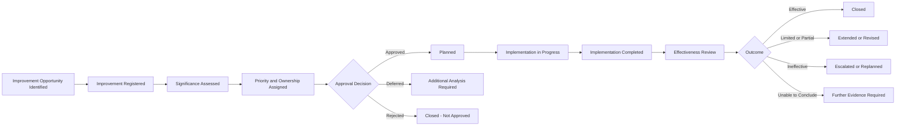

# AI Continual Improvement Register

## Executive Summary

The AI Continual Improvement Register is the authoritative living record of governance improvement opportunities and approved improvement initiatives across Megastar Mortgage.

It captures where the opportunity originated, which governance capability is affected, why the issue is broader than a routine corrective action, who owns the improvement, what resources and milestones are required, whether implementation is progressing, and whether the intended governance benefit was achieved.

The register applies to improvements involving the AI governance management system, including the governance of the Megastar Intelligent Processor (MIP) and other governed AI systems.

It does not replace operational corrective-action records, incident remediation, control redesign, change implementation, assurance execution, or the detailed AI Governance Improvement Plan.

Its purpose is to maintain one authoritative record of continual-improvement opportunities from identification through approval, implementation, effectiveness review, and closure.

---

## Purpose

The purpose of this document is to establish the structure, ownership, lifecycle rules, and minimum information requirements for the AI Continual Improvement Register.

The register enables Megastar Mortgage to:

- assign a unique Improvement ID;
- distinguish continual improvement from routine corrective action;
- record the source and systemic significance of an improvement;
- identify affected governance capabilities;
- prioritize approved initiatives;
- assign accountable ownership;
- track resources, dependencies, milestones, and implementation status;
- link improvement activity to governance decisions and supporting evidence;
- assess whether the intended governance outcome was achieved;
- identify ineffective, delayed, blocked, or superseded initiatives;
- support Management Review and executive oversight; and
- retain improvement history after closure.

---

## Register Scope

The register includes improvement opportunities and approved initiatives that strengthen the AI governance management system across one or more capabilities, functions, business areas, providers, or enterprise processes.

Typical entries may include:

- governance operating-model improvement;
- policy redesign;
- decision-right clarification;
- cross-capability process improvement;
- systemic control improvement;
- assurance-program improvement;
- monitoring and reporting improvement;
- incident-prevention improvement;
- provider-governance improvement;
- change-governance improvement;
- governance tooling or data improvement;
- evidence-quality improvement;
- training and capability development;
- resource or capacity improvement;
- maturity improvement;
- regulatory-readiness improvement; and
- removal of duplicated or unnecessarily burdensome governance activity.

Routine actions addressing a single operational issue should remain in the authoritative record of the capability that owns them unless they reveal a broader governance-system weakness.

---

## Register Boundary

### The register owns

- unique Improvement ID;
- improvement identity;
- source;
- affected capabilities;
- problem or opportunity statement;
- systemic significance;
- improvement classification;
- priority;
- approval status;
- accountable owner;
- governance sponsor;
- expected benefit;
- resource requirement;
- dependencies;
- milestones;
- implementation status;
- evidence references;
- effectiveness-review requirement;
- effectiveness outcome;
- escalation status;
- closure status; and
- improvement history.

### The register does not own

- incident corrective actions;
- risk-treatment actions;
- control implementation;
- assurance remediation;
- provider corrective actions;
- monitoring issue resolution;
- change implementation;
- management-review conclusions;
- governance decision approval; or
- detailed initiative planning.

Those remain in their authoritative capabilities, governance records, or the AI Governance Improvement Plan.

---

## Core Distinction

### Corrective Action

A corrective action addresses a specific identified issue within the process or capability that owns it.

Examples include:

- correcting one failed control;
- resolving one overdue provider action;
- remediating one incident root cause;
- completing one missing assessment;
- repairing one monitoring feed.

### Continual Improvement Initiative

A continual-improvement initiative strengthens the governance system more broadly.

Examples include:

- redesigning the control taxonomy after recurring control failures;
- improving provider-notification governance across all critical vendors;
- implementing a common evidence repository;
- clarifying decision rights across governance forums;
- introducing enterprise-wide governance training;
- automating governance reporting across multiple capabilities.

A routine corrective action may become a continual-improvement initiative when evidence shows that the underlying weakness is repeated, persistent, systemic, cross-capability, or structurally significant.

---

## Improvement Lifecycle

---

## Improvement Sources

Improvement opportunities may arise from:

- AI Governance Management Review;
- AI Governance Decision Register;
- AI Assurance;
- Continuous Monitoring;
- AI Incident Management;
- AI Change Management;
- Third-Party AI Governance;
- AI Risk Management;
- AI Controls;
- repeated residual-risk acceptance;
- repeated governance exceptions;
- Internal Audit;
- external audit or certification;
- regulatory or legal developments;
- privacy or security findings;
- stakeholder feedback;
- customer or employee concerns;
- maturity assessments;
- lessons learned;
- process delays;
- resource or skill gaps;
- evidence-quality weaknesses;
- technology or data limitations; and
- enterprise strategy.

The source record shall be referenced rather than copied.

---

## Improvement Classifications

| Classification | Meaning |
|---|---|
| Corrective Improvement | Addresses a repeated, persistent, or systemic weakness. |
| Preventive Improvement | Reduces the likelihood of future governance failure. |
| Maturity Improvement | Strengthens governance capability, consistency, or sophistication. |
| Efficiency Improvement | Reduces duplication, delay, manual effort, or unnecessary burden. |
| Strategic Improvement | Aligns governance with enterprise or AI strategy. |
| Regulatory Improvement | Responds to changed legal, regulatory, contractual, or framework expectations. |
| Technology or Data Improvement | Improves governance tooling, automation, evidence, reporting, or data quality. |
| Capability Improvement | Strengthens skills, ownership, resources, or operating capacity. |

Each initiative shall have one primary classification.

---

## Systemic Significance

The register shall classify the significance of the underlying issue or opportunity.

| Classification | Meaning |
|---|---|
| Isolated | Limited to one occurrence with no broader pattern. |
| Repeated | Has occurred more than once in a similar context. |
| Persistent | Continues despite prior action. |
| Systemic | Reflects a structural weakness affecting multiple systems, capabilities, functions, or decisions. |
| Strategic | Represents a deliberate opportunity to improve future governance capability. |

Isolated matters should ordinarily remain within routine corrective-action processes unless the expected benefit justifies wider improvement.

---

## Improvement Prioritization

Priority shall consider:

- severity of the underlying weakness;
- number of capabilities affected;
- recurrence;
- stakeholder consequence;
- regulatory urgency;
- High or Critical risk exposure;
- control criticality;
- incident-prevention value;
- provider dependency;
- governance decision delay;
- expected risk reduction;
- expected efficiency or maturity benefit;
- resource requirement;
- implementation complexity;
- dependency on other initiatives;
- strategic alignment; and
- consequence of delay.

Priority may be recorded as:

- Critical;
- High;
- Moderate; or
- Low.

The register records the approved priority. Detailed sequencing belongs in the AI Governance Improvement Plan.

---

## Required Register Fields

### 1. Improvement Identification

| Field | Purpose |
|---|---|
| Improvement ID | Unique and permanent identifier. |
| Improvement Title | Concise name of the improvement. |
| Improvement Classification | Primary improvement category. |
| Source | Originating review, finding, decision, trend, or opportunity. |
| Source Reference | Link to the authoritative source record. |
| Registration Date | Date entered in the register. |
| Current Status | Current lifecycle position. |
| Improvement Version | Current approved version of the initiative. |

---

### 2. Problem or Opportunity

| Field | Purpose |
|---|---|
| Problem or Opportunity Statement | Clear description of what should improve. |
| Current Condition | Present governance state. |
| Desired Condition | Intended future governance state. |
| Evidence | Supporting references. |
| Systemic Significance | Isolated, Repeated, Persistent, Systemic, or Strategic. |
| Root or Contributing Cause Reference | Relevant analysis where available. |
| Consequence of Inaction | Expected effect if the improvement is not pursued. |

---

### 3. Scope

| Field | Purpose |
|---|---|
| Affected Capabilities | Governance capabilities affected. |
| Affected AI Systems or Portfolio | Relevant AI-system scope. |
| Affected Business Functions | Functions affected. |
| Affected Providers | Providers affected. |
| Affected Policies or Processes | Governance requirements affected. |
| Jurisdictions | Geographic or regulatory scope. |
| Scope Exclusions | Explicit boundaries. |

---

### 4. Ownership and Governance

| Field | Purpose |
|---|---|
| Improvement Owner | Accountable owner for the initiative. |
| Governance Sponsor | Senior sponsor responsible for direction and support. |
| Delivery Owner | Owner responsible for implementation. |
| Approval Authority | Authority approving the initiative. |
| Decision ID | Linked governance decision. |
| Receiving Governance Forum | Forum overseeing progress. |
| Escalation Authority | Authority receiving unresolved issues. |

---

### 5. Priority and Benefit

| Field | Purpose |
|---|---|
| Priority | Critical, High, Moderate, or Low. |
| Priority Rationale | Basis for prioritization. |
| Expected Benefit | Intended governance improvement. |
| Expected Risk Reduction | Anticipated reduction in exposure. |
| Expected Efficiency Benefit | Anticipated improvement in timeliness or effort. |
| Expected Maturity Benefit | Anticipated capability uplift. |
| Success Measures | Evidence used to assess achievement. |

---

### 6. Resources and Dependencies

| Field | Purpose |
|---|---|
| Resource Requirement | People, budget, tooling, data, training, or specialist support. |
| Resource Approval Status | Current resource decision. |
| Dependencies | Prerequisite work or decisions. |
| Related Change IDs | Linked implementation changes. |
| Related Action IDs | Linked operational actions. |
| Constraints | Known barriers. |
| Implementation Risk | Risk to successful delivery. |

---

### 7. Milestones and Delivery

| Field | Purpose |
|---|---|
| Planned Start Date | Approved start date. |
| Target Completion Date | Approved completion date. |
| Milestones | Key delivery stages. |
| Current Implementation Status | Current delivery state. |
| Progress | Current completion position. |
| Current Blocker | Active delivery barrier. |
| Revised Target Date | Approved revised completion date. |
| Implementation Evidence Reference | Evidence of delivery. |

---

### 8. Effectiveness Review

| Field | Purpose |
|---|---|
| Effectiveness Review Required | Whether effectiveness must be assessed. |
| Review Owner | Owner of the effectiveness review. |
| Review Date | Planned review date. |
| Baseline | Pre-improvement condition. |
| Success Criteria | Required outcomes. |
| Evidence Reference | Supporting evidence. |
| Effectiveness Outcome | Effective, Effective with Limitations, Partially Effective, Ineffective, or Unable to Conclude. |
| Further Action Required | Whether additional work is needed. |

---

### 9. Closure

| Field | Purpose |
|---|---|
| Closure Readiness | Ready, Conditionally Ready, or Not Ready. |
| Closure Status | Open, Closure Pending, Closed, Reopened, Cancelled, or Superseded. |
| Closure Rationale | Basis for closure. |
| Closure Authority | Authority approving closure. |
| Closure Date | Date closure was approved. |
| Closure Evidence Reference | Evidence supporting closure. |
| Open Matter Retained Elsewhere | Linked record retaining unresolved work. |
| Record Retention Date | Required retention or review date. |

---

## Improvement Status Model

| Status | Meaning |
|---|---|
| Identified | Opportunity has been recognized but not yet assessed. |
| Registered | Improvement record has been created. |
| Under Assessment | Significance, scope, benefit, and feasibility are being evaluated. |
| Pending Approval | Assessment is complete and approval is pending. |
| Approved | Initiative is authorized. |
| Deferred | Additional analysis, funding, dependency resolution, or timing is required. |
| Rejected | Initiative is not approved. |
| Planned | Delivery plan and milestones are defined. |
| In Progress | Implementation is underway. |
| Blocked | Delivery cannot proceed due to an unresolved dependency or constraint. |
| Overdue | Target date has passed without approved completion. |
| Implemented | Planned activity is complete and effectiveness review is pending. |
| Effectiveness Review | Outcome evaluation is underway. |
| Effective | Intended improvement has been achieved. |
| Effective with Limitations | Improvement achieved the core objective with remaining constraints. |
| Partially Effective | Some benefit was achieved, but material further work is required. |
| Ineffective | Intended outcome was not achieved. |
| Unable to Conclude | Evidence is insufficient to determine effectiveness. |
| Closure Pending | Closure criteria are met and approval is pending. |
| Closed | Initiative is complete and closure is approved. |
| Cancelled | Initiative was terminated with approved rationale. |
| Superseded | Replaced by another approved initiative. |
| Reopened | New evidence or ineffective outcome requires renewed action. |

---

## Approval

An improvement initiative shall be approved before resources or enterprise-level delivery commitments are represented as authorized.

Approval shall confirm:

- the problem or opportunity is clear;
- the initiative is appropriate for continual improvement;
- scope is defined;
- ownership is assigned;
- priority is justified;
- expected benefit is credible;
- resources are understood;
- dependencies are visible;
- success measures are defined;
- target dates are proportionate; and
- governance oversight is assigned.

Possible approval outcomes include:

- Approved;
- Approved with Conditions;
- Deferred;
- Rejected;
- Escalated; or
- Superseded.

---

## Relationship to the AI Governance Improvement Plan

The register is the authoritative record of each improvement initiative.

The AI Governance Improvement Plan is the portfolio-level execution roadmap that sequences and coordinates approved initiatives.

The plan may use register information concerning:

- priority;
- owner;
- target date;
- dependencies;
- resources;
- milestones;
- expected benefits; and
- current status.

The plan shall not replace the individual register record.

---

## Relationship to AI Change Management

An improvement initiative may require one or more governed changes.

Examples include:

- policy changes;
- control redesign;
- system configuration;
- reporting automation;
- governance tooling;
- provider changes;
- operating-model changes;
- workflow changes.

Where a material change is required:

- the Improvement ID shall be linked to the Change ID;
- AI Change Management shall govern the implementation;
- the improvement record shall track the change outcome;
- the improvement effectiveness review shall assess whether the broader governance benefit was achieved.

Implementation activity shall not be duplicated in the Improvement Register.

---

## Effectiveness Review

An improvement shall not be considered effective merely because planned activity was completed.

Effectiveness review shall determine whether:

- the original weakness was reduced;
- recurrence declined;
- governance coverage improved;
- decision quality improved;
- delay or duplication decreased;
- control or monitoring performance improved;
- ownership became clearer;
- evidence quality improved;
- stakeholder outcomes improved;
- resource or capability constraints were reduced;
- the governance system became more proportionate; and
- unintended consequences emerged.

---

## Effectiveness Outcomes

| Outcome | Meaning |
|---|---|
| Effective | Intended governance outcome was achieved. |
| Effective with Limitations | Core outcome was achieved, but constraints remain. |
| Partially Effective | Some benefit was achieved, but material further work is required. |
| Ineffective | Initiative did not resolve the underlying weakness or deliver the intended benefit. |
| Unable to Conclude | Evidence is insufficient or the observation period is inadequate. |

An Ineffective or Unable to Conclude outcome shall trigger reassessment, extension, revision, replacement, or escalation.

---

## Escalation

Escalation may be required where:

- a Critical or High initiative is overdue;
- required resources are not available;
- dependencies remain unresolved;
- implementation repeatedly slips;
- scope changes materially;
- the initiative conflicts with another governance priority;
- implementation risk becomes unacceptable;
- effectiveness is unsatisfactory;
- the same weakness continues to recur;
- the initiative cannot achieve the intended outcome; or
- executive or board intervention is required.

Each escalation shall identify:

- issue;
- consequence;
- owner;
- decision required;
- target authority;
- due date;
- interim action; and
- supporting evidence.

---

## Closure Criteria

An improvement initiative may be closed when:

- approved implementation is complete;
- required evidence is available;
- success measures are assessed;
- effectiveness review is complete where required;
- the outcome is approved;
- related change and action records are updated;
- open matters are transferred to authoritative records;
- no unresolved material blocker remains;
- closure authority approves; and
- closure evidence is recorded.

An initiative shall not be closed solely because the target date has passed or implementation activity has ended.

---

## Register Integrity Rules

The register shall comply with the following rules:

- Every improvement receives one unique Improvement ID.
- Improvement IDs shall not be reused.
- One initiative shall not be duplicated by each participating capability.
- Source records shall be linked rather than copied.
- Routine corrective actions shall remain in their owning capability unless formally elevated.
- Current status shall be updated after each material lifecycle event.
- Approval, ownership, priority, milestone, and closure history shall be retained.
- Implementation completion shall remain distinct from effectiveness.
- Closed, rejected, cancelled, superseded, and ineffective initiatives shall remain retained.
- Reopened initiatives shall retain the original Improvement ID.
- Scope changes shall be approved and versioned.
- Sensitive information shall be protected through role-based access.
- Summary reporting shall derive from the register without altering source records.

---

## Data Quality Requirements

Register information shall be:

- complete;
- current;
- accurate;
- consistent;
- traceable;
- decision-useful;
- access-controlled; and
- supported by authoritative references.

Minimum quality checks shall confirm:

- valid Improvement ID;
- clear source;
- clear problem or opportunity;
- affected capability;
- systemic significance;
- assigned owner;
- approved priority;
- expected benefit;
- target date;
- current status;
- next activity;
- linked Decision ID where approval is required;
- effectiveness-review requirement; and
- closure status.

---

## Register Review

The register shall be reviewed periodically to identify:

- unassessed opportunities;
- initiatives awaiting approval;
- initiatives without owners;
- initiatives without target dates;
- blocked initiatives;
- overdue initiatives;
- repeated extensions;
- resource gaps;
- unresolved dependencies;
- implemented initiatives awaiting effectiveness review;
- ineffective initiatives;
- initiatives unable to conclude;
- closure-ready initiatives;
- duplicate initiatives;
- stale records; and
- recurring systemic themes.

Material themes shall inform Management Review and the AI Governance Oversight Summary.

---

## Register Maintenance

The register shall be updated when:

- an improvement opportunity is identified;
- an initiative is registered;
- significance is assessed;
- ownership is assigned;
- priority changes;
- approval is issued;
- resources are approved or denied;
- milestones change;
- implementation begins or ends;
- a blocker emerges;
- a target date changes;
- related changes or actions are created;
- effectiveness review begins or concludes;
- escalation occurs;
- closure is approved; or
- the initiative is reopened, cancelled, or superseded.

---

## Related Artifacts

- AI Governance Oversight Framework
- AI Governance Decision Register
- AI Residual Risk Acceptance
- AI Governance Exception Management
- AI Governance Management Review
- AI Governance Improvement Plan
- AI Governance Oversight Summary

---

## Document Control

| Field | Value |
|---|---|
| Document | AI Continual Improvement Register |
| Capability | Governance Oversight & Continual Improvement |
| Capability Number | 11 |
| Repository | Enterprise AI Governance Playbook |
| Reference Organization | Megastar Mortgage |
| Reference AI System | Megastar Intelligent Processor (MIP) |
| Register Owner | AI Governance Lead |
| Version | 1.0 |
| Review Cycle | Quarterly |
| Status | Published Reference |

---

## Revision History

| Version | Date | Description |
|---|---|---|
| 1.0 | July 2026 | Initial release of the AI Continual Improvement Register. |