# AI Governance Improvement Plan

## Executive Summary

The AI Governance Improvement Plan is the portfolio-level roadmap for delivering approved improvements to the AI governance management system across Megastar Mortgage.

It converts approved initiatives from the AI Continual Improvement Register into a coordinated delivery plan with clear priorities, sequencing, ownership, milestones, dependencies, resources, governance checkpoints, risks, and reporting expectations.

The plan applies to improvements affecting the governance of the Megastar Intelligent Processor (MIP) and other governed AI systems.

The AI Continual Improvement Register remains the authoritative record for each individual improvement initiative. This plan does not replace those records. It coordinates how approved initiatives will be delivered together across the enterprise.

Implementation completion does not, by itself, demonstrate that an improvement was effective. Effectiveness remains governed through the AI Continual Improvement Register and the relevant review process.

---

## Purpose

The purpose of this document is to establish a consistent and auditable approach for planning and coordinating approved AI governance improvements.

It enables Megastar Mortgage to:

- convert approved improvement initiatives into an executable roadmap;
- align improvement activity with governance priorities;
- sequence initiatives according to risk, dependency, and strategic value;
- assign delivery ownership;
- identify resource requirements;
- manage cross-capability dependencies;
- establish milestones and governance checkpoints;
- monitor portfolio progress;
- identify delays, conflicts, and implementation risks;
- support management and executive reporting;
- revise the plan through authorized governance decisions; and
- maintain traceability to the AI Continual Improvement Register and AI Governance Decision Register.

---

## Scope

The plan may include approved improvements relating to:

- governance operating model;
- governance forums and decision rights;
- AI inventory coverage;
- impact assessment;
- risk management;
- control design and implementation;
- assurance;
- third-party AI governance;
- continuous monitoring;
- incident management;
- change management;
- residual-risk governance;
- exception management;
- management review;
- governance reporting;
- governance metrics and dashboards;
- data quality;
- evidence management;
- policy;
- regulatory readiness;
- governance technology and automation;
- skills and training;
- resource capacity; and
- maturity improvement.

Routine corrective actions that affect only one operational issue should remain in the authoritative record of the capability that owns them unless they are formally elevated into the improvement portfolio.

---

## Governance Boundary

### This plan owns

- approved improvement portfolio;
- portfolio prioritization;
- delivery sequencing;
- implementation waves;
- roadmap;
- milestone coordination;
- dependency management;
- resource planning;
- governance checkpoints;
- portfolio delivery monitoring;
- portfolio-level risks and issues;
- management reporting;
- plan revision;
- portfolio completion status; and
- traceability to improvement and decision records.

### This plan does not own

- individual improvement approval;
- individual Improvement Register records;
- detailed project-management methodology;
- operational corrective actions;
- risk treatment execution;
- control implementation;
- assurance execution;
- incident remediation;
- technical change execution;
- effectiveness conclusions; or
- closure of individual improvement initiatives.

Those remain with the AI Continual Improvement Register, AI Governance Decision Register, AI Change Management, and the relevant operational capabilities.

---

## Improvement Delivery Model

```mermaid
flowchart LR

A[Improvement Opportunity]
--> B[AI Continual Improvement Register]
--> C[Governance Approval]
--> D[Improvement Portfolio]
--> E[Prioritization and Sequencing]
--> F[Delivery Roadmap]
--> G[Implementation]
--> H[Governance Checkpoints]
--> I[Implementation Completion]
--> J[Effectiveness Review]
--> K[Improvement Closure]
```

Only approved initiatives may enter the formal improvement portfolio.

---

## Planning Principles

Megastar Mortgage applies the following principles:

- The AI Continual Improvement Register remains authoritative for each initiative.
- Only approved initiatives enter the Improvement Plan.
- Priority shall reflect risk, consequence, dependency, urgency, and strategic value.
- High-impact weaknesses shall not be displaced by lower-risk convenience improvements.
- Dependencies shall be identified before sequencing.
- Resources shall be explicitly assigned.
- Delivery ownership shall remain clear.
- Cross-capability initiatives shall have one accountable Improvement Owner.
- Major implementation activity shall follow AI Change Management where applicable.
- Governance checkpoints shall be proportionate to the initiative.
- Material scope, priority, timing, or resource changes shall require authorized revision.
- Implementation completion shall remain distinct from effectiveness.
- Delayed, blocked, or ineffective initiatives shall be escalated.
- Portfolio reporting shall not replace individual initiative records.
- Improvement activity shall reduce unnecessary duplication rather than create additional governance burden.

---

## Planning Inputs

The plan shall draw from approved information in:

- AI Continual Improvement Register;
- AI Governance Decision Register;
- AI Governance Management Review;
- AI Governance Oversight Framework;
- Enterprise AI Risk Register;
- Enterprise AI Control Register;
- AI Assurance records;
- Third-Party AI Governance records;
- Continuous Monitoring;
- AI Incident Management;
- AI Change Management;
- Internal Audit;
- regulatory and legal developments;
- privacy and security findings;
- stakeholder feedback;
- resource plans; and
- enterprise strategy.

Source records shall be linked rather than duplicated.

---

## Portfolio Entry Criteria

An initiative may enter the plan when:

- a valid Improvement ID exists;
- the problem or opportunity is defined;
- systemic significance has been assessed;
- approval has been granted;
- priority has been assigned;
- an Improvement Owner is identified;
- expected outcomes are defined;
- success measures are documented;
- required resources are known;
- dependencies are identified;
- target dates are approved;
- the receiving governance forum is identified; and
- the initiative is ready for coordinated planning.

An initiative that does not meet these criteria shall remain in the AI Continual Improvement Register until planning readiness is achieved.

---

## Improvement Portfolio

The portfolio shall provide a consolidated view of all approved initiatives.

At minimum, it shall identify:

- Improvement ID;
- improvement title;
- primary classification;
- systemic significance;
- affected capabilities;
- priority;
- governance sponsor;
- Improvement Owner;
- delivery owner;
- approved start date;
- target completion date;
- delivery wave;
- current status;
- resource position;
- dependency status;
- overall health;
- next governance checkpoint; and
- related Decision ID.

---

## Portfolio Prioritization

Prioritization shall consider:

- severity of the underlying weakness;
- number of affected capabilities;
- High or Critical risk exposure;
- regulatory urgency;
- stakeholder impact;
- incident recurrence;
- control criticality;
- assurance significance;
- provider dependency;
- exception or residual-risk recurrence;
- expected risk reduction;
- expected maturity uplift;
- strategic value;
- resource availability;
- implementation complexity;
- dependencies;
- time sensitivity; and
- consequence of delay.

Priority levels are:

| Priority | Meaning |
|---|---|
| Critical | Immediate or near-term action is required to address severe governance exposure or mandatory obligation. |
| High | Material improvement is required to reduce significant risk or systemic weakness. |
| Moderate | Important improvement with manageable delay and limited immediate exposure. |
| Low | Desirable enhancement with limited immediate governance consequence. |

Priority shall not be determined solely by ease of implementation.

---

## Portfolio Balancing

The portfolio shall be balanced across:

- urgent risk reduction;
- regulatory obligations;
- systemic control improvement;
- capability maturity;
- efficiency;
- technology and data;
- resource capacity;
- strategic development; and
- long-term governance sustainability.

The portfolio should avoid:

- overconcentration in one capability;
- excessive simultaneous transformation;
- improvement activity without sufficient ownership;
- duplicated initiatives;
- conflicting changes;
- unresourced commitments; and
- large volumes of low-value activity.

---

## Delivery Waves

Approved initiatives may be grouped into delivery waves.

| Wave | Typical Purpose |
|---|---|
| Wave 1 — Immediate Stabilization | Critical, regulatory, severe-risk, or urgent systemic weaknesses |
| Wave 2 — Core Governance Strengthening | High-priority control, oversight, assurance, provider, monitoring, or operating-model improvements |
| Wave 3 — Capability Maturity | Standardization, automation, training, evidence quality, and cross-capability consistency |
| Wave 4 — Strategic Optimization | Advanced analytics, governance automation, maturity uplift, and long-term strategic improvement |

Wave assignment shall reflect readiness and dependency, not only priority.

---

## Roadmap

The roadmap shall identify:

- initiative;
- delivery wave;
- planned start;
- planned completion;
- key milestones;
- dependencies;
- governance checkpoints;
- resource requirement;
- change-management requirement;
- effectiveness-review date; and
- current status.

Roadmap views may be maintained by:

- quarter;
- month;
- delivery wave;
- capability;
- owner;
- priority;
- provider;
- regulatory obligation; or
- strategic theme.

---

## Improvement Themes

The plan may organize initiatives under themes such as:

- Governance Structure;
- Risk and Controls;
- Assurance;
- Third-Party Governance;
- Monitoring and Reporting;
- Incident and Change Resilience;
- Policy and Regulatory Readiness;
- Data and Evidence;
- Technology and Automation;
- Skills and Capability;
- Efficiency and Simplification; and
- Strategic Maturity.

Themes support portfolio navigation but do not replace initiative ownership.

---

## Ownership

Every planned initiative shall have:

- Improvement Owner;
- Governance Sponsor;
- Delivery Owner;
- affected Capability Owners;
- resource owner;
- change owner where implementation requires a governed change;
- effectiveness-review owner; and
- escalation authority.

The Improvement Owner remains accountable for the overall governance outcome even where delivery is distributed across multiple teams.

---

## Resource Planning

The plan shall identify requirements for:

- people;
- budget;
- governance expertise;
- risk and control expertise;
- assurance capacity;
- privacy and security support;
- Legal & Compliance support;
- technology;
- data;
- tooling;
- provider support;
- training;
- project coordination; and
- external specialist support.

Resource status may be:

- Approved;
- Partially Approved;
- Pending;
- Rejected;
- Unavailable; or
- Reallocation Required.

An initiative shall not be represented as fully planned where essential resources remain unresolved.

---

## Dependency Management

Dependencies may include:

- governance decisions;
- policy approval;
- budget approval;
- resource availability;
- provider delivery;
- system change;
- data availability;
- control implementation;
- assurance;
- legal or regulatory review;
- incident closure;
- completion of another improvement;
- technology procurement;
- training;
- business readiness; or
- executive direction.

Each dependency shall identify:

- dependency;
- owner;
- required date;
- impact of delay;
- current status;
- escalation trigger; and
- resolution plan.

---

## Relationship to AI Change Management

An improvement initiative shall enter AI Change Management where delivery requires a material change involving:

- policy;
- operating model;
- governance workflow;
- control design;
- technology;
- monitoring;
- provider arrangement;
- data;
- reporting;
- access;
- human oversight; or
- another governed AI-related change.

Where Change Management applies:

- the Improvement ID shall link to the Change ID;
- the Change Register shall govern implementation status;
- this plan shall track the portfolio dependency and outcome;
- implementation evidence shall remain in the Change record;
- the Improvement Register shall retain the broader governance objective; and
- effectiveness review shall determine whether the improvement benefit was achieved.

---

## Milestones

Milestones shall be outcome-oriented where possible.

Typical milestones may include:

- design approved;
- policy approved;
- control defined;
- resource approved;
- procurement complete;
- implementation started;
- pilot complete;
- rollout complete;
- training complete;
- monitoring activated;
- assurance complete;
- change validated;
- implementation complete;
- effectiveness review started;
- effectiveness confirmed; and
- closure approved.

Each milestone shall identify:

- owner;
- target date;
- completion criteria;
- evidence reference;
- status; and
- dependency.

---

## Governance Checkpoints

Governance checkpoints may include:

- portfolio-entry approval;
- planning readiness;
- design approval;
- resource authorization;
- implementation authorization;
- mid-delivery review;
- scope-change approval;
- implementation completion;
- effectiveness-review readiness;
- effectiveness decision; and
- closure approval.

Checkpoint depth shall be proportionate to:

- priority;
- systemic significance;
- affected capabilities;
- resource requirement;
- regulatory impact;
- implementation risk; and
- reversibility.

---

## Delivery Status

Initiative delivery status may be:

| Status | Meaning |
|---|---|
| Planned | Delivery approach and dates are approved. |
| Ready to Start | Prerequisites and resources are available. |
| In Progress | Delivery activity is underway. |
| At Risk | Delivery may miss approved scope, timing, outcome, or resource expectation. |
| Blocked | Delivery cannot proceed because of an unresolved issue or dependency. |
| Overdue | The approved milestone or completion date has passed. |
| Implemented | Planned activity is complete and effectiveness review is pending. |
| Effectiveness Review | Outcome evaluation is underway. |
| Closed | Delivery and effectiveness obligations are complete. |
| Cancelled | Initiative has been terminated through authorized decision. |
| Superseded | Another initiative has replaced it. |

---

## Portfolio Health

Portfolio health shall consider:

- schedule;
- scope;
- resources;
- dependency;
- risk;
- governance decision;
- implementation quality;
- evidence;
- stakeholder readiness; and
- expected benefit.

Portfolio health may be classified as:

| Health | Meaning |
|---|---|
| On Track | Delivery remains within approved expectations. |
| Watch | Emerging concern requires closer attention. |
| At Risk | Material delay, resource, scope, or outcome concern exists. |
| Critical | Severe delivery failure or governance intervention is required. |
| Complete | Implementation is complete and the initiative has moved to effectiveness review or closure. |

---

## Portfolio Risks

The plan shall identify portfolio-level risks such as:

- insufficient governance capacity;
- competing enterprise priorities;
- resource conflict;
- specialist bottlenecks;
- provider dependency;
- delayed decisions;
- budget shortfall;
- data limitations;
- tooling limitations;
- change saturation;
- stakeholder resistance;
- control-design complexity;
- regulatory deadline;
- cross-capability dependency;
- ineffective prior improvement; and
- benefits not realized.

Each portfolio risk shall identify:

- owner;
- likelihood;
- impact;
- response;
- target date;
- escalation trigger; and
- related improvement initiatives.

Detailed risk analysis shall remain in the appropriate Risk Register where required.

---

## Portfolio Issues

An issue is a current condition affecting delivery.

Examples include:

- missed milestone;
- unavailable resource;
- unresolved dependency;
- blocked approval;
- provider delay;
- scope conflict;
- ineffective implementation;
- incomplete evidence;
- failed change;
- policy disagreement;
- unplanned cost; or
- regulatory deadline risk.

Each issue shall identify:

- issue;
- affected initiatives;
- owner;
- impact;
- decision required;
- target date;
- interim action; and
- escalation status.

---

## Progress Monitoring

The plan shall track, where useful:

- initiatives by status;
- initiatives by priority;
- initiatives by delivery wave;
- milestones completed;
- milestones overdue;
- blocked initiatives;
- resource gaps;
- dependency delays;
- initiatives requiring change;
- implementation completion;
- effectiveness-review completion;
- ineffective initiatives;
- benefit realization;
- initiatives closed; and
- portfolio health.

Metric definitions, calculations, targets, and thresholds remain governed through Continuous Monitoring.

---

## Reporting

Portfolio reporting may be provided to:

- Operational Governance Review;
- AI Governance Committee;
- Executive Management;
- Board or Board Committee;
- Management Review; and
- relevant Capability Owners.

Reporting shall focus on:

- material progress;
- Critical and High initiatives;
- overdue milestones;
- blocked initiatives;
- unresolved resource needs;
- portfolio risks;
- decisions required;
- expected outcome changes;
- systemic themes; and
- effectiveness results.

---

## Plan Review

The plan shall be reviewed periodically and when:

- a new Critical or High initiative is approved;
- Management Review changes priorities;
- a regulatory obligation changes;
- a material incident reveals a systemic weakness;
- a major initiative is delayed;
- essential resources become unavailable;
- a dependency fails;
- an initiative becomes ineffective;
- portfolio capacity is exceeded;
- strategic priorities change; or
- Executive Management requests review.

---

## Plan Revision

A formal revision may be required where:

- priority changes;
- delivery wave changes;
- scope changes;
- target dates change materially;
- resource commitments change;
- dependencies change;
- an initiative is added or removed;
- governance checkpoints change;
- a material implementation risk emerges; or
- the expected benefit changes.

Each revision shall identify:

- revision date;
- affected initiatives;
- reason;
- approving authority;
- prior position;
- revised position;
- decision reference; and
- communication requirements.

---

## Escalation

Escalation shall occur where:

- a Critical initiative is delayed;
- a High initiative becomes blocked;
- resource gaps threaten mandatory delivery;
- regulatory deadlines are at risk;
- dependencies remain unresolved;
- portfolio capacity is exceeded;
- initiative scope changes materially;
- expected benefits are no longer achievable;
- repeated implementation failure occurs;
- governance decisions are overdue;
- improvement delivery creates unacceptable change risk; or
- executive intervention is required.

---

## Implementation Completion

An initiative may be marked Implemented when:

- approved delivery activity is complete;
- required milestones are complete;
- required changes are implemented;
- required evidence is available;
- related records are updated;
- unresolved matters are transferred;
- implementation approval is recorded; and
- effectiveness-review requirements are confirmed.

Implemented does not mean Effective.

---

## Portfolio Completion

An improvement portfolio cycle may be concluded when:

- all in-scope initiatives are closed, cancelled, superseded, or transferred;
- open actions have authoritative owners;
- effectiveness reviews are complete or scheduled;
- portfolio outcomes are summarized;
- unresolved systemic matters are escalated;
- Management Review has received the results;
- the AI Continual Improvement Register is current; and
- the next planning cycle is approved.

---

## Required Outputs

The plan produces:

- approved improvement portfolio;
- delivery roadmap;
- delivery waves;
- milestone schedule;
- ownership model;
- resource plan;
- dependency register;
- governance checkpoints;
- portfolio risks and issues;
- progress reporting;
- revision history;
- implementation-completion status; and
- effectiveness-review handoff.

---

## Related Artifacts

- AI Governance Oversight Framework
- AI Governance Decision Register
- AI Governance Management Review
- AI Continual Improvement Register
- AI Governance Oversight Summary
- Enterprise AI Change Register

---

## Document Control

| Field | Value |
|---|---|
| Document | AI Governance Improvement Plan |
| Capability | Governance Oversight & Continual Improvement |
| Capability Number | 11 |
| Repository | Enterprise AI Governance Playbook |
| Reference Organization | Megastar Mortgage |
| Reference AI System | Megastar Intelligent Processor (MIP) |
| Document Owner | AI Governance Lead |
| Version | 1.0 |
| Review Cycle | Quarterly |
| Status | Published Reference |

---

## Revision History

| Version | Date | Description |
|---|---|---|
| 1.0 | July 2026 | Initial release of the AI Governance Improvement Plan. |