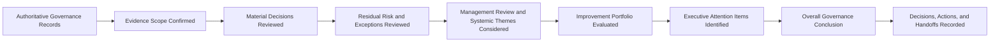

# AI Governance Oversight Summary

## Executive Summary

The AI Governance Oversight Summary provides a concise, decision-ready view of the health of Megastar Mortgage’s AI governance management system.

It consolidates material evidence from governance forums, the AI Governance Decision Register, residual-risk acceptances, governance exceptions, Management Review, the AI Continual Improvement Register, and the AI Governance Improvement Plan.

The summary is intended for the AI Governance Committee, Executive Management, and the Board or Board Committee where required.

Its purpose is not to reproduce operational detail. It identifies:

- the current enterprise governance position;
- material decisions and unresolved matters;
- residual-risk and exception exposure;
- management-system conclusions;
- repeated or systemic weaknesses;
- improvement delivery and effectiveness;
- resource and capability constraints;
- matters requiring executive action; and
- the overall governance conclusion for the reporting period.

Operational capabilities remain authoritative for their underlying records, analysis, metrics, and specialist conclusions.

---

## Purpose

The purpose of this document is to establish a consistent approach for presenting enterprise-level AI governance oversight information.

It enables Megastar Mortgage to:

- provide a consolidated view of AI governance health;
- surface material decisions and unresolved obligations;
- identify active, expired, breached, or repeatedly renewed residual-risk acceptances and exceptions;
- communicate Management Review conclusions;
- highlight repeated, persistent, and systemic governance themes;
- track the status and effectiveness of improvement initiatives;
- identify resource, capability, and decision bottlenecks;
- support executive and board oversight;
- assign accountable actions and escalation; and
- preserve traceability to authoritative governance records.

---

## Scope

The summary may cover:

- the enterprise;
- a business function;
- an AI portfolio;
- a geographic region;
- a provider portfolio;
- a defined governance period; or
- a material governance event.

The reporting scope shall identify:

- reporting period;
- comparison period;
- data cut-off date;
- AI systems included;
- business functions included;
- providers included;
- jurisdictions included;
- governance forums included;
- known exclusions; and
- material evidence limitations.

---

## Summary Boundary

### This summary owns

- enterprise governance-health conclusion;
- governance decision overview;
- residual-risk position;
- exception position;
- Management Review conclusion;
- systemic-theme summary;
- improvement portfolio status;
- overdue governance matters;
- resource and capability concerns;
- executive and board attention items;
- required decisions and actions; and
- cross-capability governance handoffs.

### This summary does not own

- AI-system assessment;
- risk scoring;
- control testing;
- assurance analysis;
- provider assessment;
- metric calculation;
- incident investigation;
- change assessment;
- individual residual-risk evaluation;
- individual exception assessment;
- improvement implementation; or
- operational record maintenance.

Those remain within their authoritative capabilities and records.

---

## Oversight Summary Process

---

## Reporting Principles

Megastar Mortgage prepares the AI Governance Oversight Summary according to the following principles:

- Conclusions shall use current and authoritative evidence.
- Operational detail shall be referenced rather than duplicated.
- High and Critical matters shall remain visible.
- Portfolio averages shall not conceal severe weaknesses.
- Decision status shall remain distinct from action completion.
- Action completion shall remain distinct from effectiveness.
- Residual-risk acceptance shall remain distinct from exception approval.
- Expired or breached decisions shall not be represented as valid.
- Repeated issues shall be assessed for systemic significance.
- Evidence limitations shall be disclosed.
- Required decisions shall identify the correct authority.
- The summary shall lead to action, escalation, or an explicit conclusion.

---

## Authoritative Sources

The summary may draw from:

- AI Governance Oversight Framework;
- AI Governance Decision Register;
- AI Residual Risk Acceptance records;
- AI Governance Exception Management records;
- AI Governance Management Review;
- AI Continual Improvement Register;
- AI Governance Improvement Plan;
- Enterprise AI System Inventory;
- Enterprise AI Risk Register;
- Enterprise AI Control Register;
- AI Assurance records;
- Third-Party AI Governance records;
- Continuous Monitoring records;
- Enterprise AI Incident Register;
- Enterprise AI Change Register;
- Internal Audit;
- Privacy;
- Security;
- Legal & Compliance;
- regulatory developments; and
- stakeholder feedback.

The summary shall not alter the authoritative source records.

---

## Evidence Sufficiency

Evidence shall be assessed as:

| Status | Meaning |
|---|---|
| Sufficient | Supports a defensible enterprise governance conclusion. |
| Sufficient with Limitations | Supports a conclusion subject to disclosed constraints. |
| Insufficient | Material evidence is missing, stale, or unreliable. |
| Unable to Conclude | The governance position cannot be determined reliably. |

Material evidence limitations shall be included in the executive conclusion.

---

## Enterprise Governance Position

The summary shall provide a concise view of:

- governance forums operating as intended;
- decision authority clarity;
- quorum and conflict-management performance;
- decision timeliness;
- action completion;
- escalation effectiveness;
- policy and operating-model adequacy;
- Management Review status;
- residual-risk governance;
- exception governance;
- continual-improvement performance;
- unresolved High and Critical matters; and
- overall governance-system effectiveness.

---

## Governance Forum Performance

The summary may include:

- meetings scheduled;
- meetings completed;
- quorum failures;
- decisions deferred because of insufficient authority or evidence;
- overdue decisions;
- conflicts declared;
- escalations completed;
- unresolved escalations;
- prior actions overdue;
- actions repeatedly extended; and
- matters requiring Executive or Board review.

Forum volume alone shall not be treated as evidence of governance effectiveness.

---

## Material Governance Decisions

The summary shall identify material decisions concerning:

- AI-system approval;
- restriction;
- suspension;
- retirement;
- residual-risk acceptance;
- governance exceptions;
- control remediation;
- assurance requirements;
- provider remediation or exit review;
- enhanced monitoring;
- incident escalation;
- material changes;
- policy or operating-model changes;
- resource allocation;
- improvement priorities; and
- executive or board escalation.

Each material decision shall identify:

- Decision ID;
- matter;
- authority;
- outcome;
- conditions;
- owner;
- due date;
- review or expiry date; and
- current status.

---

## Decision Position

The summary may report:

- decisions submitted;
- decisions issued;
- decisions approved;
- decisions approved with conditions;
- decisions deferred;
- decisions rejected;
- decisions escalated;
- decisions awaiting review;
- decisions approaching expiry;
- expired decisions;
- revised decisions;
- revoked decisions;
- reopened decisions;
- decisions with breached conditions;
- overdue decision actions; and
- decisions awaiting closure.

Material expired or breached decisions shall be highlighted.

---

## Residual-Risk Position

The summary shall provide the current position of residual-risk acceptance, including:

- active acceptances;
- High and Critical acceptances;
- acceptances with conditions;
- acceptances approaching review;
- acceptances approaching expiry;
- expired acceptances;
- repeatedly renewed acceptances;
- breached conditions;
- revoked acceptances;
- acceptances with insufficient monitoring;
- acceptances awaiting higher authority; and
- residual risks outside appetite or tolerance.

Residual-risk acceptance does not change the underlying risk rating unless the Enterprise AI Risk Register is formally updated.

---

## Residual-Risk Themes

The summary shall identify themes such as:

- repeated acceptance caused by delayed treatment;
- repeated acceptance caused by unavailable controls;
- provider dependency;
- inadequate monitoring;
- insufficient assurance evidence;
- operating-model constraints;
- resource limitations;
- recurring incidents;
- repeated change delays; and
- risks remaining accepted beyond intended duration.

Repeated acceptance shall be assessed for systemic improvement.

---

## Governance Exception Position

The summary shall provide the current exception position, including:

- active exceptions;
- exceptions by category;
- exceptions approaching expiry;
- expired exceptions;
- repeatedly renewed exceptions;
- breached conditions;
- inadequate compensating controls;
- inadequate monitoring;
- revoked exceptions;
- exceptions awaiting decision;
- exceptions linked to residual-risk acceptance;
- exceptions suggesting policy or control weakness; and
- potential exception misuse.

An exception shall not be represented as a permanent operating authorization.

---

## Exception Themes

The summary shall identify:

- recurring control exceptions;
- recurring provider exceptions;
- recurring review or assurance delays;
- recurring human-oversight exceptions;
- recurring data or monitoring exceptions;
- exceptions caused by resource constraints;
- exceptions caused by unclear requirements;
- expired exceptions still in operation; and
- exceptions repeatedly renewed without credible remediation.

Persistent exception patterns shall be considered for policy, control, process, resource, or operating-model change.

---

## Management Review Position

The summary shall include:

- Management Review period;
- review authority;
- evidence sufficiency;
- overall Management Review conclusion;
- capability-level weaknesses;
- policy or operating-model decisions;
- resource conclusions;
- systemic themes;
- required actions;
- improvement priorities;
- unresolved escalations; and
- next review date.

The Management Review conclusion shall remain distinct from the current-period Oversight Summary conclusion.

---

## Systemic Themes

Themes shall be classified as:

| Classification | Meaning |
|---|---|
| Isolated | Limited occurrence with no established pattern. |
| Repeated | More than one similar occurrence. |
| Persistent | Continues despite prior action. |
| Systemic | Structural weakness affecting multiple systems, functions, providers, or capabilities. |
| Strategic | Deliberate opportunity to improve governance maturity or future readiness. |

Potential themes include:

- decision delays;
- unclear authority;
- repeated control failures;
- repeated assurance findings;
- provider-notification failures;
- monitoring blind spots;
- recurring incidents;
- failed or emergency changes;
- residual-risk renewal;
- exception renewal;
- overdue actions;
- evidence-quality weakness;
- resource constraints;
- duplicated governance activity;
- capability-boundary confusion; and
- inadequate improvement effectiveness.

---

## Unresolved High and Critical Matters

The summary shall identify every unresolved High or Critical matter requiring oversight.

These may include:

- High or Critical AI risks;
- Critical control failures;
- unsatisfactory assurance outcomes;
- critical provider concerns;
- High or Critical incidents;
- failed Major changes;
- expired High or Critical residual-risk acceptances;
- material exception breaches;
- regulatory or legal concerns;
- ineffective High-priority improvements;
- major resource constraints; and
- decisions exceeding current authority.

Each matter shall identify:

- owner;
- current protection;
- required decision;
- decision authority;
- due date;
- consequence of delay; and
- authoritative reference.

---

## Continual-Improvement Position

The summary shall provide a portfolio-level view of:

- improvement opportunities identified;
- initiatives approved;
- Critical and High initiatives;
- initiatives in progress;
- blocked initiatives;
- overdue initiatives;
- implemented initiatives;
- initiatives awaiting effectiveness review;
- effective initiatives;
- partially effective initiatives;
- ineffective initiatives;
- initiatives unable to conclude;
- initiatives closed;
- resource gaps;
- dependency constraints; and
- expected benefits at risk.

The AI Continual Improvement Register remains authoritative for each initiative.

---

## Improvement Portfolio Health

Portfolio health may be classified as:

| Health | Meaning |
|---|---|
| On Track | Approved initiatives are progressing within expected scope, timing, and resources. |
| Watch | Emerging concerns require closer oversight. |
| At Risk | Material delay, dependency, resource, or outcome concerns exist. |
| Critical | Significant delivery failure or executive intervention is required. |
| Complete | The planning cycle is complete and outcomes have been transferred to effectiveness review or closure. |

The summary shall identify any initiative whose implementation is complete but effectiveness remains unproven.

---

## Resource and Capability Position

The summary may identify material constraints involving:

- governance staffing;
- AI risk expertise;
- control ownership;
- assurance capacity;
- privacy and security support;
- Legal & Compliance support;
- provider-governance capability;
- monitoring capability;
- incident-response capability;
- change-management capability;
- data quality;
- evidence systems;
- technology and tooling;
- training;
- budget;
- specialist dependency; and
- executive sponsorship.

Each material constraint shall identify the governance impact and required decision.

---

## Governance Metrics

The summary may use approved measures such as:

- decision timeliness;
- overdue decision rate;
- condition-breach rate;
- residual-risk review completion;
- exception-expiry compliance;
- repeated-renewal rate;
- escalation timeliness;
- action completion;
- action effectiveness;
- Management Review completion;
- improvement delivery;
- improvement effectiveness;
- unresolved High or Critical matters; and
- governance-record completeness.

Continuous Monitoring remains authoritative for metric definitions, calculation, thresholds, and data quality.

---

## Executive Attention Required

Matters requiring Executive or Board attention may include:

- Critical risks;
- residual risk beyond committee authority;
- expired High or Critical acceptances;
- severe exception misuse;
- unresolved regulatory exposure;
- systemic control weakness;
- repeated Critical incidents;
- failed strategic changes;
- material provider concentration or failure;
- ineffective governance operating model;
- insufficient governance resources;
- significant policy or structural change;
- improvement portfolio failure;
- unresolved cross-capability conflict; and
- matters formally reserved for Board oversight.

Each matter shall state the decision required, not merely describe the issue.

---

## Required Decisions and Actions

Every item requiring action shall identify:

- Matter ID;
- source;
- decision or action required;
- accountable owner;
- decision authority;
- target date;
- interim protection;
- consequence of delay;
- linked records; and
- escalation status.

---

## Cross-Capability Handoffs

| Oversight Matter | Receiving Capability |
|---|---|
| AI-system reassessment, restriction, suspension, or retirement | AI Inventory & Assessment |
| Risk reassessment or treatment | AI Risk Management |
| Control implementation or redesign | AI Controls |
| Independent testing or assurance | AI Assurance |
| Provider remediation, restriction, or exit review | Third-Party AI Governance |
| New or enhanced monitoring | Continuous Monitoring |
| Incident investigation or response | AI Incident Management |
| Material governance or system change | AI Change Management |
| Regulatory or framework update | Framework Alignment |

The Oversight Summary records the handoff. The receiving capability owns execution.

---

## Overall Governance Conclusion

The summary shall issue one overall conclusion.

| Conclusion | Meaning |
|---|---|
| Effective | Governance remains suitable, adequate, effective, and proportionate. |
| Effective with Watch Items | Governance remains sound, but emerging matters require closer oversight. |
| Improvement Required | Material weaknesses or delays require coordinated action. |
| Escalation Required | Significant unresolved or systemic issues exceed routine governance authority. |
| Critical Intervention Required | Severe governance weakness requires immediate executive or board action. |
| Unable to Conclude | Evidence is insufficient for a defensible enterprise conclusion. |

The conclusion shall reflect the most material current governance condition, not the average condition across the portfolio.

---

## Conclusion Factors

The overall conclusion shall consider:

- Management Review conclusion;
- unresolved High and Critical matters;
- decision timeliness;
- residual-risk governance;
- exception governance;
- control and assurance confidence;
- provider position;
- incident recurrence;
- change outcomes;
- improvement portfolio health;
- effectiveness of prior actions;
- resource adequacy;
- regulatory exposure;
- evidence quality; and
- trend from the prior period.

---

## Summary Approval

Before approval, Megastar Mortgage shall confirm that:

- reporting scope is clear;
- evidence sources are current;
- evidence limitations are disclosed;
- material decisions are accurate;
- residual-risk status is current;
- exception status is current;
- expired and breached decisions remain visible;
- Management Review conclusions are represented accurately;
- systemic themes are supported;
- unresolved High and Critical matters are visible;
- improvement status and effectiveness are distinct;
- resource constraints are identified;
- required decisions are explicit;
- action owners and dates are assigned;
- handoffs are recorded; and
- the overall conclusion is supported.

---

## Related Artifacts

- AI Governance Oversight Framework
- AI Governance Decision Register
- AI Residual Risk Acceptance
- AI Governance Exception Management
- AI Governance Management Review
- AI Continual Improvement Register
- AI Governance Improvement Plan

---

## Document Control

| Field | Value |
|---|---|
| Document | AI Governance Oversight Summary |
| Capability | Governance Oversight & Continual Improvement |
| Capability Number | 11 |
| Repository | Enterprise AI Governance Playbook |
| Reference Organization | Megastar Mortgage |
| Reference AI System | Megastar Intelligent Processor (MIP) |
| Document Owner | AI Governance Lead |
| Version | 1.0 |
| Review Cycle | Quarterly |
| Status | Published Reference |

---

## Revision History

| Version | Date | Description |
|---|---|---|
| 1.0 | July 2026 | Initial release of the AI Governance Oversight Summary. |