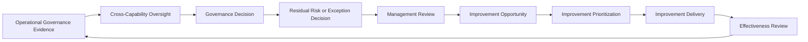

# Governance Oversight & Continual Improvement

## Document Control

| Field | Value |
|---|---|
| Document Name | Governance Oversight & Continual Improvement |
| Capability | Governance Oversight & Continual Improvement |
| Capability Number | 11 |
| Repository | Enterprise AI Governance Playbook |
| Reference Organization | Megastar Mortgage |
| Reference AI System | Megastar Intelligent Processor (MIP) |
| Document Owner | AI Governance Lead |
| Version | 1.0 |
| Classification | Public Reference Implementation |
| Status | Published |
| Review Cycle | Annual |
| Last Updated | July 2026 |

---

# Executive Summary

Governance Oversight & Continual Improvement is the enterprise decision layer of the AI governance operating model.

The capabilities established earlier in this repository identify AI systems, assess impact, manage risk, implement controls, conduct assurance, govern third parties, monitor ongoing conditions, respond to incidents, and control material changes.

This capability brings those outputs together so Megastar Mortgage can determine whether its AI governance system remains effective, proportionate, accountable, and fit for purpose.

It establishes how governance authorities:

- review the overall condition of the AI portfolio;
- make and record material governance decisions;
- evaluate and accept residual AI risk;
- govern temporary exceptions;
- conduct periodic management review;
- identify systemic weaknesses;
- prioritize governance improvements;
- track improvement delivery; and
- provide executive oversight of the AI governance program.

Governance Oversight does not repeat operational assessment, risk analysis, control testing, monitoring, incident response, provider review, or change execution. It relies on the authoritative records and conclusions produced by those capabilities.

---

# Purpose

The purpose of this capability is to establish a controlled and auditable structure for enterprise-level AI governance decisions and continual improvement.

It enables Megastar Mortgage to:

- maintain clear governance forums and decision rights;
- escalate material matters to the appropriate authority;
- preserve a traceable record of governance decisions;
- determine whether residual AI risk may be accepted;
- approve, monitor, renew, revoke, or close governance exceptions;
- review the effectiveness of the AI governance management system;
- evaluate cross-capability performance and systemic trends;
- direct corrective and strategic improvement;
- maintain accountability for improvement actions;
- monitor governance maturity;
- confirm whether the governance operating model remains suitable; and
- provide a consolidated executive view of AI governance health.

---

# Capability Scope

This capability applies to enterprise-level governance matters arising from:

- AI Inventory & Assessment;
- AI Risk Management;
- AI Controls;
- AI Assurance;
- Third-Party AI Governance;
- Continuous Monitoring;
- AI Incident Management;
- AI Change Management;
- Privacy;
- Security;
- Legal & Compliance;
- Internal Audit;
- business operations;
- regulatory developments; and
- executive or board direction.

It governs decisions concerning:

- material AI-system approval, restriction, suspension, or retirement;
- residual AI risk;
- policy, control, or process exceptions;
- overdue or ineffective remediation;
- repeated or systemic incidents;
- recurring control or monitoring weaknesses;
- material provider concerns;
- failed or high-impact changes;
- governance priorities;
- resource allocation;
- capability maturity;
- policy and operating-model improvement; and
- management-system effectiveness.

---

# Capability Boundary

## This capability owns

- governance oversight structure;
- governance forums and decision rights;
- enterprise governance decisions;
- governance decision records;
- residual-risk acceptance;
- governance exception management;
- management review;
- cross-capability oversight;
- improvement identification and prioritization;
- continual-improvement tracking;
- governance improvement planning;
- executive governance reporting; and
- oversight of unresolved systemic matters.

## This capability does not own

- AI-system intake or impact assessment;
- risk identification or scoring;
- control design or operation;
- assurance testing;
- provider due diligence or monitoring;
- metric calculation;
- incident investigation or response;
- change implementation;
- specialist privacy, security, legal, or regulatory analysis; or
- framework mapping.

Those activities remain with their accountable capabilities and functions.

---

# Governance Artifacts

| Governance Artifact | Purpose |
|---|---|
| AI Governance Oversight Framework | Defines governance forums, roles, decision rights, escalation pathways, review cadence, and oversight boundaries. |
| AI Governance Decision Register | Maintains the authoritative record of material governance decisions, conditions, owners, expiry dates, and follow-up actions. |
| AI Residual Risk Acceptance | Establishes how residual AI risk is evaluated, approved, time-bound, reviewed, renewed, revoked, or escalated. |
| AI Governance Exception Management | Governs temporary deviations from approved policies, controls, standards, or operating requirements. |
| AI Governance Management Review | Establishes the formal periodic review of the suitability, adequacy, and effectiveness of the AI governance management system. |
| AI Continual Improvement Register | Maintains the authoritative record of identified governance improvements and their current status. |
| AI Governance Improvement Plan | Prioritizes approved improvement initiatives, sequencing, ownership, resources, milestones, and expected outcomes. |
| AI Governance Oversight Summary | Provides the consolidated executive view of governance health, decisions, residual risk, exceptions, systemic issues, and improvement progress. |

Together, these artifacts establish the enterprise oversight and continual-improvement cycle.

---

# Oversight and Improvement Cycle



The cycle is continuous. Governance decisions and improvement actions shall remain traceable to the evidence that triggered them.

---

# Governance Principles

Megastar Mortgage applies the following principles:

- Governance decisions shall be made by the appropriate authority.
- Decisions shall be supported by current and authoritative evidence.
- Decision rationale, conditions, dissent, ownership, and expiry shall be recorded.
- Residual risk shall not be accepted implicitly.
- Risk acceptance shall be proportionate, time-bound where appropriate, and subject to review.
- Exceptions shall be temporary, justified, controlled, and monitored.
- An exception shall not become an undocumented permanent operating practice.
- Management review shall evaluate the governance system, not merely individual AI systems.
- Operational metrics shall inform oversight but shall not replace judgment.
- Portfolio averages shall not conceal material High or Critical conditions.
- Repeated incidents, failed controls, overdue actions, and recurring exceptions shall be assessed for systemic weakness.
- Improvement actions shall address causes rather than symptoms.
- Improvement ownership, resources, milestones, and expected outcomes shall be explicit.
- Closure of an improvement action shall require evidence of completion and, where appropriate, effectiveness.
- Governance Oversight shall consume specialist conclusions without duplicating specialist analysis.
- The AI governance operating model shall evolve when evidence shows that it is no longer adequate or effective.

---

# Governance Structure

Governance Oversight operates through defined forums appropriate to the organization.

These may include:

| Governance Forum | Primary Role |
|---|---|
| Operational Governance Review | Reviews routine portfolio conditions, overdue actions, and operational escalations. |
| AI Governance Committee | Makes cross-functional governance decisions and reviews material AI risks, exceptions, incidents, changes, providers, and assurance outcomes. |
| Executive Management | Decides strategic, enterprise-wide, Critical, or potentially unacceptable matters. |
| Board or Board Committee | Provides oversight where required by organizational governance, regulation, or risk significance. |

The AI Governance Oversight Framework defines:

- forum purpose;
- membership;
- chair;
- quorum;
- meeting cadence;
- standing agenda;
- decision authority;
- escalation thresholds;
- delegated authority;
- conflict management;
- recordkeeping; and
- action tracking.

A separate committee charter is not required where these elements are fully established in the approved Oversight Framework.

---

# Governance Inputs

Governance Oversight may receive:

- AI portfolio and inventory status;
- impact-assessment outcomes;
- enterprise AI risk position;
- residual-risk proposals;
- control implementation and health information;
- AI Assurance conclusions;
- provider-governance summaries;
- monitoring dashboards and summaries;
- KPI and KRI results;
- incident summaries;
- change-management summaries;
- overdue corrective actions;
- policy exceptions;
- regulatory or legal developments;
- audit findings;
- customer or stakeholder concerns;
- resource or capacity constraints; and
- prior management-review actions.

Each operational capability remains authoritative for its underlying records and specialist conclusions.

---

# Governance Decision Management

Material governance decisions shall be recorded in the AI Governance Decision Register.

Decisions may include:

- approve, restrict, suspend, or retire an AI system;
- approve or reject residual-risk acceptance;
- approve, reject, renew, or revoke an exception;
- require additional controls;
- require independent assurance;
- require risk reassessment;
- require provider remediation or exit review;
- require enhanced monitoring;
- require incident or change action;
- approve policy or operating-model changes;
- prioritize improvement initiatives;
- allocate resources;
- escalate to Executive Management or the Board; or
- close a governance action.

A decision record shall identify:

- Decision ID;
- matter considered;
- supporting evidence;
- decision authority;
- decision;
- rationale;
- conditions;
- accountable owner;
- required actions;
- target dates;
- review or expiry date;
- related governance records; and
- closure status.

---

# Residual AI Risk Acceptance

Residual risk is the risk remaining after relevant controls and treatments have been considered.

Residual-risk acceptance shall use the authoritative conclusions maintained in:

- Enterprise AI Risk Register;
- Enterprise AI Control Register;
- AI Assurance records;
- Continuous Monitoring records;
- incident records;
- provider-governance records; and
- change records.

Residual-risk acceptance shall consider:

- residual likelihood;
- residual impact;
- residual risk rating;
- control design and implementation;
- control-effectiveness conclusions;
- assurance outcome;
- monitoring coverage;
- unresolved findings;
- incidents;
- provider dependencies;
- legal or regulatory constraints;
- available treatment alternatives;
- proposed acceptance duration; and
- accountable risk owner.

Possible decisions are:

| Decision | Meaning |
|---|---|
| Accepted | Residual risk is accepted within defined authority and conditions. |
| Accepted with Conditions | Acceptance is granted subject to actions, restrictions, monitoring, or review. |
| Deferred | Additional evidence, remediation, or assurance is required. |
| Rejected | Residual risk is not acceptable and further treatment or discontinuation is required. |
| Escalated | The decision exceeds the current authority. |
| Expired | The acceptance period has ended and renewal or closure is required. |
| Revoked | Acceptance is withdrawn because conditions materially changed. |

Acceptance shall not alter the underlying risk evidence without an authorized update to the Enterprise AI Risk Register.

---

# AI Governance Exception Management

An exception is a formally approved, temporary deviation from an established governance requirement.

Exceptions may relate to:

- policy;
- control;
- evidence;
- review timing;
- monitoring;
- provider obligation;
- approval condition;
- human-oversight requirement;
- data requirement;
- technical standard; or
- another approved governance requirement.

An exception request shall identify:

- requirement from which deviation is requested;
- business justification;
- scope;
- duration;
- affected AI systems;
- affected risks and controls;
- potential consequences;
- compensating controls;
- monitoring requirements;
- accountable owner;
- expiry date;
- renewal conditions; and
- exit or remediation plan.

Exception outcomes may be:

- Approved;
- Approved with Conditions;
- Deferred;
- Rejected;
- Renewed;
- Revoked;
- Expired; or
- Closed.

Repeated renewal or continued dependence on an exception shall trigger review of the underlying policy, control, operating model, or resource constraint.

---

# Management Review

Management Review is the formal periodic evaluation of whether the AI governance management system remains:

- suitable;
- adequate;
- effective;
- proportionate;
- resourced;
- aligned with enterprise objectives; and
- responsive to changing obligations and risk.

Management Review may consider:

- progress against governance objectives;
- AI portfolio changes;
- significant risks;
- residual-risk acceptances;
- open exceptions;
- control and assurance results;
- provider performance;
- monitoring trends;
- incidents and recurrence;
- change outcomes;
- regulatory developments;
- stakeholder feedback;
- audit findings;
- overdue actions;
- capability maturity;
- resource adequacy;
- previous review actions; and
- improvement opportunities.

Management Review outputs may include:

- governance decisions;
- policy changes;
- operating-model changes;
- priority changes;
- resource decisions;
- improvement initiatives;
- additional assurance;
- revised oversight cadence;
- escalation; and
- formal conclusions on management-system effectiveness.

---

# Governance Metrics and Dashboard

Governance Oversight consumes approved metrics and dashboard information produced through Continuous Monitoring.

The oversight layer may use:

- AI portfolio coverage;
- High and Critical risk exposure;
- residual-risk acceptance status;
- key-control health;
- assurance outcomes;
- provider-governance status;
- overdue findings and actions;
- incident trends;
- change success and failure rates;
- exception aging;
- decision aging;
- improvement progress;
- governance capability maturity; and
- unresolved executive matters.

This capability does not redefine operational metric calculations or thresholds.

It determines:

- which information requires governance attention;
- what decision is needed;
- who owns the response;
- whether escalation is required; and
- whether systemic improvement is necessary.

The AI Governance Dashboard remains a presentation layer. Authoritative records remain within their owning capabilities.

---

# Continual Improvement

Continual improvement ensures that governance evidence leads to deliberate enhancement of the AI governance operating model.

Improvement opportunities may arise from:

- management review;
- assurance findings;
- monitoring trends;
- incidents;
- failed or repeated changes;
- provider weaknesses;
- risk trends;
- control failures;
- recurring exceptions;
- audit findings;
- regulatory developments;
- stakeholder feedback;
- lessons learned;
- maturity assessments; and
- operating-model inefficiencies.

Improvement opportunities shall be distinguished from routine corrective actions.

A corrective action addresses a specific identified issue.

A continual-improvement initiative strengthens the governance system more broadly.

---

# AI Continual Improvement Register

The AI Continual Improvement Register is the authoritative living record of governance improvement opportunities and approved initiatives.

It may contain:

- Improvement ID;
- improvement title;
- source;
- affected capability;
- problem or opportunity;
- systemic significance;
- expected benefit;
- priority;
- accountable owner;
- required resources;
- dependencies;
- target dates;
- implementation status;
- evidence;
- effectiveness-review requirement;
- effectiveness outcome; and
- closure status.

A separate register is justified because governance improvement is a distinct managed object with its own prioritization, ownership, delivery, effectiveness review, and closure lifecycle.

---

# AI Governance Improvement Plan

The AI Governance Improvement Plan converts approved improvement priorities into an executable roadmap.

The plan may include:

- strategic improvement themes;
- approved initiatives;
- sequencing;
- ownership;
- milestones;
- dependencies;
- resource requirements;
- implementation risks;
- expected benefits;
- success measures;
- reporting cadence; and
- decision points.

The plan shall not duplicate detailed corrective actions already governed in operational capabilities.

It shall focus on improvements that strengthen the governance system across capabilities, functions, or the enterprise.

---

# Improvement Prioritization

Improvement priority may consider:

- severity of the underlying weakness;
- cross-capability impact;
- repeated or systemic recurrence;
- regulatory urgency;
- stakeholder impact;
- control criticality;
- risk reduction;
- incident prevention;
- provider dependency;
- resource requirements;
- implementation complexity;
- strategic value; and
- dependency on other initiatives.

Priority shall not be determined solely by the number of findings associated with an issue.

---

# Improvement Effectiveness

An improvement shall not be considered effective solely because implementation activity is complete.

Effectiveness review may consider:

- whether the original weakness was reduced;
- whether recurrence declined;
- whether governance coverage improved;
- whether decision quality improved;
- whether control or monitoring performance improved;
- whether delays decreased;
- whether ownership became clearer;
- whether stakeholder outcomes improved;
- whether the operating model became more efficient; and
- whether unintended consequences occurred.

Effectiveness may be concluded as:

- Effective;
- Effective with Limitations;
- Partially Effective;
- Ineffective; or
- Unable to Conclude.

---

# Cross-Capability Governance Handoffs

| Oversight Decision or Finding | Receiving Capability |
|---|---|
| AI-system reassessment or lifecycle decision | AI Inventory & Assessment |
| Risk treatment or reassessment | AI Risk Management |
| Control implementation, redesign, or retirement | AI Controls |
| Independent evaluation or retesting | AI Assurance |
| Provider remediation, restriction, continuation, or exit review | Third-Party AI Governance |
| New or revised monitoring requirement | Continuous Monitoring |
| Incident investigation or response | AI Incident Management |
| Material governance change | AI Change Management |
| Regulatory or framework-mapping update | Framework Alignment |

Governance Oversight assigns and tracks the decision. The receiving capability performs the specialist activity.

---

# Governance Outcomes

This capability produces:

- defined governance forums;
- clear decision rights;
- traceable enterprise governance decisions;
- formal residual-risk decisions;
- controlled governance exceptions;
- periodic management-review conclusions;
- prioritized governance improvements;
- an authoritative improvement record;
- an executable improvement plan;
- cross-capability accountability;
- executive oversight; and
- evidence that the AI governance management system is being reviewed and improved.

---

# Capability Completion Criteria

This capability is complete when:

- the AI Governance Oversight Framework is approved;
- governance forums and decision rights are established;
- the AI Governance Decision Register is operational;
- residual-risk acceptance is governed;
- governance exceptions are governed;
- Management Review is operational;
- the AI Continual Improvement Register is established;
- the AI Governance Improvement Plan is maintained;
- cross-capability decision handoffs are traceable;
- improvement effectiveness is reviewed; and
- the AI Governance Oversight Summary is produced.

---

# Capability Completion Checklist

| Status | Deliverable |
|---|---|
| ☐ | AI Governance Oversight Framework completed |
| ☐ | AI Governance Decision Register established |
| ☐ | AI Residual Risk Acceptance completed |
| ☐ | AI Governance Exception Management completed |
| ☐ | AI Governance Management Review completed |
| ☐ | AI Continual Improvement Register established |
| ☐ | AI Governance Improvement Plan completed |
| ☐ | AI Governance Oversight Summary completed |

---

# Why This Capability Matters

Operational governance capabilities can identify risks, implement controls, test effectiveness, detect deterioration, respond to incidents, and govern change.

They cannot, by themselves, determine whether the organization’s overall AI governance system remains adequate.

Without Governance Oversight:

- residual risks may remain implicitly accepted;
- exceptions may become permanent;
- decisions may be inconsistent or undocumented;
- repeated incidents may be treated as isolated events;
- assurance findings may remain unresolved;
- provider weaknesses may persist;
- governance priorities may compete without direction;
- resources may not follow risk;
- management review may become a reporting exercise; and
- lessons may not become improvement.

Governance Oversight & Continual Improvement ensures that evidence becomes decision, decision becomes accountability, and accountability becomes measurable improvement.

---

# Relationship to Other Capabilities

This capability receives authoritative inputs from:

- Foundations;
- Governance Operating Model;
- AI Inventory & Assessment;
- AI Risk Management;
- AI Controls;
- AI Assurance;
- Third-Party AI Governance;
- Continuous Monitoring;
- AI Incident Management; and
- AI Change Management.

It provides enterprise decisions and improvement direction back to those capabilities.

It also provides the completed governance-management-system evidence required for Framework Alignment.

---

# Next Capability

Following completion of Governance Oversight & Continual Improvement, Megastar Mortgage proceeds to:

```text
12-Framework-Alignment
```

Framework Alignment maps the completed governance operating model to applicable standards, regulations, and governance frameworks.

It does not redesign the operating model or duplicate its artifacts.

---

# Related Capabilities

- Foundations
- Governance Operating Model
- AI Inventory & Assessment
- AI Risk Management
- AI Controls
- AI Assurance
- Third-Party AI Governance
- Continuous Monitoring
- AI Incident Management
- AI Change Management
- Framework Alignment

---

# Revision History

| Version | Date | Description |
|---|---|---|
| 1.0 | July 2026 | Initial release of the Governance Oversight & Continual Improvement capability. |